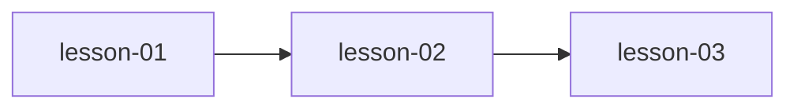

# MODULE.md — [模块名称]

## 模块信息

| 字段 | 值 |
|------|---|
| 模块编号 | module-XX |
| 模块名称 | [名称] |
| 原书章节 | Ch X, Ch Y |
| 课程数量 | N |
| 预计总时长 | X 小时 |

---

## 模块目标

学完本模块后，你应该能够：

1. [目标1]
2. [目标2]
3. [目标3]

---

## 课程列表

| # | 课程文件 | 标题 | 核心概念 | 状态 |
|---|---------|------|---------|------|
| 1 | `lesson-01-xxx.md` | [标题] | [概念列表] | draft |
| 2 | `lesson-02-xxx.md` | [标题] | [概念列表] | draft |

---

## 前置模块

- [module-XX-name](../module-XX-name/MODULE.md) — [需要的前置知识]

---

## 模块内课程依赖

---

## 关键术语预览

| 术语 | 英文 | 首次出现课程 |
|------|------|------------|
| [术语] | [English] | lesson-XX |
