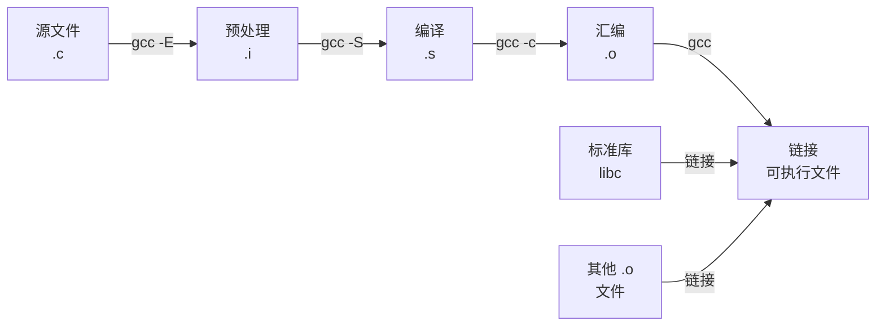

# C 程序结构与编译

## 前置知识检查

> 开始前确认这几个问题你能回答，否则先自行补充基础再来。

1. 你能写一个包含 `main` 函数的 C 程序并用 `gcc` 编译运行吗？
2. 你知道 `int`、`char`、`float`、`double` 这些基本数据类型分别存什么吗？
3. 你知道 `#include` 和 `#define` 大概是做什么的吗？

---

## 核心概念

### 1. C 程序的基本结构

#### 是什么

一个典型的 C 源文件从头到尾由以下几个部分组成：

```
+-----------------------------------------------+
|  预处理指令（#include, #define）               |
|  - 引入头文件，定义宏常量                      |
+-----------------------------------------------+
|  函数原型声明（function prototype）            |
|  - 告诉编译器后面会用到哪些函数                |
+-----------------------------------------------+
|  int main(void) { ... }                       |
|  - 程序入口点                                  |
+-----------------------------------------------+
|  自定义函数的定义                              |
|  - 各函数的具体实现                            |
+-----------------------------------------------+
```

这不是语法强制的，但这是 C 社区广泛遵循的约定。把预处理指令放最前面、函数原型放在 `main` 之前、函数定义放在 `main` 之后，是最常见的组织方式。

**注释**用 `/* ... */` 包裹，凡是可以插入空白的地方都可以插入注释。但有一个重要限制：**注释不能嵌套**。第一个 `/*` 和第一个 `*/` 之间的所有内容都被视为注释，不管中间有多少个 `/*`。

> ➕ **注释代码的安全方法**
>
> 如果你想临时注释掉一段包含 `/* */` 注释的代码，用 `/* */` 包裹会出问题。更安全的做法是：
>
> ```c
> #if 0
>     /* 这段代码被"注释"掉了 */
>     printf("这行不会编译\n");
> #endif
> ```
>
> `#if 0` 到 `#endif` 之间的代码在预处理阶段就被去除，即使内部有注释也不影响。

#### 为什么重要

- 读别人的 C 代码时，按这个结构从上往下看就能快速理解程序
- 函数原型放在 `main` 之前，让编译器在看到函数调用时已知道参数和返回值类型，能做类型检查
- 多文件项目中，这种结构直接对应"头文件放声明、源文件放定义"的工程规范

#### 代码演示

```c
/* program_structure.c — C 程序基本结构演示 */

/* === 第一部分：预处理指令 === */
#include <stdio.h>   /* 标准 I/O：printf, fgets 等 */
#include <stdlib.h>  /* EXIT_SUCCESS 等常量 */

#define MAX_NAME 50  /* 名字最大长度 */

/* === 第二部分：函数原型 === */
void greet(const char *name);

/* === 第三部分：main 函数 === */
int main(void) {
    char name[MAX_NAME];

    printf("请输入你的名字: ");
    /* fgets 安全读取，防止缓冲区溢出 */
    if (fgets(name, MAX_NAME, stdin) != NULL) {
        /* 去掉 fgets 读入的换行符 */
        size_t len = 0;
        while (name[len] != '\0') {
            if (name[len] == '\n') {
                name[len] = '\0';
                break;
            }
            len++;
        }
        greet(name);
    }

    return EXIT_SUCCESS;
}

/* === 第四部分：自定义函数定义 === */
void greet(const char *name) {
    printf("你好, %s! 欢迎学习 C 语言。\n", name);
}
```

```bash
gcc -std=c99 -Wall -Wextra -g -o program_structure program_structure.c
./program_structure
```

输入 `Alice` 后输出：

```
请输入你的名字: Alice
你好, Alice! 欢迎学习 C 语言。
```

> 🔄 **原书更新说明**
>
> 原书示例中使用了 `gets()` 函数读取输入。`gets()` 无法限制输入长度，存在严重的缓冲区溢出风险，**C11 标准已将其移除**。现代 C 程序应使用 `fgets(buf, size, stdin)` 替代——它接受缓冲区大小参数，能防止越界写入。

#### 易错点

**❌ 错误：调用函数时没有函数原型**

```c
/* no_prototype.c — 缺少函数原型 */
#include <stdio.h>

int main(void) {
    /* 编译器还不知道 square 的参数和返回值类型 */
    printf("结果: %d\n", square(5));
    return 0;
}

int square(int n) {
    return n * n;
}
```

```bash
gcc -std=c99 -Wall -Wextra -g -o no_prototype no_prototype.c
```

C99 标准规定隐式函数声明不再合法。GCC 会发出警告：`warning: implicit declaration of function 'square' [-Wimplicit-function-declaration]`，代码仍能编译通过（exit code 0），但这是危险的——编译器会假设函数返回 `int` 并猜测参数类型，可能导致运行时错误。加上 `-Werror` 可将此警告升级为错误，强制修复。

**✅ 正确：在调用前声明函数原型**

```c
/* with_prototype.c — 有函数原型 */
#include <stdio.h>

int square(int n);  /* 函数原型：告诉编译器参数和返回类型 */

int main(void) {
    printf("结果: %d\n", square(5));
    return 0;
}

int square(int n) {
    return n * n;
}
```

```bash
gcc -std=c99 -Wall -Wextra -g -o with_prototype with_prototype.c
./with_prototype
```

输出：

```
结果: 25
```

> 🔄 **原书更新说明**
>
> 原书成书时 C89 是主流标准，允许隐式声明（implicit declaration）——调用未声明的函数时编译器自动假设它返回 `int`。**C99 起隐式声明不再合法**，编译器会报错。这是好事：它迫使你在调用前声明所有函数，避免参数类型不匹配的隐蔽 bug。

---

### 2. 编译流程

#### 是什么

从 `.c` 源文件到可执行文件，要经历四个阶段：



| 阶段 | 工具 | 输入 | 输出 | 做了什么 |
|------|------|------|------|---------|
| 预处理 | 预处理器 | `.c` | `.i` | 展开 `#include`、替换 `#define`、处理 `#if` |
| 编译 | 编译器 | `.i` | `.s` | 把 C 代码翻译成汇编代码，**大部分错误在这里报出** |
| 汇编 | 汇编器 | `.s` | `.o` | 把汇编代码翻译成机器指令（目标文件） |
| 链接 | 链接器 | `.o` + 库 | 可执行文件 | 把多个目标文件和库函数合并，解析符号引用 |

关键认知：**编译错误和链接错误是两回事。** 编译错误说明语法/类型有问题，链接错误说明某个函数或变量被引用但找不到定义。

#### 为什么重要

- 理解报错信息是编译错误还是链接错误，能帮你更快定位问题
- 理解预处理阶段做了什么，才能理解为什么 `#include` 是"复制粘贴"、为什么宏没有类型检查
- 多文件项目中，你需要知道哪些文件需要重新编译、怎么只编译改动的部分

#### 代码演示

用 GCC 的分步编译命令观察每个阶段的产物：

```c
/* compile_demo.c — 编译流程演示 */
#include <stdio.h>

#define GREETING "Hello, World!"

int main(void) {
    printf("%s\n", GREETING);
    return 0;
}
```

```bash
# 阶段 1：预处理 — 展开所有 #include 和 #define
gcc -E compile_demo.c -o compile_demo.i
# 打开 compile_demo.i 看看：
# - stdio.h 的内容被展开了（几千行）
# - GREETING 被替换成了 "Hello, World!"

# 阶段 2：编译 — 翻译为汇编
gcc -S compile_demo.c -o compile_demo.s
# 打开 compile_demo.s 可以看到汇编指令

# 阶段 3：汇编 — 生成目标文件
gcc -c compile_demo.c -o compile_demo.o
# compile_demo.o 是二进制文件，不能直接阅读

# 阶段 4：链接 — 生成可执行文件
gcc compile_demo.o -o compile_demo
./compile_demo
```

输出：

```
Hello, World!
```

#### 易错点

**❌ 错误：编译通过但链接失败**

```c
/* link_error.c — 链接错误演示 */
#include <stdio.h>

int compute(int x);  /* 声明了函数，但从没定义 */

int main(void) {
    printf("结果: %d\n", compute(10));
    return 0;
}
/* 注意：compute 函数没有定义！ */
```

```bash
gcc -std=c99 -Wall -Wextra -g -o link_error link_error.c
# 编译阶段通过（语法没问题），但链接阶段报错：
# undefined reference to `compute'
```

**✅ 正确：确保每个声明的函数都有对应定义**

```c
/* link_ok.c — 有定义就不会链接错误 */
#include <stdio.h>

int compute(int x);

int main(void) {
    printf("结果: %d\n", compute(10));
    return 0;
}

int compute(int x) {
    return x * x + 1;
}
```

```bash
gcc -std=c99 -Wall -Wextra -g -o link_ok link_ok.c
./link_ok
```

输出：

```
结果: 101
```

> [BEGINNER] 如果你对 `gcc` 命令的各个参数不熟悉：`-std=c99` 指定 C99 标准，`-Wall -Wextra` 开启常用警告（帮你提前发现问题），`-g` 加入调试信息（方便 gdb 调试），`-o` 指定输出文件名。

#### ⭐ 深入：`-Wall` 不是"所有警告"

> 以下内容为深层原理，理解它有助于加深认识，但不影响日常使用。跳过不影响后续学习。

`-Wall` 的名字容易让人以为它开启了"所有警告"（all warnings），但实际上它只开启了"常用且误报率低"的警告。`-Wextra` 补充了更多有用的警告，比如：

- 函数参数声明了但未使用
- 有符号和无符号整数比较
- 条件表达式中的赋值

如果你想要更严格的检查，可以加上 `-Wpedantic`（严格遵守标准）甚至 `-Werror`（把警告当错误处理）。本书统一使用 `-Wall -Wextra` 作为标准编译选项。

---

### 3. 数据类型与 sizeof

#### 是什么

C 语言有四大类型家族：

| 家族 | 类型 | 说明 |
|------|------|------|
| 整型 | `char`, `short`, `int`, `long`, `long long` | 每种分 `signed`/`unsigned` 两种版本 |
| 浮点 | `float`, `double`, `long double` | 分别为单精度、双精度、扩展精度 |
| 指针 | `int *`, `char *`, `void *`, ... | 存储地址值，module-01 详讲 |
| 聚合 | 数组、结构体(`struct`)、联合(`union`) | 后续模块详讲 |

**整型的大小关系**只有一条保证：

```
sizeof(char) ≤ sizeof(short) ≤ sizeof(int) ≤ sizeof(long) ≤ sizeof(long long)
```

具体每个类型占几个字节取决于平台。标准只规定了**最小范围**：`short` 至少 16 位，`long` 至少 32 位，`int` 的大小由编译器根据平台选择最高效的值。

**`char` 的 signed/unsigned 是实现定义的**——不同编译器可能不同。如果你关心 `char` 的符号性，必须显式写出 `signed char` 或 `unsigned char`。

**`sizeof` 操作符**用来查询类型或变量占多少字节：

```c
sizeof(int)     /* 类型名必须加括号 */
sizeof x        /* 变量名可以不加括号（加了也行） */
```

`sizeof` 返回 `size_t` 类型的值，打印时用 `%zu` 格式说明符。**`sizeof` 不会对表达式求值**——`sizeof(a = b + 1)` 不会修改 `a` 的值。

#### 为什么重要

- 类型大小影响内存布局、数据溢出行为、跨平台移植性
- `sizeof` 在后续模块中频繁使用：`malloc(n * sizeof(int))` 分配内存、计算数组长度 `sizeof(arr)/sizeof(arr[0])` 等
- `char` 的符号性不确定是一个经典的可移植性陷阱

#### 代码演示

```c
/* type_sizes.c — 查看各类型大小和范围 */
#include <stdio.h>
#include <limits.h>   /* 整型范围常量 */
#include <float.h>    /* 浮点范围常量 */

int main(void) {
    /* sizeof 查看各类型大小 */
    printf("=== 类型大小（字节）===\n");
    printf("char:      %zu\n", sizeof(char));       /* 永远是 1 */
    printf("short:     %zu\n", sizeof(short));
    printf("int:       %zu\n", sizeof(int));
    printf("long:      %zu\n", sizeof(long));
    printf("long long: %zu\n", sizeof(long long));
    printf("float:     %zu\n", sizeof(float));
    printf("double:    %zu\n", sizeof(double));
    printf("void *:    %zu\n", sizeof(void *));     /* 指针大小 */

    printf("\n=== 整型范围（limits.h）===\n");
    printf("char:  %d ~ %d\n", CHAR_MIN, CHAR_MAX);
    printf("short: %d ~ %d\n", SHRT_MIN, SHRT_MAX);
    printf("int:   %d ~ %d\n", INT_MIN, INT_MAX);
    printf("long:  %ld ~ %ld\n", LONG_MIN, LONG_MAX);

    printf("\n=== 浮点范围（float.h）===\n");
    printf("float  最大值: %e\n", FLT_MAX);
    printf("double 最大值: %e\n", DBL_MAX);

    /* sizeof 作用于表达式不会求值 */
    int a = 10;
    printf("\nsizeof(a = 99) = %zu, a 仍然是 %d\n",
           sizeof(a = 99), a);  /* a 不变！ */

    return 0;
}
```

```bash
gcc -std=c99 -Wall -Wextra -g -o type_sizes type_sizes.c
./type_sizes
```

在 64 位 Linux（WSL2）上的典型输出：

```
=== 类型大小（字节）===
char:      1
short:     2
int:       4
long:      8
long long: 8
float:     4
double:    8
void *:    8

=== 整型范围（limits.h）===
char:  -128 ~ 127
short: -32768 ~ 32767
int:   -2147483648 ~ 2147483647
long:  -9223372036854775808 ~ 9223372036854775807

=== 浮点范围（float.h）===
float  最大值: 3.402823e+38
double 最大值: 1.797693e+308

sizeof(a = 99) = 4, a 仍然是 10
```

> ➕ **NUL 与 NULL 的区别**
>
> 这两个名字看起来很像，但含义完全不同，全书会反复出现：
>
> | 名字 | 是什么 | 值 | 用在哪里 |
> |------|--------|---|---------|
> | **NUL** | 字符 `'\0'` | 整数 0 | 字符串的结尾标记 |
> | **NULL** | 空指针宏 | 通常是 `((void *)0)` | 表示指针不指向任何有效数据 |
>
> `"Hello"` 在内存中占 6 个字节（5 个字符 + 1 个 NUL 终止符）。NUL 不是可打印字符，ASCII 值为 0。
>
> NULL 是指针的概念，在 module-01 会详讲。现在记住：**NUL 结束字符串，NULL 标记"无效指针"**。

#### 易错点

**❌ 错误：假设 `char` 总是 signed**

```c
/* char_sign.c — char 符号性不确定 */
#include <stdio.h>

int main(void) {
    char c = 200;  /* 200 超过 signed char 的范围（-128~127） */
    if (c > 0) {
        printf("c > 0: char 是 unsigned\n");
    } else {
        printf("c <= 0: char 是 signed（200 溢出为负值）\n");
    }
    return 0;
}
```

```bash
gcc -std=c99 -Wall -Wextra -g -o char_sign char_sign.c
./char_sign
```

在大多数 x86 编译器上 `char` 默认是 signed，`200` 会溢出为 `-56`，但换到 ARM 平台可能不同。

**✅ 正确：需要确定符号性时显式声明**

```c
/* char_explicit.c — 显式声明符号性 */
#include <stdio.h>

int main(void) {
    unsigned char uc = 200;  /* 明确无符号：0~255 */
    signed char   sc = -50;  /* 明确有符号：-128~127 */
    printf("unsigned char: %u\n", uc);  /* 200 */
    printf("signed char:   %d\n", sc);  /* -50 */
    return 0;
}
```

```bash
gcc -std=c99 -Wall -Wextra -g -o char_explicit char_explicit.c
./char_explicit
```

输出：

```
unsigned char: 200
signed char:   -50
```

---

### 4. 变量声明与常量

#### 是什么

变量声明的基本形式：

```
说明符（一个或多个）  声明表达式列表;
```

`const` 关键字用于声明常量——一旦初始化就不能修改。有两种等价写法：

```c
int const a = 15;  /* 原书风格：类型在前 */
const int a = 15;  /* 更常见的风格 */
```

当 `const` 与指针结合时，情况变得有趣，因为有两样东西可以成为常量——**指针本身**和**它指向的值**。这里有三种组合：

```
int *p;                  普通指针
                         ↓ 指向的值可改，指针可改

const int *p;            指向常量的指针
int const *p;            （两种写法等价）
                         ↓ 指向的值不可改，指针可改

int * const p;           常量指针
                         ↓ 指向的值可改，指针不可改

const int * const p;     指向常量的常量指针
                         ↓ 指向的值不可改，指针不可改
```

**记忆技巧：`const` 修饰它左边最近的东西。** 如果 `const` 左边没有东西，就修饰右边的。

```
const int *p    →  const 左边没东西，修饰右边的 int  → 值不可改
int * const p   →  const 左边是 *（指针）           → 指针不可改
```

#### 为什么重要

- `const` 在函数参数中大量使用：`void print(const char *msg)` 告诉调用者"我不会修改你传入的字符串"
- 理解 `const` 与指针的组合是阅读标准库函数原型的前提（如 `strcpy(char *dest, const char *src)`）
- 声明和初始化规则影响变量的作用域和生命周期（后面三节详讲）

#### 代码演示

```c
/* const_pointer.c — const 与指针的三种组合 */
#include <stdio.h>

int main(void) {
    int x = 10, y = 20;

    /* --- 1. 指向常量的指针：值不可改，指针可改 --- */
    const int *p1 = &x;
    /* *p1 = 99;  ❌ 编译错误：不能通过 p1 修改 x */
    p1 = &y;       /* ✅ 可以让 p1 指向别的地方 */
    printf("p1 -> %d\n", *p1);  /* 20 */

    /* --- 2. 常量指针：值可改，指针不可改 --- */
    int * const p2 = &x;
    *p2 = 99;      /* ✅ 可以通过 p2 修改 x */
    /* p2 = &y;    ❌ 编译错误：不能让 p2 指向别的地方 */
    printf("x = %d\n", x);     /* 99 */

    /* --- 3. 指向常量的常量指针：都不可改 --- */
    const int * const p3 = &y;
    /* *p3 = 99;   ❌ 编译错误 */
    /* p3 = &x;    ❌ 编译错误 */
    printf("p3 -> %d\n", *p3);  /* 20 */

    return 0;
}
```

```bash
gcc -std=c99 -Wall -Wextra -g -o const_pointer const_pointer.c
./const_pointer
```

输出：

```
p1 -> 20
x = 99
p3 -> 20
```

> ➕ **字符串字面量是"指向常量字符的指针"**
>
> 当你写 `"Hello"` 时，编译器把这 6 个字节（5 个字符 + NUL）存在只读区。表达式 `"Hello"` 的类型是 `char *`（历史原因），但**修改字符串字面量是未定义行为（UB）**：
>
> ```c
> char *s = "Hello";  /* s 指向只读区 */
> s[0] = 'h';         /* ❌ UB：可能段错误，也可能"碰巧成功" */
>
> char arr[] = "Hello"; /* arr 是栈上的数组，内容从字面量复制而来 */
> arr[0] = 'h';         /* ✅ 没问题 */
> ```
>
> 这个话题在 module-04（字符串处理）会详细展开。现在记住：**如果你需要修改字符串，用数组而不是指针**。

#### 易错点

**❌ 错误：混淆 `const int *` 和 `int * const`**

```c
/* const_confusion.c — const 位置搞错 */
#include <stdio.h>

void print_value(int * const p) {
    /* 你以为 p 指向的值不能改？错了！
       int * const 限制的是指针本身，不是值 */
    *p = 999;  /* 这行完全合法 */
    printf("值被改成了: %d\n", *p);
}

int main(void) {
    int x = 42;
    print_value(&x);
    printf("x = %d\n", x);  /* x 被改了！ */
    return 0;
}
```

```bash
gcc -std=c99 -Wall -Wextra -g -o const_confusion const_confusion.c
./const_confusion
```

输出：

```
值被改成了: 999
x = 999
```

**✅ 正确：要保护值不被修改，用 `const int *`**

```c
/* const_correct.c — 正确使用 const 保护值 */
#include <stdio.h>

void print_value(const int *p) {
    /* const int * 限制的是 p 指向的值 */
    /* *p = 999;  ❌ 编译错误：assignment of read-only location */
    printf("值是: %d\n", *p);
}

int main(void) {
    int x = 42;
    print_value(&x);
    printf("x = %d（没被修改）\n", x);
    return 0;
}
```

```bash
gcc -std=c99 -Wall -Wextra -g -o const_correct const_correct.c
./const_correct
```

输出：

```
值是: 42
x = 42（没被修改）
```

---

### 5. 作用域（Scope）

#### 是什么

标识符的作用域（scope）是它在源代码中可以被使用的区域。编译器识别四种作用域：

| 作用域 | 声明位置 | 可见范围 |
|--------|---------|---------|
| **代码块作用域** | 花括号 `{}` 内部 | 从声明处到 `}` 结束 |
| **文件作用域** | 所有 `{}` 外部 | 从声明处到文件结尾 |
| **原型作用域** | 函数原型的参数列表内 | 仅在原型内有效 |
| **函数作用域** | 仅用于 `goto` 标签 | 整个函数体 |

最常用的是前两种。关键规则：**内层代码块中声明的同名变量会隐藏外层变量。**

```
int x = 10;            ← 外层 x
{
    int x = 20;        ← 内层 x，隐藏了外层 x
    printf("%d", x);   → 输出 20
}
printf("%d", x);       → 输出 10（外层 x 恢复可见）
```

#### 为什么重要

- 作用域决定了"你能在哪里使用这个名字"
- 不理解作用域会导致"以为修改了外层变量，实际修改的是内层新变量"这种隐蔽 bug
- 作用域是理解链接属性和存储类型的前提——三者共同决定变量的可见性和生命周期

#### 代码演示

```c
/* scope_demo.c — 作用域演示 */
#include <stdio.h>

int global = 100;  /* 文件作用域：从这里到文件末尾都可见 */

void demonstrate_scope(void) {
    int local = 200;  /* 代码块作用域：只在函数体内可见 */
    printf("函数内: global = %d, local = %d\n", global, local);

    {   /* 嵌套代码块 */
        int local = 300;  /* 隐藏了外层的 local */
        int inner = 400;  /* 只在此代码块内有效 */
        printf("内层块: global = %d, local = %d, inner = %d\n",
               global, local, inner);
    }
    /* inner 在这里已不可见 */
    /* local 恢复为 200 */
    printf("回到函数: local = %d\n", local);
}

int main(void) {
    demonstrate_scope();
    printf("main: global = %d\n", global);
    /* printf("%d", local);  ❌ 编译错误：local 不在 main 的作用域内 */
    return 0;
}
```

```bash
gcc -std=c99 -Wall -Wextra -Wshadow -g -o scope_demo scope_demo.c
./scope_demo
```

注意 `-Wshadow` 参数——它会在内层变量隐藏外层变量时给出警告。输出：

```
函数内: global = 100, local = 200
内层块: global = 100, local = 300, inner = 400
回到函数: local = 200
main: global = 100
```

编译器同时会警告：`warning: declaration of 'local' shadows a previous local definition`。

#### 易错点

**❌ 错误：内层块意外声明同名变量**

```c
/* shadow_bug.c — 变量隐藏导致的 bug */
#include <stdio.h>

int main(void) {
    int count = 0;

    for (int i = 0; i < 5; i++) {
        int count = 0;  /* 意外创建了新的 count！ */
        count++;        /* 修改的是内层 count，外层不变 */
    }

    /* 你以为 count == 5？实际上 count == 0 */
    printf("count = %d\n", count);
    return 0;
}
```

```bash
gcc -std=c99 -Wall -Wextra -Wshadow -g -o shadow_bug shadow_bug.c
./shadow_bug
```

输出：

```
count = 0
```

**✅ 正确：避免在嵌套块中使用相同的变量名**

```c
/* shadow_fix.c — 使用不同名字 */
#include <stdio.h>

int main(void) {
    int count = 0;

    for (int i = 0; i < 5; i++) {
        count++;  /* 直接修改外层 count */
    }

    printf("count = %d\n", count);  /* 5 */
    return 0;
}
```

```bash
gcc -std=c99 -Wall -Wextra -g -o shadow_fix shadow_fix.c
./shadow_fix
```

输出：

```
count = 5
```

---

### 6. 链接属性（Linkage）

#### 是什么

链接属性（linkage）决定了**不同文件中出现的同名标识符是否指向同一个实体**。共有三种：

| 链接属性 | 含义 | 例子 |
|---------|------|------|
| **external** | 所有源文件中的同名声明都指向同一个实体 | 非 static 的文件作用域变量/函数 |
| **internal** | 仅在本源文件内各声明指向同一实体 | static 修饰的文件作用域变量/函数 |
| **none** | 每次声明都是独立个体 | 局部变量、函数参数 |

两个关键字用于修改链接属性：

- **`static`**：把 external 改为 internal（文件私有）
- **`extern`**：声明一个定义在别处的 external 实体

#### 为什么重要

链接属性是多文件 C 项目的核心机制。不理解它：

- 不知道为什么两个文件定义同名全局变量会冲突
- 不知道 `static` 在文件作用域的真正作用
- 不知道 `extern` 声明是在"引用别人的定义"

#### 代码演示

创建两个源文件演示 external vs internal 链接：

**文件 1：`linkage_main.c`**

```c
/* linkage_main.c — 链接属性演示：主文件 */
#include <stdio.h>

/* 声明定义在其他文件的变量和函数 */
extern int shared_count;       /* external 链接：引用 linkage_lib.c 的定义 */
void increment(void);          /* 函数默认是 external 链接 */

/* static int private_var;     ❌ 无法访问 linkage_lib.c 的 private_var */

int main(void) {
    printf("初始值: shared_count = %d\n", shared_count);
    increment();
    increment();
    printf("调用两次后: shared_count = %d\n", shared_count);
    return 0;
}
```

**文件 2：`linkage_lib.c`**

```c
/* linkage_lib.c — 链接属性演示：库文件 */

int shared_count = 0;             /* external 链接：其他文件可以用 extern 访问 */
static int private_var = 100;     /* internal 链接：只有本文件能访问 */

void increment(void) {            /* external 链接：其他文件可以调用 */
    shared_count++;
    private_var++;                 /* 本文件内部使用，外部看不到 */
}

/* 如果想让函数也变成文件私有，加 static：
   static void helper(void) { ... }
*/
```

```bash
gcc -std=c99 -Wall -Wextra -g -o linkage_demo linkage_main.c linkage_lib.c
./linkage_demo
```

输出：

```
初始值: shared_count = 0
调用两次后: shared_count = 2
```

#### 易错点

**❌ 错误：两个文件都定义同名全局变量**

```c
/* file_a.c */
int count = 0;   /* external 链接 */

/* file_b.c */
int count = 0;   /* external 链接 — 和 file_a.c 的 count 冲突！ */
```

```bash
gcc -std=c99 file_a.c file_b.c -o program
# 链接错误: multiple definition of `count'
```

**✅ 正确：用 `static` 让变量文件私有，或用 `extern` 引用**

```c
/* file_a.c — 定义变量 */
int count = 0;            /* 唯一的定义 */

/* file_b.c — 引用变量 */
extern int count;         /* 不是新定义，是引用 file_a.c 的 count */
```

或者，如果两个文件需要各自独立的 `count`：

```c
/* file_a.c */
static int count = 0;    /* internal 链接：file_a 私有 */

/* file_b.c */
static int count = 0;    /* internal 链接：file_b 私有，互不干扰 */
```

---

### 7. 存储类型（Storage Class）

#### 是什么

存储类型（storage class）决定变量**存在哪里**（内存的哪个区域）、**活多久**（何时创建和销毁）、**初始值是什么**。

| 存储类型 | 关键字 | 存储位置 | 生命周期 | 默认初始值 |
|---------|--------|---------|---------|-----------|
| 静态 | 无（文件作用域）或 `static` | 数据段 | 程序开始到结束 | **0** |
| 自动 | `auto`（默认，几乎不写） | 栈 | 进入代码块到离开 | **不确定（垃圾值）** |
| 寄存器 | `register` | 寄存器（建议） | 同自动变量 | **不确定** |

三条核心规则：

1. **文件作用域变量**（在所有 `{}` 外面声明的）总是静态存储，你没有选择
2. **代码块内变量**默认是自动存储（栈上），加 `static` 可以改为静态存储
3. **静态变量不显式初始化时自动为 0，自动变量不初始化时值是垃圾**

#### 为什么重要

- 不知道自动变量不会自动清零，就会写出"有时正确有时出错"的程序
- 不知道 `static` 局部变量会保持值，就无法理解计数器、一次性初始化等模式
- 存储类型是理解函数调用时"栈帧创建/销毁"机制的基础（module-02 会用到）

#### 代码演示

```c
/* storage_class.c — 存储类型对比 */
#include <stdio.h>

void counter(void) {
    int auto_count = 0;          /* 自动变量：每次调用都重新创建为 0 */
    static int static_count = 0; /* 静态变量：只初始化一次，值会保留 */

    auto_count++;
    static_count++;
    printf("auto_count = %d, static_count = %d\n",
           auto_count, static_count);
}

int main(void) {
    for (int i = 0; i < 5; i++) {
        counter();
    }
    return 0;
}
```

```bash
gcc -std=c99 -Wall -Wextra -g -o storage_class storage_class.c
./storage_class
```

输出：

```
auto_count = 1, static_count = 1
auto_count = 1, static_count = 2
auto_count = 1, static_count = 3
auto_count = 1, static_count = 4
auto_count = 1, static_count = 5
```

`auto_count` 每次都是 1（每次调用重新创建），`static_count` 从 1 递增到 5（值跨调用保持）。

> 📝 **register 在现代编译器中的地位**
>
> `register` 关键字提示编译器将变量存在 CPU 寄存器中以提高访问速度。但现代编译器的优化能力远超手工指定，`register` 提示通常被忽略。更重要的是，`register` 变量不能取地址（`&`），因为寄存器没有内存地址。在现代 C 代码中，`register` 几乎不使用。

#### 易错点

**❌ 错误：使用未初始化的局部变量**

```c
/* uninitialized.c — 未初始化的自动变量 */
#include <stdio.h>

int main(void) {
    int x;  /* 自动变量，未初始化 */
    printf("x = %d\n", x);  /* 值不确定！每次运行可能不同 */
    /* 编译器会警告：'x' is used uninitialized */
    return 0;
}
```

```bash
gcc -std=c99 -Wall -Wextra -g -o uninitialized uninitialized.c
./uninitialized
# 输出不确定，可能是 0，也可能是 -858993460 或其他垃圾值
```

**✅ 正确：声明时就初始化**

```c
/* initialized.c — 声明即初始化 */
#include <stdio.h>

int main(void) {
    int x = 0;  /* 明确初始化 */
    printf("x = %d\n", x);  /* 确定是 0 */
    return 0;
}
```

```bash
gcc -std=c99 -Wall -Wextra -g -o initialized initialized.c
./initialized
```

输出：

```
x = 0
```

#### ⭐ 深入：内存四区布局

> 以下内容为深层原理，理解它有助于加深认识，但不影响日常使用。跳过不影响后续学习。

程序运行时，内存大致分为四个区域：

```
高地址
+---------------------------+
|         栈 (Stack)        |  ← 自动变量、函数参数、返回地址
|         ↓ 向下增长        |    进入函数时分配，离开函数时释放
+---------------------------+
|                           |
|       （未使用空间）       |
|                           |
+---------------------------+
|         ↑ 向上增长        |
|         堆 (Heap)         |  ← malloc/calloc 分配的内存
+---------------------------+
|    数据段 (Data/BSS)      |  ← 全局变量、static 变量
|    已初始化 | 未初始化     |    程序启动时分配，程序结束时释放
+---------------------------+
|      代码段 (Text)        |  ← 程序的机器指令（只读）
+---------------------------+
低地址
```

- **代码段**：存放编译后的机器指令，只读
- **数据段**：全局变量和 `static` 变量。已初始化的放在 Data 段，未初始化的放在 BSS 段（自动清零）
- **堆**：`malloc`/`calloc` 动态分配的内存，需要手动 `free`（module-06 详讲）
- **栈**：函数调用时自动分配局部变量和参数，函数返回时自动释放

**`static` 关键字的双重含义总结**：

| `static` 用在 | 改变的是 | 效果 |
|--------------|---------|------|
| 文件作用域（全局变量/函数前） | 链接属性 | external → internal（文件私有） |
| 代码块内（局部变量前） | 存储类型 | auto → static（值跨调用保持） |

口诀：**文件外改链接，函数内改存储。**

---

## 概念串联

本课 7 个概念构成一个完整的认知链条：

```
程序结构（代码怎么组织）
    ↓
编译流程（代码怎么变成可执行文件）
    ↓
数据类型与 sizeof（程序操作什么数据，怎么查大小）
    ↓
变量声明与常量（数据怎么命名、保护和初始化）
    ↓
作用域（变量在哪里可见）
    ↓
链接属性（多文件中变量/函数怎么关联）
    ↓
存储类型（变量存在哪里、活多久）
```

**作用域、链接属性、存储类型**是变量的三个属性维度，它们共同决定了一个变量的"可见性"和"生命周期"：

- **作用域**回答：在源代码的哪个范围内可以用这个名字？
- **链接属性**回答：不同文件中的同名标识符是不是同一个？
- **存储类型**回答：这个变量存在内存的哪个区域？什么时候创建和销毁？

下一课「控制流与操作符」将在此基础上深入操作符优先级、左值/右值、隐式类型转换等概念。再往后，module-01（指针基础）会用到本课的内存模型和 `const` 知识，module-02（函数）会用到作用域和存储类型来理解函数调用机制。

---

## 常见陷阱清单

| # | 陷阱 | 症状 | 原因 | 修复 |
|---|------|------|------|------|
| 1 | 局部变量未初始化就使用 | 程序行为不确定，每次运行结果可能不同 | 自动变量（栈上）不会自动清零，值是之前的栈残留 | 声明时立即初始化 |
| 2 | 忘写函数原型 | GCC 报 `implicit declaration` 错误（C99+） | C99 要求先声明后使用，编译器需要原型来检查类型 | 在调用前放函数原型，或把函数定义放在调用前 |
| 3 | 混淆 `static` 在不同位置的含义 | 文件作用域：以为限制了生命周期；代码块内：以为限制了可见性 | `static` 在文件作用域改链接属性，在代码块内改存储类型 | 记住口诀：文件外改链接，函数内改存储 |
| 4 | 使用已被移除的 `gets()` 函数 | 编译器报 `implicit declaration`（C99+），或运行时缓冲区溢出 | `gets()` 无法限制输入长度，C11 中被移除 | 用 `fgets(buf, size, stdin)` 替代 |
| 5 | 嵌套代码块中意外声明同名变量 | 以为修改了外层变量，实际外层变量值没变 | 内层声明了一个新的同名变量，隐藏了外层的 | 避免在嵌套块中用相同的变量名，编译时用 `-Wshadow` 检测 |
| 6 | 混淆 `const int *p` 和 `int * const p` | 以为保护了值实际保护了指针，或反过来 | `const` 修饰的是它左边最近的东西 | 从右往左读声明，用 cdecl 工具辅助 |
| 7 | 两个源文件都定义同名全局变量 | 链接错误 `multiple definition` | 两个 external 链接的同名变量冲突 | 一个文件定义，其他文件用 `extern` 引用；或各自加 `static` |

---

## 动手练习提示

### 练习 1：编译流程探索

用 `gcc -E`、`gcc -S`、`gcc -c` 分步编译一个简单程序，打开中间文件看看内容：
- `.i` 文件中能找到 `#include` 展开后的内容吗？`#define` 的宏名还在吗？
- `.s` 文件中能看到你写的 C 函数名吗？
- 思路提示：用一个只有 `main` 和 `printf` 的小程序，打开 `.i` 文件搜索你的宏名
- 容易卡住的地方：`.i` 文件可能很长（因为 `stdio.h` 展开了几千行），别被吓到，直接搜索你的代码

### 练习 2：static 关键字两面性

写一个程序验证 `static` 在两个位置的不同效果：
1. 在文件作用域声明一个 `static int` 变量，尝试从另一个 `.c` 文件访问它
2. 在函数内声明一个 `static int` 变量，多次调用该函数观察值变化
- 思路提示：创建两个 `.c` 文件，用 `gcc` 一起编译
- 容易卡住的地方：从另一个文件访问 `static` 变量会得到**链接错误**而非编译错误

### 练习 3：const 与指针组合

写一个程序声明所有四种指针（普通、指向常量、常量指针、指向常量的常量指针），尝试对每种指针做修改值和修改指向两种操作，观察编译器报错：
- 思路提示：把 4 种声明放在 `main` 中，逐一取消注释看哪些操作被拒绝
- 容易卡住的地方：注意区分"修改值"（`*p = ...`）和"修改指向"（`p = ...`）

---

## 自测题

> 不给答案，动脑想完再往下学。

1. 如果在两个不同的 `.c` 文件中都写了 `int count = 0;`（文件作用域、非 `static`），编译链接时会发生什么？为什么？

2. `static` 关键字用在文件作用域的变量声明和代码块内部的变量声明上，效果分别是什么？它们有没有共同点？

3. `const int *p` 和 `int * const p` 分别限制了什么？如果两个限制都要，怎么写？`void func(const int * const p)` 在实际中有用吗？

---

## 补充资源

| 资源 | 类型 | 说明 |
|------|------|------|
| [Scope, Storage Duration, and Linkage - JMU](https://users.cs.jmu.edu/bernstdh/web/common/lectures/summary_c_scope-duration-linkage.php) | 文章 | 作用域/存储期/链接属性的英文总结表，适合对照记忆 |
| [Storage-class specifiers - cppreference.com](https://en.cppreference.com/w/c/language/storage_duration.html) | 官方文档 | C 标准中存储类型说明符的权威参考 |
| [const int* vs int * const vs const int * const - GeeksforGeeks](https://www.geeksforgeeks.org/c/difference-between-const-int-const-int-const-and-int-const/) | 文章 | const 与指针三种组合的详细对比 |
| [C 作用域规则 - 菜鸟教程](https://www.runoob.com/cprogramming/c-scope-rules.html) | 教程 | 中文作用域入门教程，配有简单示例 |
| [Constant pointers vs. pointer to constants - Internal Pointers](https://www.internalpointers.com/post/constant-pointers-vs-pointer-constants-c-and-c) | 文章 | 英文 const 指针详解，含记忆技巧 |
