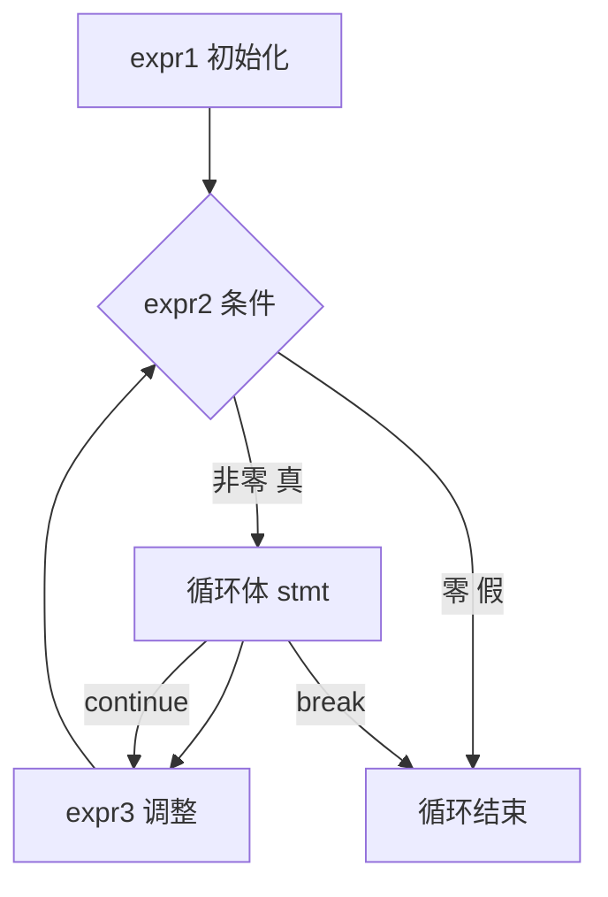

# 控制流与操作符

## 前置知识检查

> 开始前确认这几个问题你能回答，否则回头补前序课程。

1. 你能说出 C 的四种作用域和三种存储类型吗？→ 见 `lesson-01-program-structure.md`
2. 你知道 C 中局部变量未初始化的后果吗？→ 见 `lesson-01-program-structure.md`
3. 你知道 `#define` 和 `const` 的区别吗？→ 见 `lesson-01-program-structure.md`

---

## 核心概念

### 1. 控制流语句速览

#### 是什么

C 的控制流语句和大多数语言类似，但有一些独特之处需要特别注意。本节不逐一复习语法（你已有 C 基础），而是聚焦 C 的**特殊行为和常见陷阱**。

C 的控制流语句：

| 类别 | 语句 | 关键特点 |
|------|------|---------|
| 条件 | `if`/`else` | 条件是整数表达式，零为假，非零为真 |
| 循环 | `while` | 先判断后执行 |
| 循环 | `for` | while 的语法糖，三个表达式都可省略 |
| 循环 | `do`-`while` | 先执行后判断，至少执行一次 |
| 多分支 | `switch`/`case` | 必须显式 `break`，否则 fall-through |
| 跳转 | `break`/`continue` | 只影响最内层循环 |

**C 没有布尔类型**（C99 之前）。条件判断的规则很简单：**零是假，任何非零值都是真**。关系操作符（`>`、`==` 等）的结果是整型值 0 或 1，而不是布尔值 `true`/`false`。

➕ **补充**：C99 引入了 `<stdbool.h>` 头文件，提供 `bool` 类型和 `true`/`false` 宏。但底层仍然是整数（`true` 是 1，`false` 是 0），只是让代码语义更清晰：

```c
#include <stdbool.h>

bool is_valid = true;   /* 比 int is_valid = 1; 更有表达力 */
if (is_valid) { ... }
```

**for 与 while 的等价关系**——for 循环本质上是 while 的简写：

```
for (expr1; expr2; expr3)       等价于        expr1;
    statement                                while (expr2) {
                                                 statement
                                                 expr3;
                                             }
```



注意图中 `continue` 的跳转方向：在 `for` 循环中，`continue` 跳到 **expr3**（调整部分），然后重新检查条件。但在 `while` 循环中，`continue` 直接跳回条件判断——调整部分如果写在循环体末尾，就会被跳过。这是 `for` 和 `while` 的一个实际差异。

#### 为什么重要

- "零为假，非零为真"是 C 布尔判断的根本规则，不理解它就无法读懂条件表达式
- `for` 和 `while` 的 `continue` 行为差异是隐蔽的 bug 来源
- `switch` 的 fall-through 特性在其他语言中很少见，不了解就会写出诡异的逻辑

#### 代码演示

**dangling else 问题：**

```c
#include <stdio.h>

int main(void) {
    int i = 1, j = 0;

    /* else 从属于哪个 if？ */
    if (i > 0)
        if (j > 0)
            printf("i > 0 and j > 0\n");
    else
        printf("this runs when?\n");
    /* 缩进暗示 else 属于第一个 if，但实际上... */

    return 0;
}
```

```bash
gcc -std=c99 -Wall -Wextra -g -o dangle dangle.c
./dangle
```

输出：`this runs when?`

**规则**：`else` 总是与最近的、未被匹配的 `if` 配对。这里 `else` 匹配的是第二个 `if (j > 0)`，不是第一个。当 `j == 0` 时进入 else 分支。

**continue 在 for vs while 中的差异：**

```c
#include <stdio.h>

int main(void) {
    /* for 版本：正常工作 */
    printf("for: ");
    for (int i = 0; i < 5; i++) {
        if (i == 2) continue;  /* 跳到 i++ */
        printf("%d ", i);
    }
    printf("\n");

    /* while 版本：如果不小心，会死循环 */
    printf("while: ");
    int j = 0;
    while (j < 5) {
        if (j == 2) {
            j++;       /* 必须在 continue 前调整！ */
            continue;  /* 跳到 while 条件判断 */
        }
        printf("%d ", j);
        j++;
    }
    printf("\n");

    return 0;
}
```

```bash
gcc -std=c99 -Wall -Wextra -g -o cont cont.c
./cont
```

输出：

```
for: 0 1 3 4
while: 0 1 3 4
```

如果 while 版本中 `continue` 前没有 `j++`，`j` 永远是 2，死循环。

#### 易错点

❌ **错误：switch 忘写 break**

```c
#include <stdio.h>

int main(void) {
    int x = 1;
    switch (x) {
        case 1:
            printf("one\n");
            /* 忘了 break; —— 继续执行下一个 case！ */
        case 2:
            printf("two\n");
        case 3:
            printf("three\n");
    }
    return 0;
}
```

输出：

```
one
two
three
```

`x` 是 1，却打印了 one、two、three 三行。这就是 **fall-through**：没有 `break` 时，执行会"穿透"到下一个 case。

✅ **正确：每个 case 加 break（除非有意 fall-through 并注释说明）**

```c
#include <stdio.h>

int main(void) {
    int x = 1;
    switch (x) {
        case 1:
            printf("one\n");
            break;
        case 2:
            printf("two\n");
            break;
        case 3:
            printf("three\n");
            break;
        default:
            printf("other\n");
            break;
    }
    return 0;
}
```

---

### 2. 表达式与副作用

#### 是什么

C 有一个很多初学者不习惯的设计：**C 没有"赋值语句"**。赋值 `=` 是一个操作符（operator），赋值操作是表达式（expression）的一种。

```c
x = y + 3;
```

这不是"赋值语句"，而是一个**表达式语句（expression statement）**——一个表达式后面加上分号 `;` 就构成一条语句。

表达式被求值后会产生一个结果。赋值表达式的结果就是赋值后左操作数的新值：

```c
a = 5;     /* 表达式的值是 5 */
b = (a = 5);  /* a 先被赋值为 5，表达式值为 5，再赋给 b */
```

**副作用（side effect）**：表达式求值过程中对程序状态产生的改变。赋值操作的"副作用"就是修改了变量的值。`printf("hello")` 的副作用是在屏幕上输出字符。

```c
y + 3;        /* 合法语句，但没有副作用，结果被丢弃 */
getchar();    /* 合法，副作用是消耗一个输入字符 */
a++;          /* 合法，副作用是 a 自增 */
```

编译器对 `y + 3;` 这种"无副作用"的表达式语句通常会报警告。

#### 为什么重要

理解"赋值是表达式"之后，很多 C 惯用法就能读懂了：

```c
/* 在条件中赋值 + 判断（经典惯用法）*/
while ((ch = getchar()) != EOF) {
    /* ch 先被赋值为 getchar() 的返回值 */
    /* 然后这个值与 EOF 比较 */
    putchar(ch);
}
```

如果不理解赋值是表达式，就看不懂这个 `(ch = getchar()) != EOF` 为什么合法。

#### 代码演示

```c
#include <stdio.h>

int main(void) {
    int a, b, c;

    /* 连续赋值：从右到左结合 */
    a = b = c = 10;
    /* 等价于 a = (b = (c = 10)); */
    printf("a=%d, b=%d, c=%d\n", a, b, c);

    /* 赋值表达式有返回值 */
    int x;
    printf("赋值表达式的值: %d\n", (x = 42));

    /* 经典惯用法：在 while 条件中赋值并判断 */
    int ch;
    printf("请输入一行文字（回车结束）: ");
    while ((ch = getchar()) != '\n' && ch != EOF) {
        putchar(ch);  /* 回显每个字符 */
    }
    printf("\n");

    return 0;
}
```

```bash
gcc -std=c99 -Wall -Wextra -g -o expr expr.c
./expr
```

#### 易错点

❌ **错误：把 `=`（赋值）写成 `==`（比较），或反过来**

```c
#include <stdio.h>

int main(void) {
    int x = 0;

    if (x = 5) {  /* 赋值！x 变成 5，表达式值为 5（非零=真）*/
        printf("这永远会执行\n");
    }

    return 0;
}
```

```bash
gcc -std=c99 -Wall -Wextra -g -o assign assign.c
# warning: suggest parentheses around assignment used as truth value
```

GCC 的 `-Wall` 会警告这个问题。如果你确实想在 `if` 中赋值并判断，加上额外的括号消除警告：`if ((x = 5))`。

✅ **正确：用 `==` 做比较**

```c
#include <stdio.h>

int main(void) {
    int x = 0;

    if (x == 5) {  /* 比较 */
        printf("x is 5\n");
    } else {
        printf("x is not 5\n");
    }

    return 0;
}
```

---

### 3. 操作符分类

#### 是什么

C 的操作符按功能分为以下几大类：

| 类别 | 操作符 | 说明 |
|------|--------|------|
| 算术 | `+` `-` `*` `/` `%` | `%` 只用于整数 |
| 关系 | `>` `>=` `<` `<=` `==` `!=` | 结果为 0 或 1 |
| 逻辑 | `&&` `\|\|` `!` | 短路求值 |
| 位 | `&` `\|` `^` `~` `<<` `>>` | 逐位操作 |
| 赋值 | `=` `+=` `-=` `*=` 等 | 复合赋值更安全 |
| 单目 | `++` `--` `&` `*` `sizeof` `!` `~` `-` | 只接受一个操作数 |
| 条件 | `? :` | 三目操作符 |
| 逗号 | `,` | 顺序求值，结果为最后一个表达式的值 |

几个关键要点：

**整数除法截断**：两个整数相除，结果向零截断（丢弃小数部分）。

```c
5 / 2    /* 结果是 2，不是 2.5 */
-7 / 2   /* 结果是 -3（向零截断）*/
5 % 2    /* 结果是 1（余数）*/
```

**短路求值（short-circuit evaluation）**：`&&` 和 `||` 保证从左到右求值，一旦结果确定就停止：

```c
/* 如果 p 是 NULL，*p 不会被执行（避免段错误）*/
if (p != NULL && *p > 0) { ... }

/* 如果 a != 0 为真，b != 0 不会被检查 */
if (a != 0 || b != 0) { ... }
```

**前缀 vs 后缀自增/自减**：

```c
int a = 5;
int b = a++;   /* b = 5, a = 6 —— 先用后加 */
int c = ++a;   /* c = 7, a = 7 —— 先加后用 */
```

#### 为什么重要

- 整数除法截断是初学者最常遇到的"算不对"问题
- 短路求值不仅是优化，更是一种**安全保障**（如上面的 NULL 检查）
- `&`/`|` 和 `&&`/`||` 混淆是难以发现的逻辑 bug

#### 代码演示

```c
#include <stdio.h>

int main(void) {
    /* 整数除法截断 */
    printf("5 / 2 = %d\n", 5 / 2);        /* 2 */
    printf("5.0 / 2 = %f\n", 5.0 / 2);    /* 2.500000 */
    printf("-7 / 2 = %d\n", -7 / 2);      /* -3 */

    /* 短路求值 */
    int x = 0;
    int y = 5;
    if (x != 0 && y / x > 1) {
        /* y/x 不会执行，因为 x != 0 已经是假 */
        printf("不会到这里\n");
    }
    printf("安全通过，没有除以零\n");

    /* 条件操作符 */
    int a = 10, b = 20;
    int max = (a > b) ? a : b;
    printf("max = %d\n", max);  /* 20 */

    /* 复合赋值 */
    int count = 100;
    count += 5;    /* 等价于 count = count + 5 */
    count *= 2;    /* 等价于 count = count * 2 */
    printf("count = %d\n", count);  /* 210 */

    return 0;
}
```

```bash
gcc -std=c99 -Wall -Wextra -g -o operators operators.c
./operators
```

#### 易错点

❌ **错误：混淆逻辑操作符和位操作符**

```c
#include <stdio.h>

int main(void) {
    int a = 1, b = 2;

    /* 位与：1 & 2 = 0（二进制 01 & 10 = 00）*/
    if (a & b) {
        printf("位与：不会到这里\n");
    }

    /* 逻辑与：1 && 2 = 1（两个都非零）*/
    if (a && b) {
        printf("逻辑与：会到这里\n");
    }

    return 0;
}
```

`a & b` 是**位与**，结果是 0（假）。`a && b` 是**逻辑与**，结果是 1（真）。一个字符的差别，结果完全相反。

✅ **正确：逻辑判断用 `&&`/`||`，位操作用 `&`/`|`/`^`**

```c
#include <stdio.h>

int main(void) {
    int a = 1, b = 2;

    /* 逻辑判断 */
    if (a > 0 && b > 0) {
        printf("a 和 b 都是正数\n");
    }

    /* 位操作：设置/清除/检查特定位 */
    unsigned int flags = 0;
    flags |= (1 << 3);   /* 设置第 3 位 */
    if (flags & (1 << 3)) {
        printf("第 3 位已设置\n");
    }

    return 0;
}
```

---

### 4. 操作符优先级与结合性

#### 是什么

当一个表达式中有多个操作符时，**优先级（precedence）** 决定它们如何分组，**结合性（associativity）** 决定同优先级操作符的分组方向。

**核心区分**：优先级决定的是**分组**（哪些操作数属于哪个操作符），而**不是求值顺序**。

以下是精简的实用优先级表（从高到低），只列日常最常遇到的：

```
优先级   操作符                    结合性     记忆口诀
──────────────────────────────────────────────────
 1       ()  []  ->  .            L→R       后缀/访问
 2       !  ~  ++  --  *  &       R→L       单目
         sizeof  (类型)
 3       *  /  %                  L→R       乘除
 4       +  -                     L→R       加减
 5       <<  >>                   L→R       移位
 6       <  <=  >  >=            L→R       关系
 7       ==  !=                   L→R       相等
 8       &                        L→R       位与
 9       ^                        L→R       位异或
10       |                        L→R       位或
11       &&                       L→R       逻辑与
12       ||                       L→R       逻辑或
13       ?:                       R→L       条件
14       =  +=  -=  等            R→L       赋值
15       ,                        L→R       逗号
```

**实用原则：不确定时加括号。** 不需要背诵整张优先级表。你只需记住几个最常见的陷阱：

1. `*p++` 是 `*(p++)`，不是 `(*p)++` —— 后缀 `++` 优先级高于 `*`
2. `a & b == c` 是 `a & (b == c)` —— `==` 优先级高于 `&`
3. `a = b = c` 是 `a = (b = c)` —— 赋值是右结合的

#### 为什么重要

优先级错误是 C 中最隐蔽的 bug 之一。代码能编译通过，运行结果却不对，而且很难通过肉眼看出问题。

原书的建议非常实用：**与其背优先级表，不如养成加括号的习惯。** 括号不会影响性能，却能消除所有歧义。

#### 代码演示

**经典陷阱：位操作符优先级低于比较操作符**

```c
#include <stdio.h>

int main(void) {
    unsigned int flags = 0x0F;  /* 二进制 00001111 */

    /* 陷阱：== 优先级高于 & */
    if (flags & 0x04 == 0x04) {
        /* 实际解析为 flags & (0x04 == 0x04)
           即 flags & 1，即 0x0F & 1 = 1（真）
           看似"正确"但逻辑完全错误 */
        printf("陷阱版本：看似对了\n");
    }

    /* 正确：加括号明确分组 */
    if ((flags & 0x04) == 0x04) {
        printf("正确版本：第 2 位确实被设置了\n");
    }

    /* 经典：*p++ 的优先级 */
    int arr[] = {10, 20, 30};
    int *p = arr;
    printf("*p++ = %d\n", *p++);   /* 输出 10，然后 p 指向 arr[1] */
    printf("*p   = %d\n", *p);     /* 输出 20 */

    /* 赋值的右结合性 */
    int a, b, c;
    a = b = c = 42;  /* 等价于 a = (b = (c = 42)) */
    printf("a=%d, b=%d, c=%d\n", a, b, c);

    return 0;
}
```

```bash
gcc -std=c99 -Wall -Wextra -g -o prec prec.c
./prec
```

#### 易错点

❌ **错误：混淆优先级和求值顺序**

```c
#include <stdio.h>

int main(void) {
    int a = 1;
    /* 下面这个表达式的结果是未定义行为！ */
    /* int b = a++ + a++;  ← 不要这样写 */

    /* 优先级告诉你 a++ + a++ 的分组是 (a++) + (a++)
       但两个 a++ 的求值顺序是未定义的
       编译器可以先算左边的 a++ 也可以先算右边的 */

    /* 安全的写法 */
    int x = a++;
    int y = a++;
    int b = x + y;
    printf("b = %d\n", b);  /* 可预测的结果 */

    return 0;
}
```

**原则**：不要在同一个表达式中对同一个变量进行多次修改。

✅ **正确：拆成多条语句，确保求值顺序明确**

---

### 5. 左值与右值

#### 是什么

左值（lvalue, locator value）和右值（rvalue, read value）是 C 语言中一对基础概念：

- **左值**：标识了一个**内存位置**的表达式。它有地址，你可以用 `&` 取它的地址
- **右值**：一个**纯粹的值**，不对应特定的内存位置。它只能被读取

名字来源：左值能出现在赋值号 `=` 的**左边**（也能出现在右边），右值只能出现在**右边**。

```
判断一个表达式是左值还是右值：
┌───────────────────────────────────┐
│ 它有一个可以被 & 取到的地址吗？      │
│                                   │
│   是 → 左值（如 x, a[i], *p）      │
│   否 → 右值（如 42, x+1, &x）      │
└───────────────────────────────────┘
```

常见的左值和右值：

| 表达式 | 左值/右值 | 为什么 |
|--------|---------|-------|
| `x`（变量） | 左值 | 变量有固定的内存地址 |
| `42`（字面量） | 右值 | 字面量没有可取地址的位置 |
| `a[i]` | 左值 | 数组元素有确定的内存位置 |
| `*p` | 左值 | 解引用指向一个内存位置 |
| `a + b` | 右值 | 运算结果是临时值，没有固定位置 |
| `&x` | 右值 | 地址值本身是一个右值 |
| `func()` | 通常右值 | 函数返回值是临时的 |

**关键规则**：左值在需要右值的地方使用时，会自动读取其中存储的值。但右值不能当左值用。

#### 为什么重要

理解左值/右值是理解后续所有指针概念的基础：

- `&` 操作符的操作数必须是左值（你不能 `&42`）
- `*p` 为什么能出现在 `=` 左边？因为它是左值
- 数组名不是左值（不能 `arr = ...`），但 `arr[i]` 是左值——这个区别在数组模块会详细讲

原书中操作符优先级表的 `lexp` 和 `rexp` 标记就表示该操作符需要左值操作数还是右值操作数。

#### 代码演示

```c
#include <stdio.h>

int main(void) {
    int x = 10;
    int arr[3] = {1, 2, 3};
    int *p = &x;

    /* 左值示例 */
    x = 20;          /* x 是左值，可以被赋值 */
    arr[1] = 99;     /* arr[1] 是左值 */
    *p = 30;         /* *p 是左值，通过指针修改 x */

    printf("x = %d\n", x);         /* 30 */
    printf("arr[1] = %d\n", arr[1]); /* 99 */

    /* 左值当右值用：自动读取存储的值 */
    int y = x;       /* x 在右边，读取其值 30 */
    int z = x + 1;   /* x 在表达式中，读取值 */
    printf("y = %d, z = %d\n", y, z);

    /* 以下是非法的（右值不能当左值用）：*/
    /* 42 = x;         ← 编译错误：字面量不是左值 */
    /* (x + 1) = 5;    ← 编译错误：表达式结果不是左值 */
    /* &42;            ← 编译错误：不能取右值的地址 */

    return 0;
}
```

```bash
gcc -std=c99 -Wall -Wextra -g -o lvalue lvalue.c
./lvalue
```

#### 易错点

❌ **错误：以为所有变量名都是左值**

```c
#include <stdio.h>

int main(void) {
    int arr[3] = {1, 2, 3};

    /* arr 是数组名，虽然看起来像变量，但它不是可修改的左值 */
    /* arr = NULL;  ← 编译错误：assignment to expression with array type */

    /* 但 arr[0] 是左值 */
    arr[0] = 100;  /* 合法 */

    printf("arr[0] = %d\n", arr[0]);
    return 0;
}
```

数组名在大多数表达式中会退化为指向首元素的指针（右值），不能被赋值。这个概念会在 module-03 详细展开。

✅ **正确理解：左值的关键是"可定位"**

左值的判断标准不是"是不是变量名"，而是"是不是标识了一个确定的内存位置"。`*p`、`arr[i]`、`struct.member` 都是左值，它们未必是简单的变量名，但都指向一个确定的位置。

---

### 6. typedef

#### 是什么

`typedef` 为已有的类型创建一个新的名字（别名）。它的语法和变量声明完全相同，只是在最前面加上 `typedef` 关键字：

```c
/* 变量声明：ptr_to_char 是一个指向 char 的指针变量 */
char *ptr_to_char;

/* typedef：ptr_to_char 变成了"指向 char 的指针"类型的别名 */
typedef char *ptr_to_char;

/* 现在可以用 ptr_to_char 声明变量 */
ptr_to_char name;  /* name 是 char * 类型 */
```

#### 为什么重要

- **简化复杂声明**：后续会遇到函数指针、指向数组的指针等复杂类型，typedef 是驯服它们的利器
- **提高可移植性**：`typedef unsigned long size_t;` 只需改一处 typedef，所有使用 `size_t` 的地方自动适配
- **增强可读性**：`typedef struct node Node;` 让代码更简洁

#### 代码演示

```c
#include <stdio.h>

/* 基本用法 */
typedef int Length;        /* Length 是 int 的别名 */
typedef char *String;      /* String 是 char * 的别名 */

/* 更复杂的用法（预告，后续模块详解） */
typedef int (*MathFunc)(int, int);  /* 函数指针类型别名 */

int add(int a, int b) {
    return a + b;
}

int main(void) {
    Length width = 100;
    String greeting = "Hello";

    printf("width = %d\n", width);
    printf("greeting = %s\n", greeting);

    /* 函数指针别名的使用 */
    MathFunc op = add;
    printf("add(3, 4) = %d\n", op(3, 4));

    return 0;
}
```

```bash
gcc -std=c99 -Wall -Wextra -g -o typedef_demo typedef_demo.c
./typedef_demo
```

#### 易错点

❌ **错误：用 `#define` 代替 `typedef` 定义指针类型**

```c
#include <stdio.h>

#define PTR_CHAR char *

int main(void) {
    PTR_CHAR a, b;
    /* 预处理展开后变成：char *a, b;
       a 是 char* 指针，但 b 只是 char！ */

    a = "hello";
    /* b = "world";  ← 编译错误：b 是 char 不是 char* */

    printf("a = %s\n", a);
    printf("sizeof(b) = %zu\n", sizeof(b));  /* 1，证明 b 是 char */

    return 0;
}
```

`#define` 是纯文本替换，`char *` 中的 `*` 只修饰紧跟它的第一个变量。

✅ **正确：用 typedef**

```c
#include <stdio.h>

typedef char *PtrChar;

int main(void) {
    PtrChar a, b;
    /* a 和 b 都是 char* 指针 */

    a = "hello";
    b = "world";

    printf("a = %s, b = %s\n", a, b);

    return 0;
}
```

typedef 定义的是一个真正的类型别名，`PtrChar a, b;` 中 a 和 b 都是 `char *`。

**原书总结**：应该使用 typedef 而不是 `#define` 来创建新的类型名字，因为后者无法正确处理指针类型。

---

## 概念串联

本课 6 个概念的逻辑关系：

```
控制流语句（程序如何做决策和循环）
    ↓
表达式与副作用（C 的"一切皆表达式"哲学）
    ↓
操作符分类（表达式由操作符组成）
    ↓
优先级与结合性（操作符的组合规则）
    ↓
左值与右值（操作符对操作数的要求）
    ↓
typedef（为类型创建别名，简化声明）
```

**左值/右值**是连接本模块和后续指针模块的桥梁：
- 指针变量 `p` 是左值
- 解引用 `*p` 是左值（这就是指针能"间接修改"变量的原因）
- 数组名在表达式中不是可修改的左值

下一个模块「指针基础」将从内存模型入手，深入讲解指针变量、`&` 和 `*` 操作符——你在本课学到的左值/右值概念是理解它们的关键。

---

## 常见陷阱清单

| # | 陷阱 | 症状 | 原因 | 修复 |
|---|------|------|------|------|
| 1 | `=` 与 `==` 混淆 | `if (x = 5)` 永远为真，x 被意外修改 | `=` 是赋值操作符，表达式值为 5（非零=真） | 判断相等用 `==`；编译时开 `-Wall` 捕捉 |
| 2 | switch 忘写 break | 多个 case 的代码全部执行（fall-through） | C 的 switch 默认穿透到下一个 case | 每个 case 末尾加 `break`；有意 fall-through 加注释 |
| 3 | dangling else | else 匹配了错误的 if | else 总是与最近的未匹配 if 配对 | 始终用花括号 `{}` 包裹 if/else 的主体 |
| 4 | `&&`/`\|\|` 与 `&`/`\|` 混淆 | 逻辑判断结果错误（如 `1 & 2 == 0`） | 位操作符和逻辑操作符是完全不同的运算 | 逻辑判断用 `&&`/`\|\|`，位操作用 `&`/`\|` |
| 5 | `#define` 定义指针类型别名 | 多变量声明时只有第一个是指针 | `#define` 是文本替换，`*` 只修饰第一个标识符 | 用 `typedef` 代替 `#define` 定义类型别名 |
| 6 | 位操作符优先级低于比较操作符 | `a & mask == value` 被解析为 `a & (mask == value)` | `==` 优先级高于 `&` | 对位操作表达式加括号：`(a & mask) == value` |

---

## 动手练习提示

### 练习 1：操作符优先级实验

写一个程序，对比以下表达式的结果，验证优先级规则：
- `*p++` vs `(*p)++` vs `*(p++)`
- `a & b == c` vs `(a & b) == c`
- `a + b * c` vs `(a + b) * c`

思路提示：声明一些变量，分别计算带括号和不带括号的版本，用 `printf` 打印对比。
容易卡住的地方：`*p++` 中 `p` 会被修改，注意每次测试前重置指针。

### 练习 2：用 typedef 简化声明

尝试用 typedef 为以下类型创建别名：
1. `int *` → `IntPtr`
2. `const char *` → `ConstStr`
3. （挑战）`int (*)(int, int)` → `BinaryOp`（函数指针）

思路提示：typedef 的语法就是在变量声明前面加 `typedef`。
容易卡住的地方：函数指针的声明语法比较绕，但 typedef 后用起来和普通类型一样。

---

## 自测题

> 不给答案，动脑想完再往下学。

1. `int a = 1, b = 2; int c = (a = b, a + b);` 执行后 `a`、`b`、`c` 的值分别是什么？提示：逗号操作符的规则是什么？

2. 表达式 `*p++` 等价于 `*(p++)` 还是 `(*p)++`？为什么？你能设计一个实验验证吗？

3. 为什么说"优先级决定的是分组而不是求值顺序"？考虑表达式 `f() + g() * h()`——三个函数的调用顺序是什么？

---

## 补充资源

| 资源 | 类型 | 说明 |
|------|------|------|
| [C Operator Precedence - cppreference.com](https://en.cppreference.com/w/c/language/operator_precedence.html) | 官方文档 | 完整的 C 操作符优先级表，权威参考 |
| [lvalue and rvalue in C - GeeksforGeeks](https://www.geeksforgeeks.org/c/lvalue-and-rvalue-in-c-language/) | 文章 | 左值右值概念的图解和示例 |
| [C 运算符 - 菜鸟教程](https://www.runoob.com/cprogramming/c-operators.html) | 教程 | 中文操作符入门教程，配有简单示例 |
