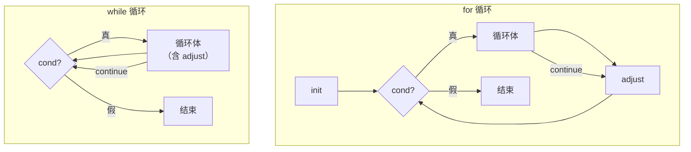

# 控制流与操作符

## 前置知识检查

> 开始前确认这几个问题你能回答，否则回头补前序课程。

1. 你能说出 C 的四种作用域和三种存储类型吗？→ 见 `lesson-01-program-structure.md`
2. 你知道 `const int *p` 和 `int * const p` 的区别吗？→ 见 `lesson-01-program-structure.md`
3. 你知道局部变量未初始化时值不确定（而静态变量默认为 0）吗？→ 见 `lesson-01-program-structure.md`

---

## 核心概念

### 1. 表达式语句与副作用

#### 是什么

C 没有"赋值语句"——赋值是一种**操作**，和加法、减法一样是表达式的一部分。你在表达式后面加一个分号 `;`，就把它变成了一条**表达式语句**（expression statement）。

```c
x = y + 3;    /* 这是"表达式语句"，不是"赋值语句" */
y + 3;        /* 合法！但没有意义——计算了结果却没保存 */
getchar();    /* 合法——读一个字符但丢弃返回值 */
printf("Hi"); /* 返回值（打印的字符数）被丢弃，但 printf 的打印动作是有用的 */
```

最后两条语句虽然丢弃了返回值，但函数执行过程中产生了可观察的效果——这就是**副作用**（side effect）。`printf` 的"副作用"是往屏幕打字，`getchar` 的"副作用"是从输入流读走一个字符。

C 中还有两种特殊语句：

- **空语句**：只有一个分号 `;`，什么也不做。适用于语法要求语句但不需要动作的场合
- **代码块**：花括号 `{ }` 包裹的声明和语句列表，可以在语法要求一条语句的地方放多条语句

#### 为什么重要

- 理解"赋值是表达式"是读懂 `while ((ch = getchar()) != EOF)` 这类惯用写法的前提
- 理解"副作用"是后续学习操作符求值顺序和未定义行为（UB）的基础——当多个副作用在同一表达式中出现且顺序不确定时，就是 UB

#### 代码演示

```c
/* expression_statement.c — 表达式语句与副作用演示 */
#include <stdio.h>

int main(void) {
    int x = 0, y = 5;

    /* 赋值是表达式，表达式有值：赋值表达式的值就是左操作数的新值 */
    int a = (x = y + 3);  /* x 得到 8，a 也得到 8 */
    printf("x = %d, a = %d\n", x, a);

    /* 链式赋值：从右往左结合 */
    int b, c;
    b = c = 42;  /* 先 c = 42（值为 42），再 b = 42 */
    printf("b = %d, c = %d\n", b, c);

    /* printf 的返回值是打印的字符数，通常被丢弃 */
    int chars_printed = printf("Hello!\n");
    printf("上一行打印了 %d 个字符\n", chars_printed);

    return 0;
}
```

```bash
gcc -std=c99 -Wall -Wextra -g -o expression_statement expression_statement.c
./expression_statement
```

输出：

```
x = 8, a = 8
b = 42, c = 42
Hello!
上一行打印了 7 个字符
```

#### 易错点

**❌ 错误：写了无副作用的表达式语句**

```c
/* no_effect.c — 无副作用的表达式语句 */
#include <stdio.h>

int main(void) {
    int x = 10, y = 20;
    x + y;       /* 计算了 30，然后丢弃——完全无意义 */
    x == 10;     /* 比较了一下，然后丢弃——可能是 x = 10 的笔误？ */
    printf("x = %d\n", x);
    return 0;
}
```

```bash
gcc -std=c99 -Wall -Wextra -g -o no_effect no_effect.c
# 编译器会警告：
# warning: statement with no effect [-Wunused-value]
# warning: statement has no effect [-Wunused-value]
```

**✅ 正确：只写有副作用的表达式语句**

```c
/* with_effect.c — 有副作用的表达式语句 */
#include <stdio.h>

int main(void) {
    int x = 10;
    x = x + 5;    /* 赋值是副作用 */
    x++;           /* ++ 是副作用 */
    printf("x = %d\n", x);  /* printf 的打印是副作用 */
    return 0;
}
```

```bash
gcc -std=c99 -Wall -Wextra -g -o with_effect with_effect.c
./with_effect
```

输出：

```
x = 16
```

---

### 2. 控制流语句

#### 是什么

C 的控制流语句和大多数语言类似，但有几处关键差异：

| 语句 | 语法 | 特别之处 |
|------|------|---------|
| `if`/`else` | `if (expr) stmt else stmt` | 用整型表示真假：0 为假，非零为真 |
| `while` | `while (expr) stmt` | 测试在前，可能一次都不执行 |
| `for` | `for (init; cond; adjust) stmt` | 三个表达式都可省略；continue 跳到 adjust |
| `do`-`while` | `do stmt while (expr);` | 循环体至少执行一次 |
| `switch` | `switch (expr) { case N: ... }` | **执行会贯穿 case 标签**（fall-through） |
| `break` | `break;` | 跳出最内层循环或 switch |
| `continue` | `continue;` | 跳过本次循环剩余部分 |
| `goto` | `goto label;` | 仅用于跳出多层嵌套循环 |

**switch 的 fall-through 是 C 最独特（也最容易出错）的控制流特性**：执行流从匹配的 case 标签进入后，会一直往下贯穿所有后续 case，直到遇到 `break` 或 switch 结束。

**for 循环中 continue 的行为和 while 不同**——这是另一个常见陷阱：



在 `for` 中，`continue` 跳到**调整部分**（adjust），然后再测试条件。在 `while` 中，`continue` 直接跳到**条件测试**，如果调整语句写在循环体里，它会被跳过。

#### 为什么重要

- switch 的 fall-through 在所有 C 程序中有 97% 需要每个 case 加 break，但剩下 3% 利用了 fall-through 特性（如字符分类计数）
- while 和 for 中 continue 的差异经常导致死循环 bug
- goto 虽然被普遍排斥，但在跳出多层嵌套循环时是唯一简洁的方案

#### 代码演示

**switch fall-through 演示：**

```c
/* switch_demo.c — switch fall-through 演示 */
#include <stdio.h>

int main(void) {
    int command = 2;

    printf("=== 没有 break 的 switch（fall-through）===\n");
    switch (command) {
        case 1:
            printf("case 1\n");
            /* 没有 break，继续执行下一个 case！ */
        case 2:
            printf("case 2\n");
            /* 没有 break，继续！ */
        case 3:
            printf("case 3\n");
    }
    /* command 是 2，但输出了 case 2 和 case 3 */

    printf("\n=== 有 break 的 switch ===\n");
    switch (command) {
        case 1:
            printf("case 1\n");
            break;
        case 2:
            printf("case 2\n");
            break;         /* ← 只输出 case 2 */
        case 3:
            printf("case 3\n");
            break;
        default:
            printf("unknown\n");
            break;         /* default 后也加 break，便于以后添加 case */
    }

    return 0;
}
```

```bash
gcc -std=c99 -Wall -Wextra -g -o switch_demo switch_demo.c
./switch_demo
```

输出：

```
=== 没有 break 的 switch（fall-through）===
case 2
case 3

=== 有 break 的 switch ===
case 2
```

**for vs while 中 continue 的差异：**

```c
/* continue_diff.c — for 和 while 中 continue 的区别 */
#include <stdio.h>

int main(void) {
    /* for 循环：continue 跳到调整部分（i++），不会死循环 */
    printf("for 循环：");
    for (int i = 0; i < 5; i++) {
        if (i == 2) continue;  /* 跳过 i==2，但 i++ 仍会执行 */
        printf("%d ", i);
    }
    printf("\n");

    /* while 循环：continue 跳到条件测试，跳过了 i++ */
    printf("while 循环（注意 2 被跳过）：");
    int i = 0;
    while (i < 5) {
        if (i == 2) {
            i++;       /* 必须在 continue 前手动调整，否则死循环！ */
            continue;
        }
        printf("%d ", i);
        i++;
    }
    printf("\n");

    return 0;
}
```

```bash
gcc -std=c99 -Wall -Wextra -g -o continue_diff continue_diff.c
./continue_diff
```

输出：

```
for 循环：0 1 3 4
while 循环（注意 2 被跳过）：0 1 3 4
```

> ➕ **C99 新特性：for 循环中声明变量**
>
> 原书基于 C89 标准，变量必须在代码块开头声明。C99 起允许在 `for` 的初始化部分直接声明变量：
>
> ```c
> /* C89 风格 */
> int i;
> for (i = 0; i < 10; i++) { ... }
>
> /* C99 风格（推荐）*/
> for (int i = 0; i < 10; i++) { ... }
> /* i 在 for 循环结束后不再可见 */
> ```
>
> C99 风格更好——`i` 的作用域被限制在 `for` 循环内部，不会意外污染外层作用域。本书使用 `-std=c99`，所有示例都采用这种风格。

#### 易错点

**❌ 错误：switch 忘写 break**

```c
/* switch_no_break.c — 忘写 break 的典型 bug */
#include <stdio.h>

int main(void) {
    int grade = 2;  /* 假设 1=优, 2=良, 3=及格 */

    switch (grade) {
        case 1:
            printf("优秀！\n");
        case 2:
            printf("良好！\n");
        case 3:
            printf("及格！\n");
    }
    /* grade 是 2，但输出了"良好！"和"及格！" */
    return 0;
}
```

```bash
gcc -std=c99 -Wall -Wextra -g -o switch_no_break switch_no_break.c
./switch_no_break
```

输出：

```
良好！
及格！
```

**✅ 正确：每个 case 加 break，有意 fall-through 时加 `/* FALL THROUGH */` 注释**

```c
/* switch_correct.c — 正确使用 break */
#include <stdio.h>

int main(void) {
    int grade = 2;

    switch (grade) {
        case 1:
            printf("优秀！\n");
            break;
        case 2:
            printf("良好！\n");
            break;
        case 3:
            printf("及格！\n");
            break;
        default:
            printf("未知等级\n");
            break;
    }
    return 0;
}
```

```bash
gcc -std=c99 -Wall -Wextra -g -o switch_correct switch_correct.c
./switch_correct
```

输出：

```
良好！
```

**❌ 错误：while 循环中 continue 跳过了调整**

```c
/* continue_bug.c — continue 导致死循环 */
#include <stdio.h>

int main(void) {
    int i = 0;
    while (i < 10) {
        if (i == 5) {
            continue;  /* 跳过了下面的 i++，i 永远是 5 → 死循环！ */
        }
        printf("%d ", i);
        i++;
    }
    return 0;
}
```

**✅ 正确：用 for 循环，或者在 continue 前调整**

```c
/* continue_fix.c — 用 for 循环避免问题 */
#include <stdio.h>

int main(void) {
    for (int i = 0; i < 10; i++) {
        if (i == 5) continue;  /* i++ 在调整部分，不会被跳过 */
        printf("%d ", i);
    }
    printf("\n");
    return 0;
}
```

```bash
gcc -std=c99 -Wall -Wextra -g -o continue_fix continue_fix.c
./continue_fix
```

输出：

```
0 1 2 3 4 6 7 8 9
```

---

### 3. 操作符分类

#### 是什么

C 的操作符按功能分为以下几大类：

| 类别 | 操作符 | 说明 |
|------|--------|------|
| 算术 | `+` `-` `*` `/` `%` | `%` 只用于整数 |
| 关系 | `>` `>=` `<` `<=` `!=` `==` | 结果是 `int`（0 或 1），不是布尔值 |
| 逻辑 | `&&` `||` `!` | **短路求值**：左操作数决定结果后不再求右操作数 |
| 位操作 | `&` `|` `^` `~` `<<` `>>` | 对整数的**各个位**进行操作 |
| 赋值 | `=` `+=` `-=` `*=` `/=` `%=` `<<=` `>>=` `&=` `^=` `|=` | 复合赋值：`a += b` 等价于 `a = a + (b)` |
| 单目 | `++` `--` `+` `-` `!` `~` `*` `&` `sizeof` `(type)` | 只接受一个操作数 |
| 条件 | `? :` | 三目操作符：`cond ? val1 : val2` |
| 逗号 | `,` | 从左到右求值，整个表达式的值是最后一个表达式的值 |
| 其他 | `[]` `()` `.` `->` | 下标引用、函数调用、结构成员访问（后续模块详讲） |

几个关键特性：

**短路求值**（short-circuit evaluation）：`&&` 和 `||` 会控制求值顺序。如果左操作数已经决定了整个表达式的值，右操作数就不会被求值。这不是优化，而是**语言保证**。

**前缀 vs 后缀 `++`/`--`**：
- `++a`（前缀）：先增加 `a`，返回增加**后**的值
- `a++`（后缀）：先复制 `a` 的值，增加 `a`，返回增加**前**的值
- 两种形式的结果都是值的**拷贝**，不是变量本身——所以 `++a = 10;` 是非法的

**布尔值**：C 没有布尔类型（C99 有 `_Bool`，但很少直接用），用整数表示真假。零是假，任何非零值都是真。但要注意：不同的非零值虽然都是"真"，但它们**不相等**。

#### 为什么重要

- **短路求值**是编写安全检查代码的关键模式：先检查边界，再访问数组
- `==` 和 `=` 只差一个字符但含义完全不同，是 C 新手最常犯的错误之一
- 逻辑操作符 `&&`/`||` 和位操作符 `&`/`|` 看起来像，但行为完全不同
- `++`/`--` 的前缀和后缀形式在复杂表达式中容易产生混淆

#### 代码演示

**短路求值防越界：**

```c
/* short_circuit.c — 短路求值安全检查 */
#include <stdio.h>

int main(void) {
    int arr[] = {10, 20, 30, 40, 50};
    int n = 5;
    int target = 30;
    int found = 0;

    for (int i = 0; i < 10; i++) {  /* 故意用 10，超过数组大小 */
        /* 短路求值保证：i >= n 时不会访问 arr[i] */
        if (i < n && arr[i] == target) {
            printf("找到 %d，位置 %d\n", target, i);
            found = 1;
            break;
        }
    }
    if (!found) {
        printf("未找到 %d\n", target);
    }

    return 0;
}
```

```bash
gcc -std=c99 -Wall -Wextra -g -o short_circuit short_circuit.c
./short_circuit
```

输出：

```
找到 30，位置 2
```

**前缀 vs 后缀 ++：**

```c
/* prefix_postfix.c — 前缀和后缀 ++ 的区别 */
#include <stdio.h>

int main(void) {
    int a = 10, b = 10;

    int c = ++a;  /* a 先变 11，c 得到 11 */
    int d = b++;  /* 先复制 b 的值 10 给 d，然后 b 变 11 */

    printf("a = %d, c = %d\n", a, c);  /* a=11, c=11 */
    printf("b = %d, d = %d\n", b, d);  /* b=11, d=10 */

    return 0;
}
```

```bash
gcc -std=c99 -Wall -Wextra -g -o prefix_postfix prefix_postfix.c
./prefix_postfix
```

输出：

```
a = 11, c = 11
b = 11, d = 10
```

**复合赋值简化位操作：**

```c
/* compound_assign.c — 复合赋值操作符 */
#include <stdio.h>

int main(void) {
    unsigned int flags = 0;

    /* 设置第 3 位（位编号从 0 开始） */
    flags |= 1 << 3;     /* 等价于 flags = flags | (1 << 3) */
    printf("设置第 3 位后: 0x%X (%u)\n", flags, flags);

    /* 设置第 0 位 */
    flags |= 1 << 0;
    printf("设置第 0 位后: 0x%X (%u)\n", flags, flags);

    /* 清除第 3 位 */
    flags &= ~(1 << 3);  /* 等价于 flags = flags & ~(1 << 3) */
    printf("清除第 3 位后: 0x%X (%u)\n", flags, flags);

    return 0;
}
```

```bash
gcc -std=c99 -Wall -Wextra -g -o compound_assign compound_assign.c
./compound_assign
```

输出：

```
设置第 3 位后: 0x8 (8)
设置第 0 位后: 0x9 (9)
清除第 3 位后: 0x1 (1)
```

#### 易错点

**❌ 错误：`==` 写成 `=`**

```c
/* eq_vs_assign.c — == 和 = 混淆 */
#include <stdio.h>

int main(void) {
    int x = 10;

    if (x = 5) {      /* 这是赋值！x 变成 5，表达式值为 5（非零=真） */
        printf("这里永远会执行，x 已经变成 %d\n", x);
    }
    /* 编译器会警告: suggest parentheses around assignment used as truth value */

    return 0;
}
```

```bash
gcc -std=c99 -Wall -Wextra -g -o eq_vs_assign eq_vs_assign.c
./eq_vs_assign
```

输出：

```
这里永远会执行，x 已经变成 5
```

**✅ 正确：使用 `==` 进行比较**

```c
/* eq_correct.c — 正确使用 == */
#include <stdio.h>

int main(void) {
    int x = 10;

    if (x == 5) {     /* 比较：x 是 10，不等于 5，条件为假 */
        printf("不会执行\n");
    } else {
        printf("x 是 %d，不是 5\n", x);
    }

    return 0;
}
```

```bash
gcc -std=c99 -Wall -Wextra -g -o eq_correct eq_correct.c
./eq_correct
```

输出：

```
x 是 10，不是 5
```

**❌ 错误：位操作符 `&` 和逻辑操作符 `&&` 混淆**

```c
/* bit_vs_logic.c — & 和 && 的区别 */
#include <stdio.h>

int main(void) {
    int a = 1, b = 2;

    /* 两个都是非零（"真"），所以逻辑 AND 为真 */
    printf("a && b = %d\n", a && b);  /* 1（真） */

    /* 但位 AND：0001 & 0010 = 0000 → 0（假！） */
    printf("a & b  = %d\n", a & b);   /* 0（假！） */

    /* 更危险的例子 */
    if (a & b) {
        printf("不会执行：位 AND 结果是 0\n");
    }
    if (a && b) {
        printf("会执行：逻辑 AND 结果是真\n");
    }

    return 0;
}
```

```bash
gcc -std=c99 -Wall -Wextra -g -o bit_vs_logic bit_vs_logic.c
./bit_vs_logic
```

输出：

```
a && b = 1
a & b  = 0
会执行：逻辑 AND 结果是真
```

#### ⭐ 深入：有符号右移是实现定义行为

> 以下内容为深层原理，理解它有助于加深认识，但不影响日常使用。跳过不影响后续学习。

对无符号整数执行右移 `>>` 时，C 标准保证执行**逻辑移位**（高位补 0）。但对有符号负数右移时，标准没有规定是逻辑移位还是**算术移位**（高位补符号位）。

```
无符号 10010110 >> 2 → 00100101 （逻辑移位，高位补 0）
有符号 10010110 >> 2 → 11100101 （算术移位，高位补 1）或 00100101（逻辑移位）
```

大多数现代编译器（包括 GCC）对有符号数执行算术移位，但这不是标准保证的。如果你的代码依赖移位行为，**使用无符号类型**来避免歧义。

---

### 4. 左值与右值

#### 是什么

**左值**（lvalue）和**右值**（rvalue）是 C 中表达式的两种分类：

- **左值**：标识一个**内存位置**的表达式，可以出现在赋值号 `=` 的左边
- **右值**：只代表一个**值**的表达式，不能出现在赋值号左边

```c
a = b + 25;
```

- `a` 是左值——它标识了一个可以存储结果的位置
- `b + 25` 是右值——它代表一个计算出来的值，但不对应特定的内存位置

关键规则：**左值可以当右值用（取出它存储的值），但右值不能当左值用（没有位置可以存东西）。**

哪些表达式是左值？

| 左值表达式 | 例子 | 说明 |
|-----------|------|------|
| 变量名 | `x` | 最简单的左值 |
| 解引用 | `*p` | 指针所指位置（module-01 详讲） |
| 下标引用 | `a[i]` | 数组元素位置（module-03 详讲） |
| 结构成员 | `s.member`、`p->member` | 结构体成员位置（module-05 详讲） |

哪些**不是**左值？

| 非左值 | 例子 | 原因 |
|--------|------|------|
| 字面量常量 | `42`、`3.14` | 常量没有可修改的位置 |
| 算术表达式 | `a + b` | 结果存在临时位置，无法引用 |
| 函数返回值 | `func()` | 返回的是值的拷贝 |
| `++a` 的结果 | `++a` | 返回的是 `a` 值的拷贝，不是 `a` 本身 |

#### 为什么重要

- 赋值号左边必须是左值，否则编译错误
- `++` 和 `--` 需要左值操作数（因为要修改变量的值）
- 理解左值是读懂指针表达式的前提——`*p` 是左值，所以 `*p = 10;` 合法
- module-01 中指针和间接访问会大量使用这个概念

#### 代码演示

```c
/* lvalue_rvalue.c — 左值与右值演示 */
#include <stdio.h>

int main(void) {
    int x = 10;
    int *p = &x;       /* &x 取左值 x 的地址 */

    /* 左值示例 */
    x = 42;            /* x 是左值：标识一个内存位置 */
    *p = 99;           /* *p 是左值：指针指向的位置 */

    int arr[3] = {1, 2, 3};
    arr[1] = 100;      /* arr[1] 是左值：数组第 2 个元素 */

    printf("x = %d, arr[1] = %d\n", x, arr[1]);

    /* 右值示例——以下都不能放在 = 左边 */
    /* 42 = x;          ❌ 编译错误：字面量不是左值 */
    /* x + y = 10;      ❌ 编译错误：表达式结果不是左值 */
    /* ++x = 10;        ❌ 编译错误：++x 返回的是值的拷贝 */

    /* 左值当右值用：取出存储的值 */
    int z = x;         /* x 作为右值，取出它的值 99 赋给 z */
    printf("z = %d\n", z);

    return 0;
}
```

```bash
gcc -std=c99 -Wall -Wextra -g -o lvalue_rvalue lvalue_rvalue.c
./lvalue_rvalue
```

输出：

```
x = 99, arr[1] = 100
z = 99
```

#### 易错点

**❌ 错误：对右值赋值**

```c
/* rvalue_error.c — 对右值赋值 */
#include <stdio.h>

int main(void) {
    int a = 10, b = 20;
    a + b = 30;    /* ❌ 编译错误：a + b 不是左值 */
    return 0;
}
```

```bash
gcc -std=c99 -Wall -Wextra -g -o rvalue_error rvalue_error.c
# error: lvalue required as left operand of assignment
```

**✅ 正确：只对左值赋值**

```c
/* lvalue_correct.c — 正确：赋值给左值 */
#include <stdio.h>

int main(void) {
    int a = 10, b = 20;
    int c = a + b;  /* a + b 是右值，赋给左值 c */
    printf("c = %d\n", c);
    return 0;
}
```

```bash
gcc -std=c99 -Wall -Wextra -g -o lvalue_correct lvalue_correct.c
./lvalue_correct
```

输出：

```
c = 30
```

---

### 5. 隐式类型转换

#### 是什么

当一个表达式中混合了不同类型的操作数时，C 会在运算前自动进行类型转换。这叫**隐式类型转换**（implicit type conversion），有两种主要机制：

**1. 整型提升（integral promotion）**

`char` 和 `short` 在参与运算前，会先被提升为 `int`（如果 `int` 能容纳其所有值）或 `unsigned int`。

```c
char a = 100, b = 100;
int result = a + b;  /* a 和 b 先提升为 int，再做加法 */
/* 结果是 200，不会因为 char 范围（-128~127）而溢出 */
```

**2. 寻常算术转换（usual arithmetic conversion）**

当两个操作数类型不同时，"较小"的类型自动转换为"较大"的类型：

```
int → unsigned int → long → unsigned long → long long → float → double → long double
                                                         ↑ 转换方向：向上转换
```

**3. 赋值时的截断**

将"较大"类型的值赋给"较小"类型的变量时，值会被截断：

```c
int x = 100000;
short s = x;     /* x 被截断，s 的值取决于 short 的大小 */
float f = 3.14;
int i = f;       /* 小数部分被舍弃，i == 3（不是四舍五入！） */
```

#### 为什么重要

- **signed/unsigned 混合比较**是最常见的隐式转换陷阱——`-1 < 1u` 的结果是 `false`
- `getchar()` 返回 `int` 而非 `char`，就是为了避免 `EOF` 被截断
- 浮点转整型时直接截断而非四舍五入，经常让人措手不及
- 整型溢出在有符号类型中是未定义行为，在无符号类型中是回绕（wrap around）

#### 代码演示

```c
/* implicit_conv.c — 隐式类型转换演示 */
#include <stdio.h>

int main(void) {
    /* 1. 整型提升 */
    char a = 100, b = 100;
    printf("char + char = %d（提升为 int 后运算，不溢出）\n", a + b);

    /* 2. 算术转换 */
    int i = 5;
    double d = 2.5;
    printf("int / double = %f（int 提升为 double）\n", i / d);

    /* 3. 整除 vs 浮点除法 */
    printf("5 / 2 = %d（整数除整数 → 整除）\n", 5 / 2);
    printf("5.0 / 2 = %f（有浮点数 → 浮点除法）\n", 5.0 / 2);

    /* 4. 赋值截断 */
    double pi = 3.14159;
    int truncated = pi;  /* 直接截断，不四舍五入 */
    printf("(int)3.14159 = %d（截断，不是四舍五入）\n", truncated);

    /* 5. signed vs unsigned 陷阱！ */
    int neg = -1;
    unsigned int pos = 1;
    if (neg < pos) {
        printf("-1 < 1u → 这里不会执行！\n");
    } else {
        printf("-1 >= 1u → 因为 -1 被转为无符号数 %u\n",
               (unsigned int)neg);
    }

    return 0;
}
```

```bash
gcc -std=c99 -Wall -Wextra -g -o implicit_conv implicit_conv.c
./implicit_conv
```

输出：

```
char + char = 200（提升为 int 后运算，不溢出）
int / double = 2.000000（int 提升为 double）
5 / 2 = 2（整数除整数 → 整除）
5.0 / 2 = 2.500000（有浮点数 → 浮点除法）
(int)3.14159 = 3（截断，不是四舍五入）
-1 >= 1u → 因为 -1 被转为无符号数 4294967295
```

#### 易错点

**❌ 错误：用 `char` 接收 `getchar()` 的返回值**

```c
/* getchar_bug.c — getchar 返回值截断 */
#include <stdio.h>

int main(void) {
    char ch;  /* 错误：应该用 int */
    int count = 0;
    /* EOF 通常是 -1，需要比 char 更大的类型才能区分 */
    while ((ch = getchar()) != EOF) {
        count++;
    }
    /* 在 unsigned char 平台上，EOF 被截断后永远不等于 EOF → 死循环
       在 signed char 平台上，值为 255（0xFF）的字节会被误判为 EOF */
    printf("读了 %d 个字符\n", count);
    return 0;
}
```

**✅ 正确：用 `int` 接收 `getchar()` 返回值**

```c
/* getchar_correct.c — 正确使用 getchar */
#include <stdio.h>

int main(void) {
    int ch;   /* int 能同时容纳所有 char 值和 EOF */
    int count = 0;
    while ((ch = getchar()) != EOF) {
        count++;
    }
    printf("读了 %d 个字符\n", count);
    return 0;
}
```

```bash
gcc -std=c99 -Wall -Wextra -g -o getchar_correct getchar_correct.c
echo "Hello" | ./getchar_correct
```

输出：

```
读了 6 个字符
```

> ➕ **显式强制类型转换**
>
> 当你**有意**要做类型转换时，用强制类型转换 `(type)` 告诉编译器"我知道我在做什么"：
>
> ```c
> int a = 300, b = 400;
> long c = (long)a * b;  /* 先把 a 转为 long，避免 int 乘法溢出 */
>
> double d = (double)5 / 2;  /* 5 转为 5.0，执行浮点除法 → 2.5 */
> ```
>
> 强制转换的优先级很高，`(float)a + b` 只转换 `a`，不转换 `a + b`。要转换整个表达式，需要加括号：`(float)(a + b)`。

---

### 6. 优先级与求值顺序

#### 是什么

C 表达式的求值由三个因素决定：

1. **优先级**（precedence）：决定操作符如何**聚组**（哪些操作数属于哪个操作符）
2. **结合性**（associativity）：决定同优先级操作符的聚组方向（左到右 or 右到左）
3. **求值顺序**（evaluation order）：操作数实际的计算顺序——**大多数操作符不保证求值顺序**

**优先级简记表（5 档记忆法）：**

```
┌─────────────────────────────────────────────────────┐
│  第 1 档：后缀/单目（最高）                          │
│  ()  []  ->  .  后缀++/--                           │
│  前缀++/--  !  ~  +  -  *  &  sizeof  (type)       │
├─────────────────────────────────────────────────────┤
│  第 2 档：算术                                       │
│  *  /  %    →    +  -    →    <<  >>                │
├─────────────────────────────────────────────────────┤
│  第 3 档：比较与位操作                               │
│  <  <=  >  >=   →   ==  !=                          │
│  &    →    ^    →    |                              │
├─────────────────────────────────────────────────────┤
│  第 4 档：逻辑与赋值                                 │
│  &&    →    ||    →    ?:    →    =  +=  -= ...     │
├─────────────────────────────────────────────────────┤
│  第 5 档：逗号（最低）                               │
│  ,                                                  │
└─────────────────────────────────────────────────────┘

记忆口诀：单目 > 算术 > 比较 > 逻辑赋值 > 逗号
拿不准就加括号——括号永远最高优先级。
```

**关键认知：优先级 ≠ 求值顺序。** 优先级只决定操作符如何聚组，不决定操作数的求值先后。只有 4 个操作符保证求值顺序：

| 操作符 | 保证 |
|--------|------|
| `&&` | 先左后右，左为假则不求右（短路） |
| `||` | 先左后右，左为真则不求右（短路） |
| `?:` | 先求条件，再根据结果只求一个分支 |
| `,` | 先左后右 |

其他所有操作符的操作数求值顺序都是**未指定的**。如果操作数有副作用，结果可能因编译器而异。

#### 为什么重要

- 记住完整的 15 级优先级表不现实，用 5 档记忆法覆盖 90% 的日常使用
- "优先级≠求值顺序"是写出 UB 表达式的根源——**在同一表达式中多次修改同一变量是 UB**
- `&&` 和 `||` 的短路特性不仅影响效率，还影响程序正确性

#### 代码演示

```c
/* precedence_demo.c — 优先级与求值顺序 */
#include <stdio.h>

int main(void) {
    /* 优先级示例：乘法先于加法 */
    int result = 2 + 3 * 4;     /* 3*4=12, 2+12=14 */
    printf("2 + 3 * 4 = %d\n", result);

    /* 结合性示例：赋值从右到左 */
    int a, b, c;
    a = b = c = 10;             /* c=10, b=10, a=10 */
    printf("a=%d, b=%d, c=%d\n", a, b, c);

    /* 结合性示例：减法从左到右 */
    int d = 10 - 3 - 2;        /* (10-3)-2 = 5，不是 10-(3-2)=9 */
    printf("10 - 3 - 2 = %d\n", d);

    /* 常见优先级陷阱：位操作 vs 比较 */
    int x = 1, y = 2;
    /* x & y == 0 被解析为 x & (y == 0)，因为 == 优先级高于 & */
    printf("x & y == 0 的结果: %d（不是你想的 (x&y)==0）\n", x & y == 0);
    printf("(x & y) == 0 的结果: %d（加括号才对）\n", (x & y) == 0);

    return 0;
}
```

```bash
gcc -std=c99 -Wall -Wextra -g -o precedence_demo precedence_demo.c
./precedence_demo
```

输出：

```
2 + 3 * 4 = 14
a=10, b=10, c=10
10 - 3 - 2 = 5
x & y == 0 的结果: 0（不是你想的 (x&y)==0）
(x & y) == 0 的结果: 1（加括号才对）
```

#### 易错点

**❌ 错误：在同一表达式中多次修改同一变量**

```c
/* undefined_order.c — 求值顺序不确定导致 UB */
#include <stdio.h>

int main(void) {
    int i = 5;

    /* ❌ UB：i 在同一表达式中被修改了两次 */
    /* 不同编译器、不同优化级别可能产生不同结果 */
    int result = i++ + ++i;
    printf("i++ + ++i = %d（结果不确定！）\n", result);

    /* ❌ 更极端的例子 */
    i = 10;
    /* i = i-- - --i * (i = -3) * i++ + ++i; */
    /* 原书中列举了 12 种编译器对这个表达式产生了 12 种不同结果 */

    return 0;
}
```

```bash
gcc -std=c99 -Wall -Wextra -g -o undefined_order undefined_order.c
# warning: operation on 'i' may be undefined [-Wsequence-point]
```

**✅ 正确：拆成多条语句，消除歧义**

```c
/* defined_order.c — 拆成独立语句 */
#include <stdio.h>

int main(void) {
    int i = 5;

    /* ✅ 每条语句只修改 i 一次，结果完全确定 */
    int a = i;   /* a = 5 */
    i++;         /* i = 6 */
    ++i;         /* i = 7 */
    int b = i;   /* b = 7 */
    int result = a + b;
    printf("result = %d（确定的结果）\n", result);  /* 12 */

    return 0;
}
```

```bash
gcc -std=c99 -Wall -Wextra -g -o defined_order defined_order.c
./defined_order
```

输出：

```
result = 12（确定的结果）
```

---

### 7. typedef

#### 是什么

`typedef` 为已有类型创建一个新名字。语法和变量声明完全相同，只是前面加上 `typedef` 关键字：

```c
/* 普通声明：ptr_to_char 是一个指向 char 的指针变量 */
char *ptr_to_char;

/* typedef 声明：ptr_to_char 是"指向 char 的指针"这个类型的新名字 */
typedef char *ptr_to_char;

/* 之后可以这样用 */
ptr_to_char a;  /* a 是一个 char * */
```

#### 为什么重要

- **简化复杂声明**：函数指针、指向数组的指针等复杂类型用 typedef 后可读性大幅提高
- **提高可移植性**：把平台相关的类型用 typedef 包装，修改时只改一处（如 `typedef unsigned int uint32_t;`）
- **增强可读性**：`typedef int (*compare_func)(const void *, const void *)` 比每次写完整声明清楚得多

#### 代码演示

```c
/* typedef_demo.c — typedef 基础用法 */
#include <stdio.h>

/* typedef 为类型起别名 */
typedef int Length;           /* Length 就是 int 的别名 */
typedef char *String;         /* String 就是 char * 的别名 */
typedef unsigned long size_type;

/* typedef 简化函数指针类型 */
typedef int (*CompareFunc)(int, int);

int ascending(int a, int b) {
    return a - b;  /* 正数表示 a > b */
}

int descending(int a, int b) {
    return b - a;
}

void sort_demo(int *arr, int n, CompareFunc cmp) {
    /* 简单冒泡排序 */
    for (int i = 0; i < n - 1; i++) {
        for (int j = 0; j < n - 1 - i; j++) {
            if (cmp(arr[j], arr[j + 1]) > 0) {
                int tmp = arr[j];
                arr[j] = arr[j + 1];
                arr[j + 1] = tmp;
            }
        }
    }
}

int main(void) {
    Length width = 100;
    String name = "Alice";
    size_type big_number = 123456789UL;

    printf("width = %d\n", width);
    printf("name = %s\n", name);
    printf("big_number = %lu\n", big_number);

    /* 函数指针通过 typedef 变得清晰 */
    int arr[] = {5, 2, 8, 1, 9};
    int n = sizeof(arr) / sizeof(arr[0]);

    sort_demo(arr, n, ascending);
    printf("升序: ");
    for (int i = 0; i < n; i++) printf("%d ", arr[i]);
    printf("\n");

    sort_demo(arr, n, descending);
    printf("降序: ");
    for (int i = 0; i < n; i++) printf("%d ", arr[i]);
    printf("\n");

    return 0;
}
```

```bash
gcc -std=c99 -Wall -Wextra -g -o typedef_demo typedef_demo.c
./typedef_demo
```

输出：

```
width = 100
name = Alice
big_number = 123456789
升序: 1 2 5 8 9
降序: 9 8 5 2 1
```

#### 易错点

**❌ 错误：用 `#define` 代替 typedef 定义指针类型**

```c
/* define_vs_typedef.c — #define 的指针陷阱 */
#include <stdio.h>

#define D_PTR_CHAR char *
typedef char *T_PTR_CHAR;

int main(void) {
    /* #define 版本：文本替换为 char * a, b; → a 是 char *，b 只是 char！ */
    D_PTR_CHAR a, b;
    /* 展开后：char * a, b; → a 是指针，b 是字符 */

    /* typedef 版本：a2 和 b2 都是 char * */
    T_PTR_CHAR a2, b2;

    printf("sizeof(a)  = %zu（指针）\n", sizeof(a));
    printf("sizeof(b)  = %zu（char！不是指针！）\n", sizeof(b));
    printf("sizeof(a2) = %zu（指针）\n", sizeof(a2));
    printf("sizeof(b2) = %zu（指针）\n", sizeof(b2));

    return 0;
}
```

```bash
gcc -std=c99 -Wall -Wextra -g -o define_vs_typedef define_vs_typedef.c
./define_vs_typedef
```

在 64 位系统上输出：

```
sizeof(a)  = 8（指针）
sizeof(b)  = 1（char！不是指针！）
sizeof(a2) = 8（指针）
sizeof(b2) = 8（指针）
```

**✅ 正确：用 typedef 定义指针类型别名**

```c
/* typedef_pointer.c — typedef 正确处理指针 */
#include <stdio.h>

typedef char *String;

int main(void) {
    String s1 = "Hello", s2 = "World";  /* 两个都是 char * */
    printf("%s %s\n", s1, s2);
    return 0;
}
```

```bash
gcc -std=c99 -Wall -Wextra -g -o typedef_pointer typedef_pointer.c
./typedef_pointer
```

输出：

```
Hello World
```

---

## 概念串联

本课 7 个概念的逻辑关系：

```
表达式语句与副作用（C 的基本执行单元是什么）
    ↓
控制流语句（如何控制执行顺序）
    ↓
操作符分类（表达式由哪些操作符组成）
    ↓
左值与右值（哪些表达式能被赋值）
    ↓
隐式类型转换（混合类型运算时怎么自动转换）
    ↓
优先级与求值顺序（复杂表达式怎么聚组和求值）
    ↓
typedef（如何为类型起别名，简化复杂声明）
```

**与前课的衔接**：lesson-01 教了数据类型、变量声明、作用域。本课的操作符操作这些数据，控制流决定程序走向，左值/右值概念桥接了"变量"和"表达式"。隐式转换发生在不同类型的变量参与运算时。

**与后续课程的衔接**：
- module-01（指针基础）会大量使用左值概念——`*p` 是左值，`&x` 取左值地址
- module-02（函数）会用到表达式语句（函数调用就是表达式）和 typedef（简化函数指针类型）
- module-03（数组）的下标引用 `a[i]` 是左值，也涉及指针算术的优先级

---

## 常见陷阱清单

| # | 陷阱 | 症状 | 原因 | 修复 |
|---|------|------|------|------|
| 1 | switch 忘写 break | case 之后的代码全部执行（fall-through） | switch 执行流贯穿 case 标签，break 是手动加的 | 每个 case 末尾加 break，有意 fall-through 加注释 |
| 2 | `==` 写成 `=` | if 条件永远为真（或永远为假） | 赋值是合法的表达式，非零值为真 | 用 `==` 比较；开启 `-Wall` 检测赋值出现在条件中 |
| 3 | 位操作符 `&`/`|` 与逻辑操作符 `&&`/`||` 混淆 | 条件判断结果错误 | 位操作对每个位运算，逻辑操作对真/假运算 | 逻辑判断用 `&&`/`||`，按位操作才用 `&`/`|` |
| 4 | `getchar()` 返回值存入 `char` | EOF 检测失败，死循环或提前退出 | `char` 无法区分 EOF（-1）和正常字符 | 用 `int` 接收 `getchar()` 返回值 |
| 5 | signed/unsigned 混合比较 | `-1 < 1u` 结果为 false | signed 被隐式转为 unsigned，-1 变成很大的数 | 避免混合比较，或显式转换后比较 |
| 6 | 同一表达式多次修改同一变量 | 不同编译器/优化级别结果不同 | C 标准未定义操作数求值顺序，这是 UB | 拆成多条语句，每条只修改一次 |
| 7 | while 循环中 continue 跳过调整 | 循环变量不增加，死循环 | continue 跳到条件测试，不经过循环体末尾的调整 | 用 for 循环；或在 continue 前手动调整 |

---

## 动手练习提示

### 练习 1：switch 计数器

编写一个程序，从标准输入读取字符直到 EOF，统计字母、数字和空白字符（空格、制表符、换行符）的个数。用 switch 语句进行分类。

- 思路提示：对空白字符的三种情况，可以利用 fall-through 让它们共享一个计数器
- 容易卡住的地方：`getchar()` 返回 `int`，不是 `char`

### 练习 2：优先级实验

写一个程序验证以下表达式的结果，先自己手算，再运行对比：
- `2 + 3 * 4`
- `2 * 3 + 4 * 5`
- `1 << 2 + 3`（移位和加法的优先级谁高？）
- `3 & 4 == 4`（位 AND 和等于的优先级谁高？）

- 思路提示：在每个表达式后面加上你认为等价的带括号版本，比较两者的结果
- 容易卡住的地方：移位操作符的优先级低于加法！

### 练习 3：typedef 练习

用 typedef 定义以下类型别名，并声明对应的变量：
1. `IntArray10`：包含 10 个 int 的数组类型
2. `FuncPtr`：指向接受两个 int 返回 int 的函数的指针类型

- 思路提示：先写出不用 typedef 的声明（如 `int arr[10];`），再在前面加 typedef
- 容易卡住的地方：数组的 typedef 写法 `typedef int IntArray10[10];`

---

## 自测题

> 不给答案，动脑想完再往下学。

1. 为什么 `char ch; while ((ch = getchar()) != EOF)` 在某些平台上会导致死循环？应该怎么修？

2. 表达式 `a + b * c` 中，`*` 一定在 `+` 之前求值吗？表达式 `f() + g() * h()` 中，三个函数的调用顺序确定吗？为什么这很重要？

3. `#define PTR char *` 和 `typedef char *PTR;` 都定义了指针类型别名，但 `PTR a, b;` 的效果不同——区别是什么？为什么？

---

## 补充资源

| 资源 | 类型 | 说明 |
|------|------|------|
| [C Operator Precedence - cppreference.com](https://en.cppreference.com/w/c/language/operator_precedence.html) | 官方文档 | C 操作符优先级权威参考表 |
| [Implicit Type Conversion in C - GeeksforGeeks](https://www.geeksforgeeks.org/c/implicit-type-conversion-in-c-with-examples/) | 文章 | 隐式类型转换详解，含代码示例 |
| [C语言运算符优先级和结合性 - C语言中文网](https://c.biancheng.net/view/161.html) | 教程 | 中文优先级表，适合对照记忆 |
| [理解 C/C++ 中的左值和右值 - nettee](https://nettee.github.io/posts/2018/Understanding-lvalues-and-rvalues-in-C-and-C/) | 博客 | 中文左值右值详解，清晰易懂 |
| [Operator Precedence and Associativity - GeeksforGeeks](https://www.geeksforgeeks.org/c/operator-precedence-and-associativity-in-c/) | 文章 | 英文优先级与结合性详解 |
