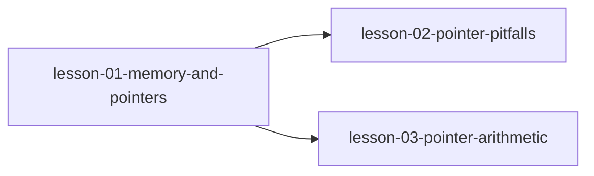

# MODULE.md — 指针基础

## 模块信息
| 字段 | 值 |
|------|---|
| 模块编号 | module-01 |
| 模块名称 | 指针基础 |
| 原书章节 | Ch 6 |
| 课程数量 | 3 |
| 预计总时长 | 3 小时 |

---
## 模块目标
学完本模块后，你应该能够：
1. 理解内存模型和指针的本质
2. 能正确使用指针并避免常见陷阱
3. 掌握指针运算规则

---
## 课程列表
| # | 课程文件 | 标题 | 核心概念 | 状态 |
|---|---------|------|---------|------|
| 1 | `lesson-01-memory-and-pointers.md` | 内存模型与指针本质 | 内存地址、指针变量、间接访问、解引用 | ⬜ |
| 2 | `lesson-02-pointer-pitfalls.md` | 指针常见陷阱 | NULL 指针、野指针、未初始化指针、类型安全 | ⬜ |
| 3 | `lesson-03-pointer-arithmetic.md` | 指针运算 | 指针加减、指针比较、指针与整数运算规则 | ⬜ |

---
## 前置模块
- [module-00-c-basics](../module-00-c-basics/MODULE.md) — C 程序基本结构、操作符和控制流基础

---
## 模块内课程依赖

---
## 关键术语预览
| 术语 | 英文 | 首次出现课程 |
|------|------|------------|
| 指针 | pointer | lesson-01 |
| 间接访问 | indirection | lesson-01 |
| 解引用 | dereference | lesson-01 |
| NULL 指针 | NULL pointer | lesson-02 |
| 指针运算 | pointer arithmetic | lesson-03 |
