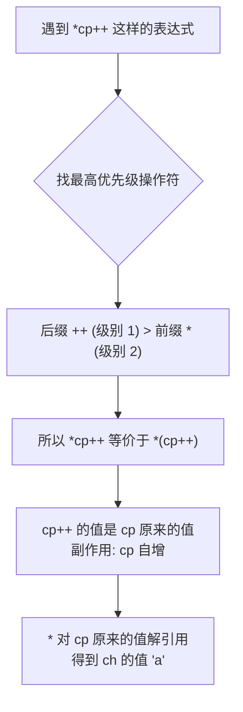

# 指针陷阱与表达式

## 前置知识检查

> 开始前确认这几个问题你能回答，否则回头补前序课程。

1. `int *p = &a;` 中，`p` 的值是什么？`*p` 的值是什么？→ 见 [lesson-01-memory-and-pointers](lesson-01-memory-and-pointers.md)
2. `&` 和 `*` 是什么关系？`*(&a)` 等于什么？→ 见 [lesson-01-memory-and-pointers](lesson-01-memory-and-pointers.md)
3. 什么是左值？`*p` 是左值吗？→ 见 [lesson-02-control-and-operators](../module-00-c-basics/lesson-02-control-and-operators.md) + lesson-01

---

## 核心概念

### 1. 未初始化指针与 NULL 指针

#### 是什么

lesson-01 提到过：声明指针时如果不初始化，指针变量中存的是**垃圾值**——一个随机的地址。对它解引用就是未定义行为（UB）。

原书 §6.5 把这个问题总结为三种后果，我们在 lesson-01 已经列出。本课深入讨论：怎么**系统性地避免**这类问题。

C 标准提供了一个约定：**NULL 指针**——一个特殊的指针值，表示"当前不指向任何东西"。

```c
int *p = NULL;   /* p 明确表示：我现在不指向任何有效数据 */
```

`NULL` 是一个宏，在 `<stdio.h>`、`<stdlib.h>`、`<stddef.h>` 等头文件中定义，通常展开为 `((void *)0)` 或 `0`。在源代码中，你用 `0` 或 `NULL` 给指针赋值都表示空指针。

三种指针状态的内存对比：

```
正常指针                  NULL 指针                未初始化指针
+------+                 +------+                 +------+
|  p1  | --→ [42]        |  p2  | --→ ⊥ (无)     |  p3  | --→ ???
+------+    (有效数据)    +------+    (明确为空)    +------+    (垃圾地址)
  安全                      可检测                    危险！
```

- **正常指针**：指向有效数据，可以安全解引用
- **NULL 指针**：明确表示"空"，解引用会崩溃但**可预测**（段错误），且可以用 `if (p != NULL)` 检测
- **未初始化指针**：完全不可预测，可能崩溃也可能静默破坏数据——**最危险的情况**

#### 为什么重要

NULL 指针是 C 编程中最重要的防御工具之一。它的典型用途：

1. **函数返回值**：查找失败返回 NULL，查找成功返回指向结果的指针
2. **链表尾部**：链表最后一个节点的 `next` 指针设为 NULL，表示链表结束
3. **可选参数**：某个指针参数传 NULL 表示"不需要这个功能"

原书 §6.6 有一个重要的设计提示：用一个指针同时表示"是否找到"和"找到了谁"，虽然方便但违背了软件工程原则。在大型程序中，更安全的做法是用两个独立的值——一个表示状态，一个表示结果。

#### 代码演示

```c
#include <stdio.h>
#include <stdlib.h>  /* NULL */

/* 在数组中查找目标值，返回指向该元素的指针，未找到返回 NULL */
int *find_value(int arr[], int size, int target) {
    for (int i = 0; i < size; i++) {
        if (arr[i] == target) {
            return &arr[i];  /* 找到：返回元素地址 */
        }
    }
    return NULL;  /* 未找到：返回 NULL */
}

int main(void) {
    int data[] = {10, 20, 30, 40, 50};
    int size = 5;

    /* 查找存在的值 */
    int *result = find_value(data, size, 30);
    if (result != NULL) {
        printf("找到了: %d (地址: %p)\n", *result, (void *)result);
    } else {
        printf("未找到\n");
    }

    /* 查找不存在的值 */
    result = find_value(data, size, 99);
    if (result != NULL) {
        printf("找到了: %d\n", *result);
    } else {
        printf("未找到 99\n");
    }

    /* 演示 NULL 的值 */
    printf("\nNULL 的值: %p\n", (void *)NULL);  /* 通常输出 (nil) 或 0x0 */
    printf("NULL == 0 ? %s\n", (NULL == 0) ? "是" : "否");  /* 是 */

    return 0;
}
```

```bash
gcc -std=c99 -Wall -Wextra -g -o null_demo null_demo.c
./null_demo
```

输出：

```
找到了: 30 (地址: 0x7ffd...08)
未找到 99

NULL 的值: (nil)
NULL == 0 ? 是
```

当指针崩溃时，用 gdb 定位问题非常方便。下面演示如何用 gdb 调试一个 NULL 指针解引用：

```c
#include <stdio.h>

int main(void) {
    int *p = NULL;
    printf("即将解引用 NULL...\n");
    *p = 42;  /* 段错误！ */
    return 0;
}
```

```bash
gcc -std=c99 -Wall -Wextra -g -o crash crash.c
gdb ./crash
```

在 gdb 中：

```
(gdb) run
即将解引用 NULL...
Program received signal SIGSEGV, Segmentation fault.
0x... in main () at crash.c:5
5	    *p = 42;
(gdb) print p
$1 = (int *) 0x0            ← p 是 NULL！
(gdb) backtrace
#0  0x... in main () at crash.c:5
```

gdb 六个最常用命令：

| 命令 | 缩写 | 作用 |
|------|------|------|
| `run` | `r` | 运行程序 |
| `break main` | `b main` | 在 main 函数设断点 |
| `next` | `n` | 执行下一行（不进入函数） |
| `step` | `s` | 执行下一行（进入函数） |
| `print p` | `p p` | 打印变量 p 的值 |
| `backtrace` | `bt` | 显示调用栈 |

➕ **原书未提及**：C23 标准引入了 `nullptr` 关键字（类似 C++ 的 `nullptr`），类型为 `nullptr_t`，比宏 `NULL` 更类型安全。但我们使用 C99 标准，目前用 `NULL` 即可。了解这个趋势就好。

#### 易错点

❌ **错误：解引用 NULL 指针**

```c
#include <stdio.h>

int main(void) {
    int *p = NULL;

    /* 忘记检查就直接用了！ */
    printf("值是: %d\n", *p);  /* 段错误！程序崩溃 */

    return 0;
}
```

```bash
gcc -std=c99 -Wall -Wextra -g -o null_crash null_crash.c
./null_crash
# 输出: Segmentation fault (core dumped)
```

✅ **正确：使用前检查 NULL**

```c
#include <stdio.h>

int main(void) {
    int *p = NULL;

    /* 先检查再使用 */
    if (p != NULL) {
        printf("值是: %d\n", *p);
    } else {
        printf("p 是 NULL，不能解引用\n");
    }

    /* 更简洁的写法（C 中 NULL 等于 0，即"假"）*/
    if (p) {
        printf("p 有效\n");
    } else {
        printf("p 为空\n");
    }

    return 0;
}
```

```bash
gcc -std=c99 -Wall -Wextra -g -o null_check null_check.c
./null_check
```

---

### 2. 指针与左值

#### 是什么

lesson-01 建立了一个概念：`*p` 可以出现在赋值号左边（左值），也可以出现在右边（右值）。但不是所有包含 `*` 的表达式都是左值。原书 §6.7 给了一个清晰的判断规则：

**间接访问操作符 `*` 的操作数是一个右值（地址），但 `*` 产生的结果是一个左值（可赋值的内存位置）。**

给定：

```c
int a;
int *d = &a;
```

| 表达式 | 是否左值 | 指定的位置 | 说明 |
|--------|---------|----------|------|
| `a` | 是 | a 本身 | 变量名是左值 |
| `d` | 是 | d 本身 | 指针变量也是左值（可以改变指向） |
| `*d` | 是 | a（d 指向的位置）| 间接访问的结果是左值 |

关键操作：

```c
*d = 10 - *d;   /* 合法：左边的 *d 是左值（写入 a），右边的 *d 是右值（读取 a 的值）*/
d = 10 - *d;    /* 非法！10 - *d 的结果是 int，不能赋给 int * 类型的 d */
```

第一条语句包含**两个**间接访问：右边的 `*d` 作为右值使用（读取 d 所指向位置的值），左边的 `*d` 作为左值使用（写入 d 所指向的位置）。

第二条语句试图把一个整型计算结果赋给指针变量——类型不匹配，编译器会报警告。

#### 为什么重要

理解左值规则能帮你：
1. 快速判断一个表达式能否放在 `=` 左边
2. 理解编译器的报错信息（"lvalue required as left operand of assignment"）
3. 为后面学习更复杂的指针表达式（概念 4）打下基础

#### 代码演示

```c
#include <stdio.h>

int main(void) {
    int a = 100;
    int *d = &a;

    printf("初始: a = %d, *d = %d\n", a, *d);

    /* *d 作为左值：通过 d 修改 a */
    *d = 10 - *d;    /* 右边 *d 读 a 的值(100)，左边 *d 写入 10-100=-90 */
    printf("*d = 10 - *d 后: a = %d\n", a);  /* -90 */

    /* d 作为左值：改变 d 的指向 */
    int b = 42;
    d = &b;           /* d 现在指向 b，不再指向 a */
    printf("d = &b 后: *d = %d (b 的值)\n", *d);  /* 42 */
    printf("a 不受影响: a = %d\n", a);  /* 仍然是 -90 */

    /* 同一条语句中 *d 既是左值又是右值 */
    *d = *d + 8;     /* 读 b 的值(42)，加 8，写回 b */
    printf("*d = *d + 8 后: b = %d\n", b);  /* 50 */

    return 0;
}
```

```bash
gcc -std=c99 -Wall -Wextra -g -o lvalue lvalue.c
./lvalue
```

输出：

```
初始: a = 100, *d = 100
*d = 10 - *d 后: a = -90
d = &b 后: *d = 42 (b 的值)
a 不受影响: a = -90
*d = *d + 8 后: b = 50
```

#### 易错点

❌ **错误：把非左值表达式放在赋值号左边**

```c
#include <stdio.h>

int main(void) {
    int a = 5;
    int *p = &a;

    /* p + 1 是一个右值（地址计算结果），不能被赋值 */
    /* p + 1 = &b; */  /* 编译错误: lvalue required */

    /* &a 是一个右值（地址值），不能被赋值 */
    /* &a = &b; */     /* 编译错误: lvalue required */

    /* 但 *(p + 0) 是左值！ */
    *(p + 0) = 999;    /* 等价于 *p = 999，修改 a */
    printf("a = %d\n", a);  /* 999 */

    return 0;
}
```

```bash
gcc -std=c99 -Wall -Wextra -g -o lvalue_err lvalue_err.c
./lvalue_err
```

✅ **判断规则**：`*` 操作符的结果是左值（因为它指定了一个内存位置），但 `&` 操作符和算术运算的结果是右值（它们产生的是一个值，不标识任何存储位置）。

---

### 3. 指针的指针

#### 是什么

指针变量本身也是变量，也有地址。所以**另一个指针可以指向它**——这就是**指针的指针**，也叫二级指针。

```c
int a = 12;
int *b = &a;     /* b 指向 a */
int **c = &b;    /* c 指向 b */
```

在内存中：

```
变量名   类型      地址      值           指向
+-----+ int    0x1000  +---------+
|  a  |                |   12    |
+-----+                +---------+
                            ↑
+-----+ int *  0x1008  +---------+
|  b  |                | 0x1000  | ----→ a
+-----+                +---------+
                            ↑
+-----+ int ** 0x1010  +---------+
|  c  |                | 0x1008  | ----→ b
+-----+                +---------+
```

逐层解引用：

| 表达式 | 等价于 | 值 | 类型 |
|--------|--------|-----|------|
| `a` | — | 12 | `int` |
| `b` | `&a` | a 的地址 | `int *` |
| `*b` | `a` | 12 | `int` |
| `c` | `&b` | b 的地址 | `int **` |
| `*c` | `b`（即 `&a`）| a 的地址 | `int *` |
| `**c` | `*b`（即 `a`）| 12 | `int` |

原书表 6.1 的核心结论：**每加一层 `*`，就跟随一层箭头。** `*c` 沿着 c 的箭头到达 b，`**c` 再沿着 b 的箭头到达 a。

#### 为什么重要

指针的指针在以下场景中必不可少：

1. **函数修改指针参数**：如果函数需要改变调用者的指针（不是改变指针指向的数据，而是改变指针本身指向谁），必须传 `int **`
2. **链表头插入**：链表头指针可能被修改，传 `Node **head` 比传 `Node *head` 更优雅（module-07 详解）
3. **命令行参数**：`main(int argc, char **argv)` 中 `argv` 就是指针的指针（module-08 详解）

#### 代码演示

```c
#include <stdio.h>

int main(void) {
    int a = 12;
    int *b = &a;
    int **c = &b;

    printf("=== 三层关系 ===\n");
    printf("a  = %d\n", a);                   /* 12 */
    printf("b  = %p (a 的地址)\n", (void *)b);
    printf("*b = %d (a 的值)\n", *b);          /* 12 */
    printf("c  = %p (b 的地址)\n", (void *)c);
    printf("*c = %p (b 的值 = a 的地址)\n", (void *)*c);
    printf("**c= %d (a 的值)\n", **c);         /* 12 */

    /* 通过二级指针修改 a 的值 */
    **c = 99;
    printf("\n执行 **c = 99 后: a = %d\n", a);  /* 99 */

    /* 通过二级指针改变 b 的指向 */
    int x = 777;
    *c = &x;    /* *c 就是 b，所以 b 现在指向 x */
    printf("\n执行 *c = &x 后:\n");
    printf("b 现在指向 x: *b = %d\n", *b);     /* 777 */
    printf("a 不受影响: a = %d\n", a);          /* 99 */
    printf("**c = %d\n", **c);                  /* 777 */

    return 0;
}
```

```bash
gcc -std=c99 -Wall -Wextra -g -o pp pp.c
./pp
```

输出：

```
=== 三层关系 ===
a  = 12
b  = 0x7ffd...1c (a 的地址)
*b = 12 (a 的值)
c  = 0x7ffd...10 (b 的地址)
*c = 0x7ffd...1c (b 的值 = a 的地址)
**c= 12 (a 的值)

执行 **c = 99 后: a = 99

执行 *c = &x 后:
b 现在指向 x: *b = 777
a 不受影响: a = 99
**c = 777
```

#### 易错点

❌ **错误：层级搞混——用 `*c` 当 int 值**

```c
#include <stdio.h>

int main(void) {
    int a = 12;
    int *b = &a;
    int **c = &b;

    /* 想打印 a 的值，但少写了一个 * */
    printf("值: %p\n", (void *)*c);  /* 打印的是地址，不是 12！ */
    printf("值: %d\n", **c);         /* 这才是 12 */

    return 0;
}
```

```bash
gcc -std=c99 -Wall -Wextra -g -o pp_trap pp_trap.c
./pp_trap
```

✅ **正确：逐层画图，数清 `*` 的个数**

记住规则：
- `c` 是 `int **`（二级指针），值是 b 的地址
- `*c` 是 `int *`（一级指针），值是 a 的地址
- `**c` 是 `int`，值是 a 的值

每加一个 `*`，类型"降"一级。`int **` → `*` → `int *` → `*` → `int`。

---

### 4. 指针表达式

#### 是什么

原书 §6.11 是这本书最经典的内容之一：通过一组系统化的例子，教你分析各种指针表达式作为右值和左值时的行为。

给定声明：

```c
char ch = 'a';
char *cp = &ch;
```

我们从简单到复杂，分三组分析。

**第一组：基础表达式**

| 表达式 | 右值（值是什么） | 是否左值 | 说明 |
|--------|---------------|---------|------|
| `ch` | `'a'` | 是 | 变量本身 |
| `&ch` | ch 的地址 | 否 | `&` 产生地址值，不标识位置 |
| `cp` | ch 的地址 | 是 | 指针变量 |
| `&cp` | cp 的地址 | 否 | 同上理由 |
| `*cp` | `'a'` | 是 | 间接访问产生左值 |

**第二组：算术表达式**

| 表达式 | 右值 | 是否左值 | 说明 |
|--------|------|---------|------|
| `*cp + 1` | `'b'`（`'a'` + 1）| 否 | 先解引用得到 `'a'`，再加 1，结果是算术值 |
| `*(cp + 1)` | ch 后面那个字节的值 | 是 | 先移动指针，再解引用。**但这里访问了 ch 后面的未知内存，不安全！** |

注意 `*cp + 1` 和 `*(cp + 1)` 的区别：`*` 的优先级高于 `+`，所以 `*cp + 1` 是 `(*cp) + 1`（先解引用再加 1），而 `*(cp + 1)` 用括号强制先做指针加法。

**第三组：自增与解引用的组合（核心难点）**

这是最容易搞混的部分。关键前提：**后缀 `++` 的优先级（级别 1）高于前缀 `*`（级别 2）。**



逐个分析：

| 表达式 | 等价于 | 表达式的值 | 副作用 | 是否左值 |
|--------|--------|----------|--------|---------|
| `++cp` | — | cp+1（新位置的地址）| cp 自增 | 否 |
| `cp++` | — | cp 原来的值（ch 的地址）| cp 自增 | 否 |
| `*++cp` | `*(++cp)` | ch 后面那个字节的值 | cp 先自增 | 是 |
| `*cp++` | `*(cp++)` | ch 的值 `'a'` | cp 后自增 | 是（ch 的位置）|
| `++*cp` | `++(*cp)` | `'b'`（`'a'+1`）| ch 自增为 `'b'` | 否 |
| `(*cp)++` | — | `'a'`（原值）| ch 自增为 `'b'` | 否 |

**最常用的是 `*cp++`**：先取当前位置的值，然后指针移到下一个位置。这个模式在遍历字符串时无处不在：

```c
while (*cp++) {
    /* 处理每个字符 */
}
```

#### 为什么重要

指针与 `++` 的组合是 C 代码中最常见的惯用法。如果你看到 `*p++` 不能立即判断它的含义，阅读任何 C 源码都会很吃力。标准库函数的实现、Linux 内核代码、各种开源项目中随处可见这种模式。

#### 代码演示

```c
#include <stdio.h>

int main(void) {
    /* ========== 第一组：基础 ========== */
    char ch = 'a';
    char *cp = &ch;

    printf("=== 基础 ===\n");
    printf("ch  = '%c'\n", ch);             /* 'a' */
    printf("*cp = '%c'\n", *cp);            /* 'a' */
    printf("*cp + 1 = '%c'\n", *cp + 1);   /* 'b' (字符 'a' + 1) */

    /* ========== 第二组：*cp++ vs (*cp)++ ========== */
    printf("\n=== *cp++ (最常用) ===\n");
    ch = 'a';
    cp = &ch;

    char result = *cp++;
    /* *cp++ 等价于 *(cp++)：
       1. cp++ 的值是 cp 原来的值（&ch）
       2. * 对这个值解引用，得到 ch = 'a'
       3. 副作用：cp 自增，现在指向 ch 后面的位置 */
    printf("*cp++ 的值: '%c'\n", result);  /* 'a' */
    printf("cp 现在指向 ch 之后（已经移走了）\n");

    printf("\n=== (*cp)++ ===\n");
    cp = &ch;  /* 重置 */
    ch = 'a';

    result = (*cp)++;
    /* (*cp)++ 等价于 ch++：
       1. *cp 解引用得到 ch
       2. 后缀 ++ 返回 ch 的原值 'a'
       3. 副作用：ch 自增变为 'b'
       注意：cp 不动！ */
    printf("(*cp)++ 的值: '%c'\n", result);  /* 'a' (原值) */
    printf("ch 变成了: '%c'\n", ch);          /* 'b' (被自增了) */
    printf("cp 没动: *cp = '%c'\n", *cp);     /* 'b' */

    /* ========== 第三组：++*cp vs *++cp ========== */
    printf("\n=== ++*cp ===\n");
    cp = &ch;
    ch = 'a';

    result = ++*cp;
    /* ++*cp 等价于 ++(*cp) 等价于 ++ch：
       1. *cp 解引用得到 ch
       2. 前缀 ++ 先自增 ch，返回新值
       注意：cp 不动！ */
    printf("++*cp 的值: '%c'\n", result);  /* 'b' (新值) */
    printf("ch 变成了: '%c'\n", ch);        /* 'b' */

    return 0;
}
```

```bash
gcc -std=c99 -Wall -Wextra -g -o ptrexpr ptrexpr.c
./ptrexpr
```

输出：

```
=== 基础 ===
ch  = 'a'
*cp = 'a'
*cp + 1 = 'b'

=== *cp++ (最常用) ===
*cp++ 的值: 'a'
cp 现在指向 ch 之后（已经移走了）

=== (*cp)++ ===
(*cp)++ 的值: 'a'
ch 变成了: 'b'
cp 没动: *cp = 'b'

=== ++*cp ===
++*cp 的值: 'b'
ch 变成了: 'b'
```

实际应用——用 `*src++` 遍历复制字符串：

```c
#include <stdio.h>

/* 简化版 strcpy */
void my_strcpy(char *dst, const char *src) {
    while ((*dst++ = *src++) != '\0') {
        /* *src++ 取源字符并移动 src
           *dst++ 写入目标并移动 dst
           赋值表达式的值是写入的字符
           遇到 '\0' 时停止 */
    }
}

int main(void) {
    char source[] = "Hello";
    char dest[10];

    my_strcpy(dest, source);
    printf("复制结果: \"%s\"\n", dest);  /* "Hello" */

    return 0;
}
```

```bash
gcc -std=c99 -Wall -Wextra -g -o strcpy_demo strcpy_demo.c
./strcpy_demo
```

这就是 C 标准库 `strcpy` 的核心逻辑——一行 `while ((*dst++ = *src++))` 完成整个复制。

#### 易错点

❌ **错误：以为 `*cp++` 自增的是 `*cp`（值），实际自增的是 `cp`（指针）**

```c
#include <stdio.h>

int main(void) {
    char str[] = "ABC";
    char *cp = str;

    /* 错误理解：以为 *cp++ 让 'A' 变成 'B' */
    char c = *cp++;

    printf("c = '%c'\n", c);        /* 'A' — 取的是原位置的值 */
    printf("*cp = '%c'\n", *cp);    /* 'B' — cp 已经移到下一个字符 */
    printf("str[0] = '%c'\n", str[0]);  /* 'A' — 原位置的值没变！ */

    return 0;
}
```

```bash
gcc -std=c99 -Wall -Wextra -g -o ptrexpr_trap ptrexpr_trap.c
./ptrexpr_trap
```

✅ **正确理解**：`*cp++` = `*(cp++)`。后缀 `++` 优先级高于 `*`，所以 `++` 作用在 `cp` 上（移动指针），不是 `*cp` 上（值）。表达式的值是 `cp` 自增**之前**所指位置的值。

快速记忆口诀：

| 表达式 | 谁变了 | 口诀 |
|--------|--------|------|
| `*cp++` | cp 移动 | "取值后移指针" |
| `(*cp)++` | *cp 变了 | "值自增，指针不动" |
| `*++cp` | cp 移动 | "先移指针后取值" |
| `++*cp` | *cp 变了 | "值先增，指针不动" |

#### ⭐ 深入：`++*++cp` 和 `++*cp++` 的完整求值

> 以下内容为深层原理，理解它有助于加深认识，但不影响日常使用。跳过不影响后续学习。

原书 §6.11 最后分析了两个最复杂的表达式。给定 `char ch = 'a'; char *cp = &ch;`：

**`++*++cp`**：
1. 两个 `++` 和一个 `*` 都是前缀单目操作符，结合性从右到左
2. 最右边：`++cp` → cp 先自增，指向 ch 后面的位置
3. 中间：`*` 解引用，访问 ch 后面那个内存位置
4. 最左边：`++` 对这个位置的值自增
5. 表达式的值：自增后的新值

**`++*cp++`**：
1. 后缀 `++`（最右边）优先级最高：`cp++` → cp 原值（&ch），副作用 cp 自增
2. `*` 对 cp 原值解引用 → 得到 ch
3. 前缀 `++` 对 ch 自增 → ch 变成 `'b'`
4. 表达式的值：`'b'`

**实际代码中永远不要写这样的表达式。** 它们纯粹是为了帮你理解优先级和结合性。如果你需要这些效果，拆成多条语句写清楚。

---

## 概念串联

本课四个概念构建了完整的指针安全与表达式知识体系：

1. **未初始化指针与 NULL** 教你防御——声明后立即初始化，使用前检查 NULL
2. **指针与左值** 教你判断——哪些指针操作可以放在 `=` 左边
3. **指针的指针** 扩展了深度——指针可以指向指针，每层 `*` 跟随一层箭头
4. **指针表达式** 教你阅读——`*` 和 `++` 的组合怎么分析

下一课（lesson-03）将进入**指针运算**：指针加减整数、两个指针相减、指针之间的比较。在那里你会看到指针与数组的关系开始浮现——指针加 1 不是加 1 个字节，而是加 1 个**元素大小**。

---

## 常见陷阱清单

| # | 陷阱 | 症状 | 原因 | 修复 |
|---|------|------|------|------|
| 1 | 解引用未初始化指针 | 段错误或静默数据损坏 | 指针含垃圾地址 | 声明时立即初始化为有效地址或 NULL |
| 2 | 解引用 NULL 指针 | 段错误 | 忘记检查函数返回的指针是否为 NULL | 使用前 `if (p != NULL)` |
| 3 | 检查 NULL 后忘记处理 | 程序逻辑跳过了 NULL 分支，后续代码仍使用了空指针 | if-else 结构不完整 | 确保 NULL 分支有明确的错误处理或提前返回 |
| 4 | 混淆 `*c` 和 `**c` | 期望得到 int 值却得到地址，或类型不匹配警告 | 多级指针层数数错 | 画图数箭头，每个 `*` 跟随一层 |
| 5 | `*cp++` 以为修改的是值 | 原位置的值没变，指针却移走了 | 后缀 `++` 优先级高于 `*` | 记住：`*cp++` 移动指针，`(*cp)++` 修改值 |
| 6 | 在同一表达式中多次修改同一变量 | 不可预测的结果 | 未定义行为：两个副作用之间无序列点 | 拆成多条语句 |

---

## 动手练习提示

### 练习 1：安全查找器

实现函数 `int safe_get(int *arr, int size, int index, int *out)`：
- 如果 `index` 在 `[0, size)` 范围内，将 `arr[index]` 通过 `out` 指针返回，函数返回 1（成功）
- 否则返回 0（失败），不修改 `*out`
- 在 `main` 中测试合法和非法的索引

**思路提示**：先检查 `index` 范围，再检查 `out` 是否为 NULL。

### 练习 2：逆序打印字符串

给定字符串 `char str[] = "Hello"`，用指针（不用下标 `[]`）从后往前逐字符打印。

**思路提示**：先找到字符串末尾（用 `while (*p)` 推进），然后递减指针逐个打印。

---

## 自测题

> 不给答案，动脑想完再往下学。

1. 给定 `int a = 5; int *b = &a; int **c = &b;`，写出 `*c`、`**c`、`&**c`、`*&*c` 各自的值（或等价表达式）。

2. `*cp++` 和 `(*cp)++` 作为右值时，表达式的值分别是什么？各自的副作用是什么？（假设 `char ch = 'a'; char *cp = &ch;`）

3. 原书建议"如果不知道指针应该初始化为什么，就初始化为 NULL"。这样做相比不初始化有什么好处？（从调试角度思考）

---

## 补充资源

| 资源 | 类型 | 说明 |
|------|------|------|
| [NULL Pointer in C (GeeksforGeeks)](https://www.geeksforgeeks.org/c/null-pointer-in-c/) | 文章 | NULL 指针完整指南：定义、检查、最佳实践 |
| [Pointer to Pointer (GeeksforGeeks)](https://www.geeksforgeeks.org/c/c-pointer-to-pointer-double-pointer/) | 文章 | 二级指针教程，含声明、初始化和应用场景 |
| [C Operator Precedence (cppreference)](https://en.cppreference.com/w/c/language/operator_precedence.html) | 参考 | C 操作符优先级权威表，分析指针表达式的必备参考 |
