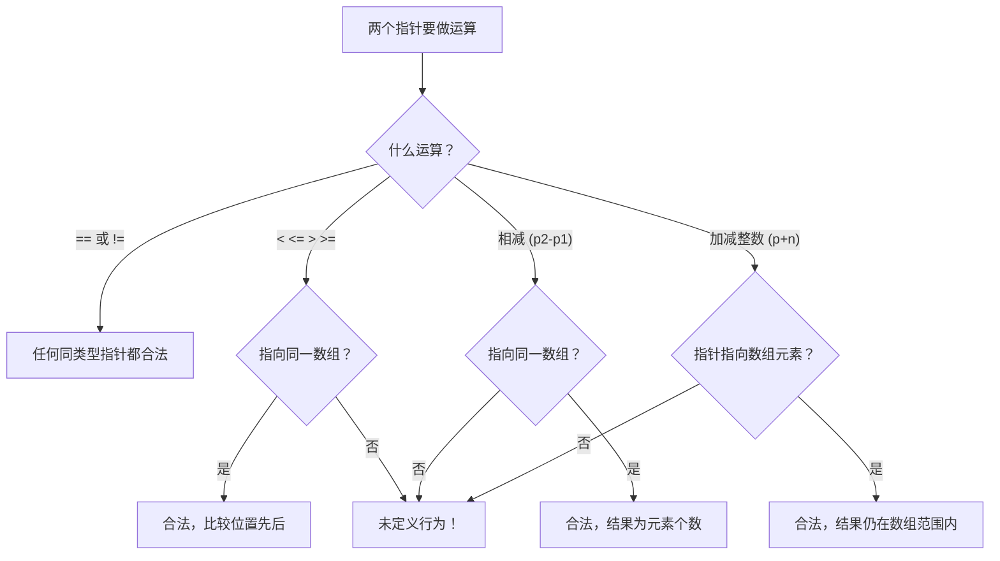

# 指针运算

## 前置知识检查

> 开始前确认这几个问题你能回答，否则回头补前序课程。

1. `int *p = &a;` 中，`p` 的值是什么？`*p` 的值是什么？`p` 在 64 位系统上占多少字节？→ 见 [lesson-01-memory-and-pointers](lesson-01-memory-and-pointers.md)
2. `*cp++` 等价于什么？表达式的值和副作用分别是什么？→ 见 [lesson-02-pointer-pitfalls](lesson-02-pointer-pitfalls.md)
3. 为什么声明指针后要立即初始化为有效地址或 NULL？→ 见 [lesson-02-pointer-pitfalls](lesson-02-pointer-pitfalls.md)

---

## 核心概念

### 1. 指针加减整数

#### 是什么

lesson-02 中你见过 `*cp++`——指针自增后指向"下一个"。但"下一个"到底在哪里？如果 `cp` 是 `char *`，"下一个"就是下一个字节。如果是 `int *` 呢？

原书 §6.13 给出的核心规则：**指针加减整数时，整数会按指针所指类型的大小进行缩放（scaling）。**

```
指针 + n  →  地址增加 n × sizeof(*指针) 个字节
指针 - n  →  地址减少 n × sizeof(*指针) 个字节
```

以 `int` 数组为例（假设 `sizeof(int) == 4`）：

```
地址:    1000    1004    1008    1012    1016
        +-------+-------+-------+-------+-------+
arr:    | arr[0]| arr[1]| arr[2]| arr[3]| arr[4]|
        +-------+-------+-------+-------+-------+
指针:     p       p+1     p+2     p+3     p+4
偏移:   +0字节  +4字节  +8字节  +12字节  +16字节
```

`p + 1` 不是在地址上加 1，而是加 `1 × sizeof(int) = 4` 个字节——刚好跳到下一个 `int` 元素。`p + 3` 加的是 `3 × 4 = 12` 个字节，指向 `arr[3]`。

原书表 6.2 展示了不同类型的缩放效果：

| 表达式 | 指向类型 | `sizeof` | 地址实际增量 |
|--------|---------|----------|-----------|
| `p + 1` | `char` | 1 | 1 字节 |
| `p + 1` | `short` | 2 | 2 字节 |
| `p + 1` | `int` | 4 | 4 字节 |
| `p + 1` | `double` | 8 | 8 字节 |
| `p + 2` | `int` | 4 | 8 字节 |
| `p + 2` | `double` | 8 | 16 字节 |

这个缩放机制让你不需要关心每种类型占多少字节——`p + i` 永远指向第 i 个元素。

#### 为什么重要

缩放机制是 C 语言让指针能**自然遍历数组**的核心设计。没有它，你每次移动指针都要手动计算 `p + i * sizeof(int)`，既麻烦又容易出错。有了它：

- `p++` 自动移到下一个元素
- `p + n` 直接跳到第 n 个元素
- 换了类型（比如从 `int *` 改成 `double *`）代码不需要改

后面学数组（module-03）时你会看到，`p[i]` 和 `*(p + i)` 完全等价——下标访问的本质就是指针运算。

#### 代码演示

```c
#include <stdio.h>

int main(void) {
    /* 不同类型指针的 +1 效果 */
    char   c_arr[] = {'A', 'B', 'C'};
    int    i_arr[] = {10, 20, 30};
    double d_arr[] = {1.1, 2.2, 3.3};

    char   *cp = c_arr;
    int    *ip = i_arr;
    double *dp = d_arr;

    printf("=== 指针 +1 的地址变化 ===\n");
    printf("char*:   cp=%p, cp+1=%p, 差=%td 字节\n",
           (void *)cp, (void *)(cp+1),
           (char *)(cp+1) - (char *)cp);
    printf("int*:    ip=%p, ip+1=%p, 差=%td 字节\n",
           (void *)ip, (void *)(ip+1),
           (char *)(ip+1) - (char *)ip);
    printf("double*: dp=%p, dp+1=%p, 差=%td 字节\n",
           (void *)dp, (void *)(dp+1),
           (char *)(dp+1) - (char *)dp);

    /* 用指针遍历数组（原书 §6.13.1 的经典模式）*/
    printf("\n=== 用指针遍历 int 数组 ===\n");
    int values[] = {0, 0, 0, 0, 0};
    int n = 5;
    int *vp;

    /* 正向遍历：用指针初始化数组 */
    int fill = 1;
    for (vp = &values[0]; vp < &values[n]; vp++) {
        *vp = fill++;  /* 赋值后 vp 自增指向下一个元素 */
    }

    /* 打印结果 */
    for (int i = 0; i < n; i++) {
        printf("values[%d] = %d\n", i, values[i]);
    }

    return 0;
}
```

```bash
gcc -std=c99 -Wall -Wextra -g -o ptrarith ptrarith.c
./ptrarith
```

输出：

```
=== 指针 +1 的地址变化 ===
char*:   cp=0x7ffd...a5, cp+1=0x7ffd...a6, 差=1 字节
int*:    ip=0x7ffd...90, ip+1=0x7ffd...94, 差=4 字节
double*: dp=0x7ffd...70, dp+1=0x7ffd...78, 差=8 字节

=== 用指针遍历 int 数组 ===
values[0] = 1
values[1] = 2
values[2] = 3
values[3] = 4
values[4] = 5
```

关键观察：`char *` 加 1 跳 1 字节，`int *` 加 1 跳 4 字节，`double *` 加 1 跳 8 字节——正好是各自 `sizeof` 的大小。

#### 易错点

❌ **错误：以为指针 +1 就是地址 +1 字节**

```c
#include <stdio.h>

int main(void) {
    int arr[] = {100, 200, 300};
    int *p = arr;

    /* 错误理解：p+1 在地址上加 1 个字节 */
    printf("p   指向的值: %d\n", *p);       /* 100 */
    printf("p+1 指向的值: %d\n", *(p+1));   /* 200，不是某个损坏的值 */

    /* 如果真的只加 1 字节会怎样？（强制用 char * 演示）*/
    char *cp = (char *)arr;
    cp += 1;  /* 只前进 1 字节，跑到 int 内部！ */
    printf("\n强制只加 1 字节后的地址: %p\n", (void *)cp);
    printf("这个地址在 arr[0] 内部，不对齐！\n");

    return 0;
}
```

```bash
gcc -std=c99 -Wall -Wextra -g -o scale_trap scale_trap.c
./scale_trap
```

✅ **正确理解**：`p + 1` 加的是 `1 × sizeof(*p)` 个字节。这个缩放是编译器自动完成的，保证指针总是对齐到正确的元素边界。你写 `p + 1`，编译器帮你翻译成 `地址 + 1 × sizeof(int)`。

---

### 2. 指针相减

#### 是什么

两个指向**同一个数组**的指针可以相减。结果不是字节差，而是**元素个数**——即两个指针之间隔了多少个元素。

```c
int arr[5] = {10, 20, 30, 40, 50};
int *p1 = &arr[1];
int *p2 = &arr[4];

ptrdiff_t diff = p2 - p1;  /* 结果是 3（不是 12 字节）*/
```

在内存中：

```
地址:    1000    1004    1008    1012    1016
        +-------+-------+-------+-------+-------+
arr:    | arr[0]| arr[1]| arr[2]| arr[3]| arr[4]|
        +-------+-------+-------+-------+-------+
                  ↑ p1                    ↑ p2
                  |←————— 3 个元素 ————→|
                  |←———— 12 字节 ————————→|

p2 - p1 = 3（元素个数，不是字节数）
```

指针相减的结果类型是 `ptrdiff_t`（pointer difference type），定义在 `<stddef.h>` 中，是一种有符号整数类型。在 64 位系统上通常是 `long`（8 字节）。

➕ **原书未提及**：打印 `ptrdiff_t` 值时应使用格式说明符 `%td`，这是 C99 引入的专用格式符，比用 `%d` 或 `%ld` 更可移植。

```c
printf("差值: %td 个元素\n", p2 - p1);
```

原书给了一个具体的数值例子：假设数组元素是 `float`（4 字节），起始地址 1000，p1 = 1004，p2 = 1024。那么 `p2 - p1 = (1024 - 1004) / 4 = 5` 个元素。指针相减的结果和类型大小无关——无论 `char`、`int` 还是 `double`，结果都是元素个数。

**合法性条件**：两个指针必须指向**同一个数组**（或其最后一个元素之后的位置）。如果两个指针指向不同的数组，相减是**未定义行为**。

#### 为什么重要

指针相减在实际编程中非常常见：

1. **计算字符串长度**：`strlen` 的一种实现方式就是用指针走到 `'\0'`，然后减去起始指针
2. **计算子数组大小**：找到某个元素后，用它的指针减去数组首地址得到索引
3. **缓冲区已用量**：当前写入位置的指针减去缓冲区起始指针

#### 代码演示

```c
#include <stdio.h>
#include <stddef.h>  /* ptrdiff_t */

/* 用指针相减实现 strlen */
size_t my_strlen(const char *s) {
    const char *p = s;
    while (*p != '\0') {
        p++;
    }
    return (size_t)(p - s);  /* 指针相减得到字符个数 */
}

int main(void) {
    /* 基本指针相减 */
    int arr[] = {10, 20, 30, 40, 50};
    int *p1 = &arr[1];
    int *p2 = &arr[4];

    ptrdiff_t diff = p2 - p1;
    printf("p2 - p1 = %td 个元素\n", diff);    /* 3 */
    printf("p1 - p2 = %td 个元素\n", p1 - p2);  /* -3 */

    /* 字节差 vs 元素差 */
    printf("\n地址差（字节）: %td\n",
           (char *)p2 - (char *)p1);  /* 12 */
    printf("元素差:         %td\n", p2 - p1);  /* 3 */
    printf("关系: 12 / sizeof(int) = %zu\n",
           (size_t)12 / sizeof(int));  /* 3 */

    /* 用指针相减实现 strlen */
    const char *msg = "Hello";
    printf("\n\"%s\" 的长度: %zu\n",
           msg, my_strlen(msg));  /* 5 */

    return 0;
}
```

```bash
gcc -std=c99 -Wall -Wextra -g -o ptrdiff ptrdiff.c
./ptrdiff
```

输出：

```
p2 - p1 = 3 个元素
p1 - p2 = -3 个元素

地址差（字节）: 12
元素差:         3
关系: 12 / sizeof(int) = 3

"Hello" 的长度: 5
```

注意 `p1 - p2` 是 `-3`——方向反了，结果是负数。这就是为什么 `ptrdiff_t` 是有符号类型。

#### 易错点

❌ **错误：对不同数组的指针做减法**

```c
#include <stdio.h>
#include <stddef.h>

int main(void) {
    int a[] = {1, 2, 3};
    int b[] = {4, 5, 6};

    int *pa = &a[0];
    int *pb = &b[0];

    /* 未定义行为！a 和 b 是两个独立的数组 */
    ptrdiff_t diff = pb - pa;
    printf("不同数组的指针差: %td\n", diff);
    /* 结果不可预测，不同编译器/运行可能不同 */

    return 0;
}
```

```bash
gcc -std=c99 -Wall -Wextra -g -o diff_trap diff_trap.c
./diff_trap
```

这段代码能编译、能运行、可能给出一个"看起来合理"的数字——但它是**未定义行为**。编译器没有义务给出有意义的结果。

✅ **正确**：只对指向**同一个数组**的指针做减法。如果不确定两个指针是否来自同一数组，就不要减。

---

### 3. 指针关系运算

#### 是什么

C 语言允许用关系操作符比较指针：

| 操作符 | 含义 | 前提条件 |
|--------|------|---------|
| `==`、`!=` | 是否指向同一位置 | **任何两个同类型指针**都可以比较 |
| `<`、`<=`、`>`、`>=` | 哪个在前/后 | **必须**指向同一数组中的元素 |

`==` 和 `!=` 是通用的——你可以比较任意两个同类型的指针，包括与 `NULL` 比较（`p != NULL`）。但 `<` 和 `>` 只在两个指针指向同一数组时才有定义。



原书 §6.13.2 的经典用法——用指针比较作为 for 循环的终止条件：

```c
/* 正向遍历：vp 从首元素走到 past-the-end */
for (vp = &values[0]; vp < &values[N]; vp++) {
    *vp = 0;
}
```

这里 `vp < &values[N]` 比较的是两个指向同一数组的指针（`&values[N]` 是数组最后一个元素之后的位置），所以是合法的。

#### 为什么重要

指针比较是两个最基本的编程模式的核心：

1. **数组遍历的终止条件**：`while (p < end)` 比用计数器 `while (i < n)` 在某些场景下更自然
2. **NULL 检查**：`if (p != NULL)` 是使用指针前的标准守卫条件

#### 代码演示

```c
#include <stdio.h>

int main(void) {
    int values[] = {10, 20, 30, 40, 50};
    int n = 5;

    /* === 正向遍历：指针比较作为终止条件 === */
    printf("正向遍历:\n");
    int *vp;
    for (vp = &values[0]; vp < &values[n]; vp++) {
        printf("  地址 %p: 值 = %d\n",
               (void *)vp, *vp);
    }

    /* === == 和 != 的通用性 === */
    int *p1 = &values[1];
    int *p2 = &values[3];
    int *p3 = &values[1];  /* 和 p1 指向同一位置 */

    printf("\np1 == p3 ? %s\n",
           (p1 == p3) ? "是" : "否");  /* 是 */
    printf("p1 == p2 ? %s\n",
           (p1 == p2) ? "是" : "否");  /* 否 */
    printf("p1 < p2  ? %s\n",
           (p1 < p2) ? "是" : "否");   /* 是 */
    printf("p1 != NULL ? %s\n",
           (p1 != NULL) ? "是" : "否"); /* 是 */

    /* === 用指针遍历清零数组 === */
    printf("\n清零前: values[2] = %d\n", values[2]);
    for (vp = &values[0]; vp < &values[n]; vp++) {
        *vp = 0;
    }
    printf("清零后: values[2] = %d\n", values[2]);

    return 0;
}
```

```bash
gcc -std=c99 -Wall -Wextra -g -o ptrcomp ptrcomp.c
./ptrcomp
```

输出：

```
正向遍历:
  地址 0x7ffd...60: 值 = 10
  地址 0x7ffd...64: 值 = 20
  地址 0x7ffd...68: 值 = 30
  地址 0x7ffd...6c: 值 = 40
  地址 0x7ffd...70: 值 = 50

p1 == p3 ? 是
p1 == p2 ? 否
p1 < p2  ? 是
p1 != NULL ? 是

清零前: values[2] = 30
清零后: values[2] = 0
```

#### 易错点

❌ **错误：反向遍历时指针减到数组第一个元素之前**

这是原书 §6.13.2 最经典的陷阱。看这个反向遍历：

```c
#include <stdio.h>

int main(void) {
    int values[] = {10, 20, 30, 40, 50};
    int n = 5;
    int *vp;

    /* 尝试反向遍历 */
    printf("反向遍历（有 bug 的版本）:\n");
    for (vp = &values[n - 1]; vp >= &values[0]; vp--) {
        printf("  *vp = %d\n", *vp);
    }
    /* 看起来没问题？但原书指出：
       当 vp 指向 values[0] 并执行 vp-- 后，
       vp 指向了 values[0] 之前的位置。
       接下来 vp >= &values[0] 的比较
       是未定义行为！ */

    return 0;
}
```

```bash
gcc -std=c99 -Wall -Wextra -g -o reverse_trap reverse_trap.c
./reverse_trap
```

这段代码在大多数编译器上能"正确"运行——但这只是运气好。C 标准规定：指针可以合法指向数组最后一个元素**之后**的位置（past-the-end），但**不允许**指向第一个元素**之前**的位置。当 `vp` 减到 `&values[0]` 之前时，`vp >= &values[0]` 的比较结果是未定义的。

✅ **正确：使用安全的反向遍历方式**

```c
#include <stdio.h>

int main(void) {
    int values[] = {10, 20, 30, 40, 50};
    int n = 5;
    int *vp;

    /* 方式 1：用前向指针反向赋值（推荐）*/
    printf("安全反向遍历:\n");
    vp = &values[n];  /* past-the-end，合法 */
    while (vp > &values[0]) {
        vp--;          /* 先减，再使用 */
        printf("  *vp = %d\n", *vp);
    }

    /* 方式 2：用下标（更简单直观）*/
    printf("\n用下标反向遍历:\n");
    for (int i = n - 1; i >= 0; i--) {
        printf("  values[%d] = %d\n", i, values[i]);
    }

    return 0;
}
```

```bash
gcc -std=c99 -Wall -Wextra -g -o reverse_safe reverse_safe.c
./reverse_safe
```

输出：

```
安全反向遍历:
  *vp = 50
  *vp = 40
  *vp = 30
  *vp = 20
  *vp = 10

用下标反向遍历:
  values[4] = 50
  values[3] = 40
  values[2] = 30
  values[1] = 20
  values[0] = 10
```

方式 1 的关键：`vp` 从 past-the-end 开始，先 `vp--` 再使用。这样 `vp` 永远不会跑到 `&values[0]` 之前。

#### ⭐ 深入：past-the-end 指针

> 以下内容为深层原理，理解它有助于加深认识，但不影响日常使用。跳过不影响后续学习。

C 标准对指针运算的边界有精确规定：

- **合法范围**：指针可以指向数组第一个元素到最后一个元素**之后一个位置**（past-the-end）
- `&arr[N]`（N 是数组长度）是 past-the-end 指针，**可以获取、可以比较，但不能解引用**
- 指针**不允许**跑到数组第一个元素**之前**

```
               合法范围
          |←—————————————————→|
arr[0]  arr[1]  arr[2]  arr[3]  arr[4]  (past-the-end)
  ↑                                ↑          ↑
 最前                             最后       可以指向
                                            不能解引用
```

这就是为什么 `for (vp = arr; vp < &arr[N]; vp++)` 是合法的——循环结束时 `vp == &arr[N]`（past-the-end），`vp < &arr[N]` 为假，循环停止。`vp` 从未在 past-the-end 位置被解引用。

但反向遍历中 `vp--` 减到 `&arr[-1]` 就越界了——这个位置不存在于合法范围中，任何对它的操作（包括比较）都是未定义行为。

---

## 概念串联

本课三个概念构建了完整的指针算术体系：

1. **指针加减整数** 是最基础的运算——让指针在数组中移动，缩放机制保证移动单位是元素而非字节
2. **指针相减** 是加法的逆运算——两个指针之间的距离用元素个数表示
3. **指针关系运算** 为指针移动提供边界控制——什么时候该停下来

三者共同支撑了一个核心编程模式：**用指针遍历数组**。

```c
for (p = &arr[0]; p < &arr[N]; p++) {
    /* 处理 *p */
}
```

这个模式中，`p++` 用了概念 1（加整数），`p < &arr[N]` 用了概念 3（关系运算），如果你想知道 `p` 走了多远，`p - &arr[0]` 就是概念 2（指针相减）。

回顾本模块三课的脉络：
- lesson-01 建立了指针的**基础概念**（地址、解引用、指针变量）
- lesson-02 教了指针的**安全使用**（NULL、左值、表达式分析）
- lesson-03（本课）教了指针的**算术操作**（移动、测距、比较）

下一步进入 module-02（函数），你会看到指针作为函数参数的第一个实战应用——传指针模拟传引用。再之后的 module-03（数组与指针）会深入展开 `p[i]` 与 `*(p + i)` 的等价关系，那时本课学到的指针运算规则将被大量使用。

---

## 常见陷阱清单

| # | 陷阱 | 症状 | 原因 | 修复 |
|---|------|------|------|------|
| 1 | `p + 1` 以为加 1 字节 | 指向了错误的内存位置，或者困惑为什么地址差不等于 1 | 不了解缩放机制 | `p + 1` 加的是 `sizeof(*p)` 字节，即一个元素的大小 |
| 2 | 指针相减以为得到字节差 | 计算缓冲区大小或数组长度时结果偏小（差了 sizeof 倍数）| 忘记指针减法结果已经过缩放 | 指针相减得到的是元素个数；要字节差用 `(char *)p2 - (char *)p1` |
| 3 | 不同数组的指针相减或比较 | 结果不可预测，换编译器/平台后行为可能变化 | 两个独立数组在内存中的相对位置是不确定的 | 只对指向同一数组的指针做减法和 `<`/`>` 比较 |
| 4 | 反向遍历指针减到数组之前 | 大多数情况下"碰巧正确"，但移植到其他平台可能崩溃 | C 标准不允许指针指向数组第一个元素之前 | 用 past-the-end + 先减后用的模式，或改用下标 |
| 5 | 对 past-the-end 指针解引用 | 读到垃圾数据或段错误 | past-the-end 指针可以持有但不能解引用 | 循环条件用 `<`（不含 past-the-end），而非 `<=` |

---

## 动手练习提示

### 练习 1：数组求和器

用指针（不用下标 `[]`）实现函数 `int sum(int *begin, int *end)`，计算从 `begin` 到 `end`（不含 `end`）的所有元素之和。在 `main` 中用 `sum(arr, arr + n)` 调用。

**思路提示**：用 `while (begin < end)` 循环，每次 `*begin++` 取值并移动指针。

### 练习 2：查找元素位置

实现函数 `int find_index(int *arr, int n, int target)`，用指针遍历查找 `target`，找到后用**指针相减**得到下标并返回。未找到返回 -1。

**思路提示**：声明 `int *p = arr`，遍历到 `arr + n`，找到后 `return (int)(p - arr)`。

---

## 自测题

> 不给答案，动脑想完再往下学。

1. 假设 `int arr[5]; int *p = arr; int *q = arr + 3;`，`q - p` 的值是多少？`(char *)q - (char *)p` 的值呢？为什么不同？

2. `for (vp = &values[N-1]; vp >= &values[0]; vp--)` 这个循环有什么隐患？在什么条件下可能出错？怎么改？

3. 为什么 `&arr[N]`（N 是数组长度）可以合法获取但不能解引用？这个设计对循环遍历有什么好处？

---

## 补充资源

| 资源 | 类型 | 说明 |
|------|------|------|
| [Pointer Arithmetics in C (GeeksforGeeks)](https://www.geeksforgeeks.org/c/pointer-arithmetics-in-c-with-examples/) | 文章 | 指针运算五种操作的完整示例，含图解 |
| [C Pointer Arithmetic (TutorialsPoint)](https://www.tutorialspoint.com/cprogramming/c_pointer_arithmetic.htm) | 文章 | 指针运算基础教程，强调类型大小自动缩放 |
| [Comparison Operators (cppreference)](https://en.cppreference.com/w/c/language/operator_comparison) | 参考 | C 比较操作符权威文档，含指针比较的标准规定 |
