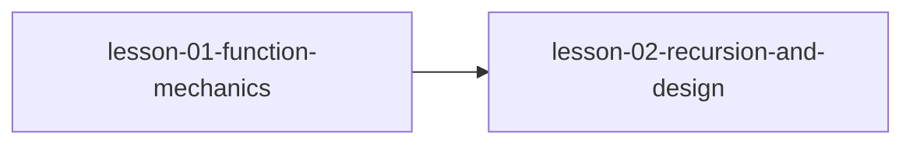

# MODULE.md — 函数深入

## 模块信息
| 字段 | 值 |
|------|---|
| 模块编号 | module-02 |
| 模块名称 | 函数深入 |
| 原书章节 | Ch 7 |
| 课程数量 | 2 |
| 预计总时长 | 2 小时 |

---
## 模块目标
学完本模块后，你应该能够：
1. 理解函数参数传递机制（传值 vs 传指针）
2. 能编写和调试递归函数
3. 理解 ADT 和黑盒设计思想

---
## 课程列表
| # | 课程文件 | 标题 | 核心概念 | 状态 |
|---|---------|------|---------|------|
| 1 | `lesson-01-function-mechanics.md` | 函数机制 | 函数原型、参数传递、传值与传指针、可变参数 | ⬜ |
| 2 | `lesson-02-recursion-and-design.md` | 递归与设计 | 递归、尾递归、抽象数据类型、黑盒设计 | ⬜ |

---
## 前置模块
- [module-01-pointer-fundamentals](../module-01-pointer-fundamentals/MODULE.md) — 指针的基本概念和使用方法

---
## 模块内课程依赖

---
## 关键术语预览
| 术语 | 英文 | 首次出现课程 |
|------|------|------------|
| 函数原型 | prototype | lesson-01 |
| 传值 | pass by value | lesson-01 |
| 可变参数 | variadic | lesson-01 |
| 递归 | recursion | lesson-02 |
| 抽象数据类型 | ADT | lesson-02 |
