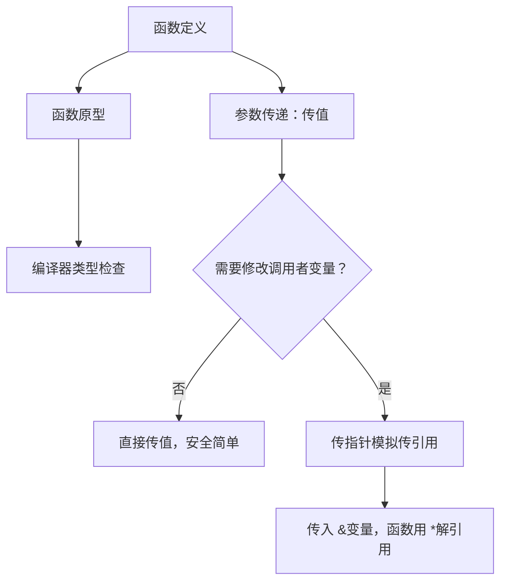

# 函数机制与参数传递

## 前置知识检查

> 开始前确认这几个问题你能回答，否则回头补前序课程。

1. `int *p = &x;` 后，`*p = 10;` 会改变 `x` 的值吗？为什么？→ 见 [lesson-01-memory-and-pointers](../module-01-pointer-fundamentals/lesson-01-memory-and-pointers.md)
2. `&` 取地址和 `*` 解引用是什么关系？→ 见 [lesson-01-memory-and-pointers](../module-01-pointer-fundamentals/lesson-01-memory-and-pointers.md)
3. 什么是作用域？局部变量的生命周期到什么时候结束？→ 见 [lesson-01-program-structure](../module-00-c-basics/lesson-01-program-structure.md)

---

## 核心概念

### 1. 函数定义与返回值

#### 是什么

C 中函数定义（function definition）的完整语法：

```
返回类型  函数名(形式参数列表)
{
    函数体（局部变量声明 + 语句）
}
```

几个要点：

- **返回类型**（return type）：函数返回值的类型。不需要返回值时用 `void`。
- **形式参数**（formal parameter，简称**形参**）：函数定义中声明的参数变量，接收调用时传入的值。
- **函数体**：一对花括号 `{}` 包起来的代码块，包含局部变量声明和执行语句。

`return` 语句用于从函数返回：

- `return expression;`：返回一个值，值的类型应与声明的返回类型一致。
- `return;`：不返回值，只能用在 `void` 函数中。
- 如果执行流到达函数体末尾的 `}` 而没有遇到 `return`，函数也会返回——但如果函数不是 `void` 类型，返回值是**未定义行为**（undefined behavior，结果为垃圾值）。

#### 为什么重要

函数是 C 语言代码组织的基本单位。每个 C 程序都从 `main` 函数开始执行，其他所有功能都通过函数来封装。理解函数定义的完整语法和 `return` 的规则，是写出正确、可维护的 C 代码的基础。

#### 代码演示

```c
/* find_int.c — 在数组中查找指定整数，返回指向该元素的指针 */
#include <stdio.h>

/* 函数定义：返回类型 int *，形参为 key、array、len */
int *find_int(int key, int array[], int len) {
    for (int i = 0; i < len; i++) {
        if (array[i] == key) {
            return &array[i];  /* 找到：返回元素地址 */
        }
    }
    return NULL;  /* 未找到：返回 NULL */
}

int main(void) {
    int data[] = {10, 20, 30, 40, 50};
    int len = sizeof(data) / sizeof(data[0]);

    int *result = find_int(30, data, len);
    if (result != NULL) {
        printf("找到了：*result = %d\n", *result);
        printf("在数组中的位置：第 %td 个元素\n",
               result - data);  /* 指针相减得到下标 */
    } else {
        printf("未找到\n");
    }

    result = find_int(99, data, len);
    if (result != NULL) {
        printf("找到了：*result = %d\n", *result);
    } else {
        printf("99 未找到\n");
    }

    return 0;
}
```

```bash
gcc -std=c99 -Wall -Wextra -g -o find_int find_int.c
./find_int
```

运行输出：

```
找到了：*result = 30
在数组中的位置：第 2 个元素
99 未找到
```

注意 `find_int` 返回的是数组元素的地址。这是安全的，因为 `data` 数组在 `main` 的栈帧（stack frame）中，调用 `find_int` 时 `main` 的栈帧还在。但如果返回的是函数**自己的**局部变量的地址，就会出大问题——见下面的易错点。

#### 易错点

❌ **返回局部变量的指针（pointer）——野指针**：

```c
/* dangling_return.c — 返回局部变量的指针（错误！） */
#include <stdio.h>

int *make_value(void) {
    int local = 42;
    return &local;  /* ❌ local 在函数返回后被销毁 */
}

int main(void) {
    int *p = make_value();
    /* p 现在指向已销毁的栈帧中的位置 */
    printf("*p = %d\n", *p);  /* 未定义行为！可能输出 42、垃圾值，或直接段错误 */
    return 0;
}
```

```bash
gcc -std=c99 -Wall -Wextra -g -o dangling_return dangling_return.c
./dangling_return
```

编译时 GCC 会发出警告：

```
dangling_return.c: warning: function returns address of local variable
```

函数返回后，它的栈帧被销毁，局部变量 `local` 的内存不再有效。返回它的地址就是制造了一个**野指针**。

✅ **正确做法**：返回值而不是返回地址，或者让调用者传入指针：

```c
/* 方法 1：返回值 */
int make_value(void) {
    int local = 42;
    return local;  /* ✅ 返回值的副本，安全 */
}

/* 方法 2：通过指针参数传出（下一节详细讲） */
void make_value2(int *out) {
    *out = 42;     /* ✅ 修改调用者提供的地址处的值 */
}
```

❌ **非 void 函数忘记 return**：

```c
int get_value(int flag) {
    if (flag) {
        return 42;
    }
    /* ❌ flag 为 0 时没有 return，返回垃圾值 */
}
```

✅ **确保所有执行路径都有 return**：

```c
int get_value(int flag) {
    if (flag) {
        return 42;
    }
    return 0;  /* ✅ 所有路径都有明确返回值 */
}
```

`-Wall` 选项会对"控制流到达非 void 函数末尾"发出警告（`-Wreturn-type`）。永远不要忽略这个警告。

---

### 2. 函数原型

#### 是什么

**函数原型**（function prototype）是函数的声明，告诉编译器函数的名字、返回类型和参数类型，但不包含函数体。语法上它和函数定义的第一行相同，只是末尾加了分号：

```c
/* 函数原型（声明） */
int *find_int(int key, int array[], int len);

/* 函数定义（实现） */
int *find_int(int key, int array[], int len) {
    /* ... */
}
```

原型中参数的名字是可选的，但建议加上——对调用者来说是有用的文档：

```c
/* 哪个更易读？ */
char *strcpy(char *, char *);              /* 看不出谁是源、谁是目标 */
char *strcpy(char *dest, char *source);    /* 一目了然 */
```

#### 为什么重要

没有原型时，编译器遇到函数调用会做**隐式假设**：
- 假设函数返回 `int`
- 不检查参数的数量和类型

这在返回非 `int` 类型（如 `float`、指针）时会造成严重错误：编译器会把返回值当作 `int` 处理，导致值完全错误。

**原型的最佳实践**：把原型放在**头文件**（`.h`）中，需要调用该函数的源文件用 `#include` 包含。这样：
1. 原型只写一次，避免多处不一致
2. 具有文件作用域（scope），整个文件都能检查
3. 定义函数的文件也包含同一个头文件，编译器会检查原型和定义是否匹配

#### 代码演示

```c
/* no_prototype.c — 缺少原型导致返回值错误 */
#include <stdio.h>

/* 故意不在 main 前提供 get_pi 的原型 */

int main(void) {
    /* 编译器看不到 get_pi 的原型，假设它返回 int */
    double pi = get_pi();
    printf("pi = %f\n", pi);  /* 结果不正确！ */
    return 0;
}

/* get_pi 的定义在 main 之后 */
double get_pi(void) {
    return 3.14159265358979;
}
```

```bash
gcc -std=c99 -Wall -Wextra -g -o no_prototype no_prototype.c
```

编译输出（GCC 13 / C99 模式下）：

```
no_prototype.c: warning: implicit declaration of function 'get_pi' [-Wimplicit-function-declaration]
no_prototype.c: error: conflicting types for 'get_pi'; have 'double(void)'
```

C99 起，隐式函数声明已**不合法**（C89 中是合法的）。GCC 首先对 `get_pi()` 的隐式声明发出警告，并假设它返回 `int`。随后遇到 `get_pi` 的实际定义返回 `double`，与隐式假设冲突，GCC 将此视为**错误**（不仅是警告），代码**无法编译**。

如果返回类型恰好也是 `int`（没有类型冲突），GCC 只会发出隐式声明的警告，代码仍能编译通过——但这同样危险，因为编译器不会检查参数类型。

✅ **添加原型后**：

```c
/* with_prototype.c — 有原型的正确写法 */
#include <stdio.h>

double get_pi(void);  /* ✅ 函数原型 */

int main(void) {
    double pi = get_pi();
    printf("pi = %f\n", pi);  /* 正确：3.141593 */
    return 0;
}

double get_pi(void) {
    return 3.14159265358979;
}
```

```bash
gcc -std=c99 -Wall -Wextra -g -o with_prototype with_prototype.c
./with_prototype
```

运行输出：

```
pi = 3.141593
```

#### 易错点

❌ **原型放在函数体内部——作用域局限**：

```c
void a(void) {
    int *func(int *value, int len);  /* 原型在 a 内部 */
    /* ... */
}

void b(void) {
    int func(int len, int *value);  /* 另一个原型，参数顺序反了！ */
    /* ... */
}
/* 编译器看不出这两个原型互相矛盾 */
```

✅ **原型放在文件顶部或头文件中**：

```c
#include "func.h"  /* 头文件中只有一份原型 */

void a(void) { /* ... */ }
void b(void) { /* ... */ }
```

#### ⭐ 深入：C99 废除了隐式函数声明

> 以下内容为深层原理，理解它有助于加深认识，但不影响日常使用。跳过不影响后续学习。

在 K&R C 和 C89 中，调用未声明的函数是合法的——编译器会**隐式假设**函数返回 `int`，并对参数执行"缺省参数提升"（`char`/`short` 提升为 `int`，`float` 提升为 `double`）。

C99 标准**废除了这一规则**：调用未声明的函数现在是约束违反（constraint violation），编译器应该报错。但为了兼容旧代码，GCC 默认只发出警告而非错误。你可以用 `-Werror=implicit-function-declaration` 把它升级为错误。

建议：始终用 `-Wall -Wextra` 编译，并认真对待每一个警告。如果你看到 `implicit declaration of function` 警告，意味着你漏了 `#include` 或漏了函数原型。

---

### 3. 参数传递（传值）

#### 是什么

C 语言函数参数的传递方式只有一种：**传值调用**（pass by value）。调用函数时，每个**实参**（actual argument，调用时传入的表达式）的值被**复制**一份给对应的**形参**（formal parameter，函数定义中的参数变量）。函数内部操作的是这份副本，**不会影响调用者的原始变量**。

用 ASCII 图展示 swap 传值调用时的栈帧：

```
调用 swap(a, b) 时（传值，失败版本）:

  main 的栈帧:                 swap 的栈帧:
  +----------+                 +----------+
  | a = 10   |                 | x = 10   | ← a 的副本
  +----------+                 +----------+
  | b = 20   |                 | y = 20   | ← b 的副本
  +----------+                 +----------+
                               | temp     |
                               +----------+

  swap 内部交换 x 和 y：
  +----------+                 +----------+
  | a = 10   | ← 没变！        | x = 20   | ← 副本被交换了
  +----------+                 +----------+
  | b = 20   | ← 没变！        | y = 10   | ← 副本被交换了
  +----------+                 +----------+

  swap 返回后，swap 的栈帧被销毁，x 和 y 消失。
  main 中的 a 和 b 完全没有被影响。
```

#### 为什么重要

传值是 C 的**唯一**参数传递方式。理解这一点至关重要，因为很多初学者在函数内修改参数后，回到调用者发现变量没变，不知道哪里出了问题。

传值的好处是**安全**：函数不会意外修改调用者的数据。但如果你确实需要修改调用者的变量，就必须用下一节讲的"传指针"技巧。

#### 代码演示

```c
/* swap_fail.c — 经典的 swap 失败示例：传值只交换了副本 */
#include <stdio.h>

void swap(int x, int y) {
    int temp;
    temp = x;
    x = y;
    y = temp;
    printf("  swap 内部: x = %d, y = %d（副本交换了）\n", x, y);
}

int main(void) {
    int a = 10, b = 20;

    printf("交换前: a = %d, b = %d\n", a, b);
    swap(a, b);
    printf("交换后: a = %d, b = %d（没变！）\n", a, b);

    return 0;
}
```

```bash
gcc -std=c99 -Wall -Wextra -g -o swap_fail swap_fail.c
./swap_fail
```

运行输出：

```
交换前: a = 10, b = 20
  swap 内部: x = 20, y = 10（副本交换了）
交换后: a = 10, b = 20（没变！）
```

`swap` 函数内部确实交换了 `x` 和 `y` 的值，但它们只是 `a` 和 `b` 的副本。函数返回后副本被销毁，`a` 和 `b` 纹丝不动。

#### 易错点

❌ **以为函数内修改参数就能改变调用者的变量**：

```c
void increment(int n) {
    n = n + 1;  /* ❌ 只修改了副本 */
}

int main(void) {
    int x = 5;
    increment(x);
    printf("x = %d\n", x);  /* 仍然是 5 */
}
```

✅ **正确理解**：函数参数是一份独立的副本。要修改调用者的变量，必须传入它的地址（见下一节）。

---

### 4. 传指针模拟传引用

#### 是什么

C 没有"传引用"（pass by reference）机制。要让函数能修改调用者的变量，方法是**传入变量的地址**（即指针），函数通过解引用（dereference）来修改原变量。

本质上这**仍然是传值**——传递的是地址值的副本。但因为副本和原件存的是同一个地址，通过解引用就能"穿透"到调用者的变量。

用 ASCII 图展示传指针版 swap 的栈帧：

```
调用 swap(&a, &b) 时（传指针，成功版本）:

  main 的栈帧:                   swap 的栈帧:
  +-----------+                   +-----------+
  | a = 10    |<---------+       | x = &a    |----> 指向 main 的 a
  +-----------+           |       +-----------+
  | b = 20    |<------+  |       | y = &b    |----> 指向 main 的 b
  +-----------+       |  |       +-----------+
                      |  |       | temp      |
                      |  |       +-----------+
                      |  |
                      |  +---- *x 就是 a
                      +------- *y 就是 b

  swap 内部通过 *x 和 *y 交换：
  +-----------+                   +-----------+
  | a = 20    | ← 被修改了！      | x = &a    |
  +-----------+                   +-----------+
  | b = 10    | ← 被修改了！      | y = &b    |
  +-----------+                   +-----------+
```

#### 为什么重要

传指针是 C 中让函数修改调用者变量的**唯一方法**。你会在以下场景中频繁使用它：

1. **交换两个变量**：经典的 `swap` 函数
2. **函数返回多个值**：C 函数只能 `return` 一个值，如果要"返回"多个结果，就用指针参数传出
3. **避免大结构体的复制**：传结构体指针比传结构体本身高效（module-05 详讲）
4. **修改调用者的指针**：需要二级指针（module-01 lesson-02 已介绍概念，后续 module-07 链表中大量使用）

#### 代码演示

```c
/* swap_ok.c — 传指针版 swap：成功交换 */
#include <stdio.h>

void swap(int *x, int *y) {
    int temp;
    temp = *x;   /* 通过解引用读取调用者的值 */
    *x = *y;
    *y = temp;
}

int main(void) {
    int a = 10, b = 20;

    printf("交换前: a = %d, b = %d\n", a, b);
    swap(&a, &b);  /* 传入地址 */
    printf("交换后: a = %d, b = %d\n", a, b);

    return 0;
}
```

```bash
gcc -std=c99 -Wall -Wextra -g -o swap_ok swap_ok.c
./swap_ok
```

运行输出：

```
交换前: a = 10, b = 20
交换后: a = 20, b = 10
```

#### 代码演示 2：函数返回多个值

C 函数只能 `return` 一个值。如果需要"返回"多个结果，可以用指针参数：

```c
/* divmod.c — 用指针参数同时返回商和余数 */
#include <stdio.h>

void divmod(int dividend, int divisor,
            int *quotient, int *remainder) {
    *quotient  = dividend / divisor;
    *remainder = dividend % divisor;
}

int main(void) {
    int q, r;

    divmod(17, 5, &q, &r);
    printf("17 / 5 = %d 余 %d\n", q, r);

    divmod(100, 7, &q, &r);
    printf("100 / 7 = %d 余 %d\n", q, r);

    return 0;
}
```

```bash
gcc -std=c99 -Wall -Wextra -g -o divmod divmod.c
./divmod
```

运行输出：

```
17 / 5 = 3 余 2
100 / 7 = 14 余 2
```

`divmod` 通过 `quotient` 和 `remainder` 两个指针参数"传出"了两个结果。调用者传入 `&q` 和 `&r`，函数通过解引用写入结果。

**const 指针参数**：如果函数**只读取**指针指向的数据而不修改，应该加上 `const` 修饰：

```c
/* 只读取 array，不修改 → 加 const */
int sum_array(const int *array, int len) {
    int total = 0;
    for (int i = 0; i < len; i++) {
        total += array[i];
    }
    return total;
}
```

`const int *array` 告诉编译器和调用者："这个函数不会修改 array 指向的数据"。如果函数内部不小心写了 `array[i] = 0;`，编译器会报错。这是一种**自我约束**，让接口语义更清晰。

#### 易错点

❌ **传指针后修改指针本身，以为能改变调用者的指针**：

```c
/* redirect_fail.c — 修改指针本身无效 */
#include <stdio.h>

void redirect(int *p, int *new_target) {
    p = new_target;  /* ❌ 只修改了 p 的副本 */
}

int main(void) {
    int a = 10, b = 20;
    int *ptr = &a;

    printf("修改前: *ptr = %d\n", *ptr);  /* 10 */
    redirect(ptr, &b);
    printf("修改后: *ptr = %d\n", *ptr);  /* 仍然是 10！ */

    return 0;
}
```

```bash
gcc -std=c99 -Wall -Wextra -g -o redirect_fail redirect_fail.c
./redirect_fail
```

运行输出：

```
修改前: *ptr = 10
修改后: *ptr = 10
```

`redirect` 函数的参数 `p` 是 `ptr` 的副本。在函数内写 `p = new_target` 只修改了副本，调用者的 `ptr` 不受影响。

✅ **需要修改调用者的指针，必须传二级指针**：

```c
void redirect(int **pp, int *new_target) {
    *pp = new_target;  /* ✅ 通过解引用修改调用者的指针 */
}

/* 调用：redirect(&ptr, &b); */
```

这个道理和 swap 一模一样：要修改什么，就传入它的地址。要修改 `int`，传 `int *`；要修改 `int *`，传 `int **`。

---

## 概念串联

本课的四个概念构成了 C 函数使用的完整基础：



**核心要点**：C 语言只有传值调用。所谓"传指针"只是传值的一个特例——传的是地址值的副本。通过这个地址副本解引用，就能"穿透"到调用者的变量。

**与前课的衔接**：
- module-01 lesson-01 讲了 `&` 和 `*` 是互逆操作——本课的"传指针"就是这对操作的典型应用：调用者用 `&` 取地址传入，函数用 `*` 解引用修改。
- module-01 lesson-02 讲了二级指针——本课的"修改调用者的指针需要 `int **`"就是二级指针的实际用途。

**与后续课程的衔接**：
- module-03 将讲数组名作为函数参数时自动退化为指针——这解释了为什么数组参数"看起来像传引用"（实际是传了指针的副本）。
- module-02 lesson-02 将讲递归——递归函数的每次调用都创建独立的栈帧和参数副本，理解传值机制是理解递归的基础。

---

## 常见陷阱清单

| # | 陷阱 | 症状 | 原因 | 修复 |
|---|------|------|------|------|
| 1 | 返回局部变量的指针 | 程序输出随机值或段错误 | 函数返回后栈帧销毁，局部变量的地址失效 | 返回值而非地址，或通过指针参数传出 |
| 2 | swap(a, b) 传值，交换失败 | 调用后 a 和 b 的值没变 | 函数交换的是参数的副本 | 传入 &a 和 &b，函数用 *x 和 *y 操作 |
| 3 | 缺少函数原型 | 返回值错误（如 float 返回了整数） | 编译器假设返回 int，按整数处理返回值 | 在调用前提供原型，或把定义放在调用前 |
| 4 | 传指针后修改指针本身 | 调用者的指针没有改变指向 | 指针本身也是传值的，修改的是副本 | 需要修改指针就传二级指针 |
| 5 | 非 void 函数缺少 return | 编译警告，运行时返回垃圾值 | 控制流到达函数末尾但没有 return 语句 | 确保所有执行路径都有 return |

---

## 动手练习提示

### 练习 1：安全的整数输入

- 目标：写一个函数 `int read_int(int *out)`，从 `stdin` 读取一个整数。成功返回 1 并把值写入 `*out`，失败返回 0
- 思路提示：用 `scanf` 读取，检查返回值是否为 1
- 容易卡住的地方：`scanf` 返回成功读取的项数，不是读到的值

### 练习 2：数组最大值和最小值

- 目标：写一个函数 `void min_max(const int *arr, int len, int *min, int *max)`，一趟遍历同时找出最大值和最小值
- 思路提示：用 `*min` 和 `*max` 作为输出参数
- 容易卡住的地方：初始值怎么设？用 `arr[0]` 初始化比用 `INT_MAX`/`INT_MIN` 更稳妥

### 练习 3：字符串反转（原地）

- 目标：写一个函数 `void str_reverse(char *s)`，原地反转字符串
- 思路提示：先用指针找到字符串末尾，然后用 swap 逻辑从两端向中间交换
- 容易卡住的地方：末尾指针应该指向最后一个字符（`'\0'` 前一个），不是 `'\0'`

---

## 自测题

> 不给答案，动脑想完再往下学。

1. 如果一个函数的返回类型是 `int *`，它可以返回一个局部 `int` 变量的地址吗？为什么？

2. `void swap(int *x, int *y)` 中的 `x` 和 `y` 本身是传值还是传指针？如果在函数内写 `x = &other_var;`，调用者的指针会变吗？

3. 为什么说"C 语言只有传值调用"？既然传指针可以修改调用者的变量，这不就是传引用吗？试解释这两者的本质区别。

---

## 补充资源

| 资源 | 类型 | 说明 |
|------|------|------|
| [Parameter Passing Techniques in C - GeeksforGeeks](https://www.geeksforgeeks.org/c/parameter-passing-techniques-in-c-cpp/) | 文章 | 传值/传指针的对比讲解，含代码示例 |
| [理解C语言的传值与传指针 - 知乎](https://zhuanlan.zhihu.com/p/70209061) | 文章 | 中文社区关于传值机制的深入分析 |
| 搜索关键词：`C语言返回局部变量指针 野指针` | 搜索 | 返回局部变量指针的常见错误案例 |
| 搜索关键词：`C function prototype importance` | 搜索 | 英文资料：函数原型为什么重要 |
