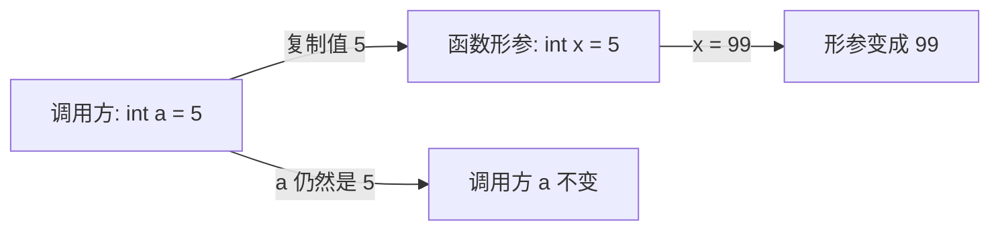

# 函数机制与参数传递

## 前置知识检查

> 开始前确认这几个问题你能回答，否则回头补前序课程。

1. `int *p = &x;` 后，`*p = 10;` 会改变 `x` 的值吗？为什么？→ 见 [lesson-01-memory-and-pointers](../module-01-pointer-fundamentals/lesson-01-memory-and-pointers.md)
2. `&` 取地址和 `*` 解引用是什么关系？→ 见 [lesson-01-memory-and-pointers](../module-01-pointer-fundamentals/lesson-01-memory-and-pointers.md)
3. 如果一个指针变量未初始化就使用，会发生什么？→ 见 [lesson-02-pointer-pitfalls](../module-01-pointer-fundamentals/lesson-02-pointer-pitfalls.md)

---

## 核心概念

### 1. 函数定义与返回值

#### 是什么

函数定义（function definition）就是函数的**实现**——包含函数体的那段代码。语法由四部分组成：

```
返回类型  函数名( 形式参数列表 )
{
    函数体（声明 + 语句）
}
```

其中：

- **返回类型**：函数返回值的类型。如果函数不返回值，写 `void`
- **函数名**：遵循标识符命名规则
- **形式参数列表**（formal parameters）：零个或多个参数，每个参数都有类型和名字。没有参数时写 `void`（不是空括号）
- **函数体**：花括号包裹的代码块

`return` 语句用于从函数返回：

```c
return expression;  /* 返回 expression 的值给调用方 */
return;             /* 仅用于 void 函数，提前结束执行 */
```

如果函数声明了非 `void` 返回类型，那么 `return` 后面**必须**跟一个表达式，且表达式的类型要能转换为返回类型。

#### 为什么重要

函数是 C 程序的基本组织单元。所有的逻辑最终都封装在函数中——`main` 是入口函数，其他函数通过调用协作完成任务。理解函数定义的语法和返回值机制，是写出正确函数的第一步。

两个关键区分：

- **有返回值的函数**：用在表达式中，调用方使用返回值。如 `int square(int n)`
- **void 函数**：执行一个动作，不返回值。如 `void print_hello(void)`。在其他语言中常称为"过程"（procedure）

#### 代码演示

```c
/* function_basics.c — 函数定义基础 */
#include <stdio.h>

/* 有返回值的函数：计算两个整数中较大的那个 */
int max(int a, int b) {
    if (a >= b) {
        return a;
    }
    return b;  /* 所有执行路径都有 return */
}

/* void 函数：打印分隔线 */
void print_separator(int width) {
    for (int i = 0; i < width; i++) {
        putchar('-');
    }
    putchar('\n');
    /* void 函数不需要 return，执行到末尾自动返回 */
}

/* 没有参数的函数：参数列表写 void */
void greet(void) {
    printf("Hello, C!\n");
}

int main(void) {
    greet();

    int a = 3, b = 7;
    printf("max(%d, %d) = %d\n", a, b, max(a, b));

    print_separator(20);
    printf("函数演示结束\n");

    return 0;
}
```

```bash
gcc -std=c99 -Wall -Wextra -g -o function_basics function_basics.c
./function_basics
```

输出：

```
Hello, C!
max(3, 7) = 7
--------------------
函数演示结束
```

#### 易错点

**❌ 错误：非 void 函数某些路径没有 return**

```c
/* missing_return.c — 缺少 return 的危险 */
#include <stdio.h>

int absolute(int x) {
    if (x < 0) {
        return -x;
    }
    /* 当 x >= 0 时没有 return！ */
    /* 编译器可能警告，但不一定报错 */
    /* 调用方拿到的是垃圾值 */
}

int main(void) {
    printf("absolute(5) = %d\n", absolute(5));
    /* 输出不确定——可能是 5，可能是任何值 */
    return 0;
}
```

```bash
gcc -std=c99 -Wall -Wextra -g -o missing_return missing_return.c
# 编译器会给出警告：control reaches end of non-void function
./missing_return
```

**✅ 正确：确保所有路径都有 return**

```c
/* absolute_correct.c — 所有路径都有 return */
#include <stdio.h>

int absolute(int x) {
    if (x < 0) {
        return -x;
    }
    return x;  /* ← 补上了 x >= 0 的情况 */
}

int main(void) {
    printf("absolute(-3) = %d\n", absolute(-3));
    printf("absolute(5) = %d\n", absolute(5));
    printf("absolute(0) = %d\n", absolute(0));
    return 0;
}
```

```bash
gcc -std=c99 -Wall -Wextra -g -o absolute_correct absolute_correct.c
./absolute_correct
```

输出：

```
absolute(-3) = 3
absolute(5) = 5
absolute(0) = 0
```

> **提示**：编译时加 `-Wall -Wextra` 就是为了捕获这类问题。养成"看到警告就修"的习惯。

---

### 2. 函数原型（声明）

#### 是什么

函数原型（function prototype）是函数的**声明**——告诉编译器函数的名字、返回类型和参数类型，但**不包含函数体**。语法：

```c
返回类型  函数名( 参数类型列表 );   /* 注意末尾的分号 */
```

原型和定义的区别：

| | 函数原型（声明） | 函数定义（实现） |
|---|---|---|
| 有函数体？ | 没有，以 `;` 结尾 | 有，花括号包裹 |
| 参数名？ | 可选（但建议写上） | 必须写 |
| 作用 | 告诉编译器如何调用 | 提供实际代码 |
| 出现次数 | 可以多次（只要一致） | 只能一次 |

**原型写在哪里？** 最佳实践是放在头文件（`.h`）中，然后用 `#include` 包含到需要的地方。这样做有三个好处：

1. 原型只写一次，所有文件共享同一份，不会出现不一致
2. 定义函数的文件也包含头文件，编译器会检查原型和定义是否匹配
3. 修改原型时只改一处，重新编译即可

#### 为什么重要

没有原型时，编译器看到一个函数调用，不知道参数类型和返回类型，只能猜——这就是**隐式声明**（implicit declaration）的问题。

> 🔄 **原书更新说明**：原书写作时（基于 C89/C90 标准），编译器在遇到没有原型的函数调用时，会默认假设函数返回 `int`，参数类型也按默认规则推断。**从 C99 标准起，隐式声明已不合法**。现代编译器（GCC、Clang）遇到隐式声明至少会给出警告，有些配置下直接报错。

原型的核心价值：**让编译器帮你查错。** 有了原型，编译器可以检查：

- 参数数量是否正确
- 参数类型是否匹配（不匹配时尝试隐式转换，转换不可行则报错）
- 返回值类型是否正确

#### 代码演示

**❌ 错误：没有原型导致编译器隐式假设（C89 行为，C99 起不合法）**

```c
/* no_prototype.c — 缺少原型的危险 */
#include <stdio.h>

/* 没有 square 的原型或定义在 main 之前 */

int main(void) {
    /* 编译器没见过 square，按 C89 会假设返回 int */
    /* C99 起会报警告：implicit declaration of function 'square' */
    int result = square(3.14);
    printf("result = %d\n", result);
    return 0;
}

/* square 的定义在 main 之后 */
double square(double x) {
    return x * x;
}
```

```bash
gcc -std=c99 -Wall -Wextra -g -o no_prototype no_prototype.c
# 警告：implicit declaration of function 'square'
# 错误：conflicting types for 'square'
# 编译失败！
```

问题出在哪里？编译器编译 `main` 时不知道 `square` 返回 `double`，假设返回 `int`。然后看到定义是 `double`，两者类型冲突，**编译直接报错无法通过**。即使在某些宽松的编译器配置下勉强通过，运行结果也是错的——3.14 被当成 `int` 传递。

**✅ 正确：在调用前提供原型**

```c
/* with_prototype.c — 正确使用函数原型 */
#include <stdio.h>

/* 在 main 之前声明原型 */
double square(double x);

int main(void) {
    double result = square(3.14);
    printf("square(3.14) = %.4f\n", result);
    return 0;
}

/* 定义可以在 main 之后 */
double square(double x) {
    return x * x;
}
```

```bash
gcc -std=c99 -Wall -Wextra -g -o with_prototype with_prototype.c
./with_prototype
```

输出：

```
square(3.14) = 9.8596
```

#### 易错点

**❌ 错误：不同文件中原型不一致**

```c
/* 文件 a.c 中写了这样的原型 */
int *func(int *value, int len);

/* 文件 b.c 中写了另一个版本——参数顺序反了！ */
int func(int len, int *value);
```

两个原型参数顺序不同、返回类型不同，但编译器分别编译两个文件时**看不到彼此的原型**，所以不会报错。链接后运行时行为不可预测。

**✅ 正确：原型放在头文件中，所有文件共享**

```c
/* func.h — 原型只在一个地方定义 */
int *func(int *value, int len);

/* a.c */
#include "func.h"
/* ... 调用 func ... */

/* b.c */
#include "func.h"
/* ... 定义 func ... */
/* 如果定义和头文件中的原型不匹配，编译器立即报错 */
```

> **提示**：原书建议在函数原型中写上参数名（如 `int *find_int(int key, int array[], int len);`），虽然编译器不要求，但对阅读代码的人很有帮助——看到参数名就知道每个参数是干什么的。

#### ⭐ 深入：K&R C 旧式声明

> 以下内容为深层原理，理解它有助于加深认识，但不影响日常使用。跳过不影响后续学习。

在 ANSI C（C89）之前的 K&R C 中，函数参数的类型是这样声明的：

```c
/* K&R 风格（已过时，不要使用） */
int find_int(key, array, array_len)
int key;
int array[];
int array_len;
{
    /* 函数体 */
}
```

参数名写在括号内，类型声明单独写在括号和花括号之间。这种风格有两个严重问题：

1. **编译器不保存参数类型信息**——旧式定义只让编译器记住返回类型，不记参数类型
2. **K&R 编译器对 `char` 和 `short` 参数做默认提升（promotion）为 `int`**，`float` 提升为 `double`

ANSI C 引入了新式原型，消除了这些问题。现在你应该**永远使用新式原型风格**，K&R 风格只在阅读古老代码时才会遇到。

---

### 3. 参数传递——永远是传值

#### 是什么

C 语言的参数传递机制只有一种：**传值调用**（pass by value）。

什么意思？当你调用函数时，实参（actual argument）的**值**被复制一份给形参（formal parameter）。函数内部操作的是这份副本，不是原始数据。



关键点：**形参和实参是两块独立的内存**。形参在函数的栈帧上分配，函数返回后栈帧销毁，形参也随之消失。

#### 为什么重要

传值是一种**安全机制**——函数不会意外修改调用方的数据。你可以放心地把变量传给任何函数，不用担心函数把你的数据改得面目全非。

这和 Modula、Pascal 中的值参数（非 `var` 参数）相同。

但问题来了：如果你**就是想让函数修改调用方的数据**呢？这就是下一个概念要解决的问题。

#### 代码演示

```c
/* pass_by_value.c — 传值调用演示 */
#include <stdio.h>

/* 这个 swap 想交换两个整数——但它做不到！ */
void swap_wrong(int x, int y) {
    int temp;
    temp = x;
    x = y;
    y = temp;
    printf("  swap_wrong 内部: x=%d, y=%d\n", x, y);
    /* 交换成功了——但只是交换了副本 */
}

int main(void) {
    int a = 10, b = 20;

    printf("交换前: a=%d, b=%d\n", a, b);
    swap_wrong(a, b);
    printf("交换后: a=%d, b=%d\n", a, b);
    /* a 和 b 完全没变！ */

    return 0;
}
```

```bash
gcc -std=c99 -Wall -Wextra -g -o pass_by_value pass_by_value.c
./pass_by_value
```

输出：

```
交换前: a=10, b=20
  swap_wrong 内部: x=20, y=10
交换后: a=10, b=20
```

函数内部的 `x` 和 `y` 确实交换了，但 `main` 中的 `a` 和 `b` 纹丝不动。因为 `x` 和 `y` 只是 `a` 和 `b` 的副本。

#### 易错点

**❌ 错误：以为形参和实参是同一个东西**

```c
/* increment_wrong.c — 传值陷阱 */
#include <stdio.h>

void increment(int n) {
    n = n + 1;  /* 只修改了副本 */
    printf("  函数内 n = %d\n", n);
}

int main(void) {
    int count = 0;
    increment(count);
    printf("count = %d\n", count);
    /* count 仍然是 0，不是 1 */
    return 0;
}
```

```bash
gcc -std=c99 -Wall -Wextra -g -o increment_wrong increment_wrong.c
./increment_wrong
```

输出：

```
  函数内 n = 1
count = 0
```

**✅ 正确：要修改调用方的变量，必须传指针（下一节讲）**

---

### 4. 传指针模拟传引用

#### 是什么

C 语言没有"传引用"（pass by reference），但可以通过**传指针**达到类似效果：把变量的地址传给函数，函数通过解引用操作修改地址处的值。

**关键理解**：传指针**仍然是传值**——传的是地址值的副本。函数拿到的是一个指针副本，但这个副本指向的内存和原始指针指向的是**同一块**。所以通过解引用 `*p` 修改的是原始数据。

下面用 ASCII 图展示 `swap(&a, &b)` 调用时的栈帧布局：

```
┌────────────────────────────────────────────────┐
│  main 的栈帧                                    │
│  ┌──────────┬──────────┐                       │
│  │ a = 10   │ b = 20   │                       │
│  │ 地址:0x100│ 地址:0x104│                       │
│  └──────────┴──────────┘                       │
│         ↑              ↑                        │
│         │              │                        │
│  ┌──────┼──────────────┼──────────────────┐    │
│  │ swap │的栈帧         │                  │    │
│  │  ┌───┴──────┬───────┴────┬──────────┐  │    │
│  │  │ x = 0x100│ y = 0x104  │ temp = ? │  │    │
│  │  │ (指向 a) │ (指向 b)   │          │  │    │
│  │  └──────────┴────────────┴──────────┘  │    │
│  └────────────────────────────────────────┘    │
└────────────────────────────────────────────────┘

x 和 y 是 &a 和 &b 的副本（传值！），
但它们指向的是 main 中的 a 和 b。
*x 就是 a，*y 就是 b。
```

#### 为什么重要

传指针是 C 中让函数修改调用方数据的**唯一方式**。你会在这些场景中大量使用它：

1. **交换两个变量**：经典 swap
2. **函数"返回"多个值**：C 函数只能 return 一个值，多个结果通过指针参数输出
3. **高效传递大数据**：传一个大结构体的指针（8 字节）比复制整个结构体（可能上百字节）高效得多
4. **修改数组内容**：数组名传给函数时自动退化为指针（module-03 详细讲）

#### 代码演示

```c
/* swap_correct.c — 传指针实现交换 */
#include <stdio.h>

/* 正确的 swap：参数是指向 int 的指针 */
void swap(int *x, int *y) {
    int temp;
    temp = *x;   /* 通过解引用读取 x 指向的值 */
    *x = *y;     /* 把 y 指向的值写入 x 指向的位置 */
    *y = temp;   /* 把暂存的值写入 y 指向的位置 */
}

int main(void) {
    int a = 10, b = 20;

    printf("交换前: a=%d, b=%d\n", a, b);

    /* 传入 a 和 b 的地址 */
    swap(&a, &b);

    printf("交换后: a=%d, b=%d\n", a, b);
    /* 这次真的交换了！ */

    return 0;
}
```

```bash
gcc -std=c99 -Wall -Wextra -g -o swap_correct swap_correct.c
./swap_correct
```

输出：

```
交换前: a=10, b=20
交换后: a=20, b=10
```

再看一个实际场景——函数通过指针参数"返回"多个值：

```c
/* multi_return.c — 用指针参数输出多个结果 */
#include <stdio.h>

/* 同时计算商和余数，通过指针参数输出 */
void divide(int dividend, int divisor,
            int *quotient, int *remainder) {
    *quotient = dividend / divisor;
    *remainder = dividend % divisor;
}

int main(void) {
    int q, r;

    divide(17, 5, &q, &r);
    printf("17 / 5 = %d 余 %d\n", q, r);

    divide(100, 7, &q, &r);
    printf("100 / 7 = %d 余 %d\n", q, r);

    return 0;
}
```

```bash
gcc -std=c99 -Wall -Wextra -g -o multi_return multi_return.c
./multi_return
```

输出：

```
17 / 5 = 3 余 2
100 / 7 = 14 余 2
```

#### 易错点

**❌ 错误：修改了指针本身，而不是指向的值**

```c
/* pointer_mistake.c — 修改指针本身 vs 修改指向的值 */
#include <stdio.h>

void set_to_zero_wrong(int *p) {
    int zero = 0;
    p = &zero;   /* 只修改了指针副本的指向！ */
    /* 函数返回后 p 这个副本销毁，什么都没改 */
    /* 更糟：zero 是局部变量，地址在函数返回后失效 */
}

int main(void) {
    int x = 42;
    set_to_zero_wrong(&x);
    printf("x = %d\n", x);  /* 仍然是 42 */
    return 0;
}
```

```bash
gcc -std=c99 -Wall -Wextra -g -o pointer_mistake pointer_mistake.c
./pointer_mistake
```

输出：

```
x = 42
```

**✅ 正确：通过解引用修改指向的值**

```c
/* pointer_correct.c — 正确修改指向的值 */
#include <stdio.h>

void set_to_zero(int *p) {
    *p = 0;  /* 解引用后赋值——修改的是 p 指向的内存 */
}

int main(void) {
    int x = 42;
    set_to_zero(&x);
    printf("x = %d\n", x);  /* 变成 0 了 */
    return 0;
}
```

```bash
gcc -std=c99 -Wall -Wextra -g -o pointer_correct pointer_correct.c
./pointer_correct
```

输出：

```
x = 0
```

> **记住这个区分**：`p = something` 改的是指针副本的指向（对调用方无影响）；`*p = something` 改的是指针指向的内存（调用方看得到）。

#### ⭐ 深入：返回局部变量的指针——未定义行为

> 以下内容为深层原理，理解它有助于加深认识，但不影响日常使用。跳过不影响后续学习。

函数的局部变量存储在栈帧上。函数返回后，栈帧被销毁，局部变量的地址变成**无效地址**。如果你返回了局部变量的指针，调用方拿到的是一个指向已销毁内存的指针——解引用它是未定义行为（UB）。

```c
/* dangling_return.c — 返回局部变量指针的错误 */
#include <stdio.h>

int *create_value(void) {
    int local = 42;
    return &local;  /* ⚠️ 返回局部变量的地址！ */
    /* 函数返回后 local 的栈帧空间被回收 */
}

int main(void) {
    int *p = create_value();
    /* p 现在是野指针——指向已销毁的栈帧 */
    printf("*p = %d\n", *p);
    /* 可能输出 42（碰巧栈内存还没被覆盖） */
    /* 可能输出垃圾值（栈内存已被其他调用覆盖） */
    /* 可能段错误 */
    /* 这就是未定义行为——什么都可能发生 */
    return 0;
}
```

```bash
gcc -std=c99 -Wall -Wextra -g -o dangling_return dangling_return.c
# 编译器会警告：function returns address of local variable
```

编译器的警告说得很清楚：`function returns address of local variable`。看到这个警告一定要修。

正确做法有三种（按场景选择）：

1. **让调用方提供内存**：函数接收指针参数，把结果写进去（就像上面的 `divide` 函数）
2. **返回值而非地址**：`return local;` 返回值的副本，而非地址
3. **使用动态内存分配**（module-06 会详讲）：`int *p = malloc(sizeof(int));` 在堆上分配，调用方负责 `free`

---

## 概念串联

本课的四个概念形成了一条清晰的逻辑链：

1. **函数定义**是基础——知道怎么写一个函数
2. **函数原型**让编译器在调用处做类型检查——保证调用正确
3. **传值**是 C 参数传递的唯一机制——理解这个才能避免 swap 那样的经典错误
4. **传指针**是传值的延伸——传的是地址的值，通过解引用间接修改原始数据

下一课（[lesson-02-recursion-and-design](lesson-02-recursion-and-design.md)）会讲递归——函数调用自身。递归的核心就是理解每次调用都会创建新的栈帧、新的局部变量副本，这和本课讲的传值机制直接相关。

往后看，module-03（数组与指针）会讲数组名作为函数参数时的自动退化——本质上就是本课"传指针"概念的应用。

---

## 常见陷阱清单

| # | 陷阱 | 症状 | 原因 | 修复 |
|---|------|------|------|------|
| 1 | swap 传值无效 | 调用 `swap(a, b)` 后 a 和 b 不变 | 传值只交换了形参副本 | 改为 `swap(&a, &b)`，函数参数改为 `int *` |
| 2 | 非 void 函数缺少 return | 编译警告 + 调用方拿到垃圾值 | 某些执行路径没有 return 语句 | 确保所有 if/else 分支都有 return |
| 3 | 原型和定义参数不匹配 | 链接通过但运行结果错误 | 不同文件中手写的原型与定义不一致 | 把原型放在头文件中，所有文件 `#include` 同一个头文件 |
| 4 | 修改指针副本而非指向的值 | `p = &other` 对调用方无影响 | 函数拿到的是指针的副本，修改副本的指向不影响原始指针 | 用 `*p = value` 解引用赋值 |
| 5 | 返回局部变量的地址 | 编译器警告 + 运行时不确定行为 | 函数返回后栈帧销毁，地址失效 | 返回值而非地址，或让调用方提供内存，或用动态分配 |

---

## 动手练习提示

### 练习 1：实现 min_max 函数

写一个函数 `void min_max(int arr[], int n, int *min, int *max)`，找出数组中的最小值和最大值，通过指针参数输出。

- 思路：遍历数组，维护当前最小/最大值，最后通过 `*min` 和 `*max` 写入结果
- 容易卡住的地方：数组参数的长度需要额外传入（为什么？本课陷阱清单间接涉及，module-03 会详讲）

### 练习 2：实现 str_to_int 函数

写一个函数 `int str_to_int(const char *str, int *result)`，把字符串转为整数。成功返回 1，失败返回 0，转换结果通过 `result` 指针输出。

- 思路：逐字符处理，`'0'` 到 `'9'` 转为数字，累加
- 容易卡住的地方：负数处理、非数字字符的检测

---

## 自测题

> 不给答案，动脑想完再往下学。

1. 下面的函数能成功交换 `*x` 和 `*y` 吗？为什么？
   ```c
   void swap(int *x, int *y) {
       int *temp;
       temp = x;
       x = y;
       y = temp;
   }
   ```

2. 如果一个函数需要返回两个结果（比如同时返回商和余数），在 C 中怎么实现？为什么不能用两个 `return`？

3. 为什么说"C 语言只有传值，没有传引用"？传指针不就是传引用吗？（提示：想想函数内部能不能让调用方的指针变量指向别的地方）

---

## 补充资源

| 资源 | 类型 | 说明 |
|------|------|------|
| [理解C语言的传值与传指针](https://zhuanlan.zhihu.com/p/70209061) | 文章 | 知乎上图文并茂的中文解释 |
| [GeeksforGeeks: Pass By Reference in C](https://www.geeksforgeeks.org/cpp/pass-by-reference-in-c/) | 文章 | 英文详解传指针模拟传引用 |
| [万恶之源：C语言中的隐式函数声明](https://www.cnblogs.com/clnchanpin/p/7189554.html) | 文章 | 深入剖析隐式声明的历史和危害 |
| [SEI CERT: DCL13-C](https://wiki.sei.cmu.edu/confluence/display/c/DCL13-C) | 编码标准 | 安全编码：用 const 修饰不修改的指针参数 |
| [C语言中文网：值传递和地址传递](https://c.biancheng.net/view/371.html) | 文章 | 简洁的中文对比讲解 |
