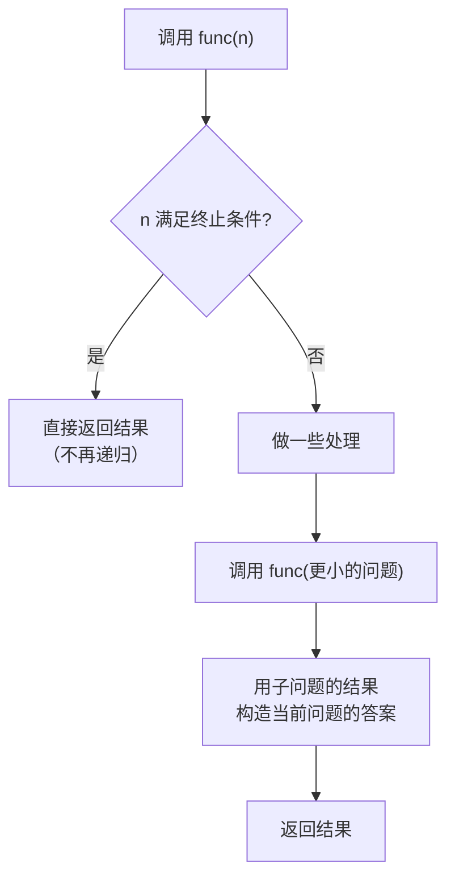
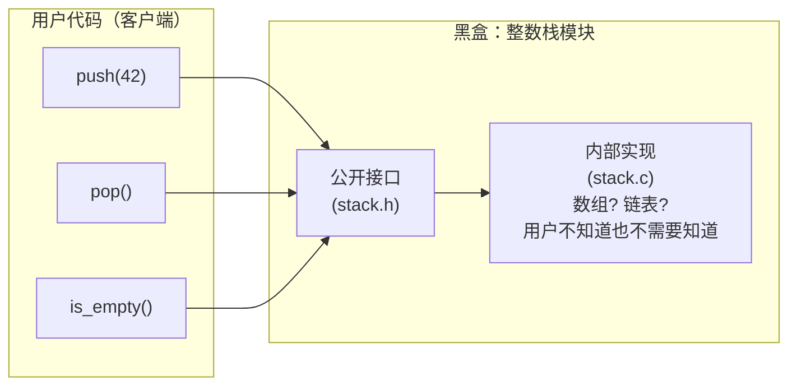

# 递归与程序设计

## 前置知识检查

> 开始前确认这几个问题你能回答，否则回头补前序课程。

1. C 语言中函数参数传递是什么机制？传指针时，函数内部修改指针本身会影响调用方吗？→ 见 [lesson-01-function-mechanics](lesson-01-function-mechanics.md)
2. 函数调用时，局部变量存储在哪里？函数返回后这些变量还有效吗？→ 见 [lesson-01-function-mechanics](lesson-01-function-mechanics.md)（⭐ 深入：返回局部变量的指针）
3. 什么是函数原型？为什么要在调用前声明？→ 见 [lesson-01-function-mechanics](lesson-01-function-mechanics.md)

---

## 核心概念

### 1. 递归（Recursion）

#### 是什么

递归（recursion）就是**函数调用自身**。一个函数在执行过程中直接或间接地调用自己，就构成了递归。

递归函数必须满足两个条件，缺一不可：

1. **存在限制条件（终止条件/基准情形）**：当满足某个条件时，递归停止，不再调用自身
2. **每次调用都更接近限制条件**：递归调用的参数必须向终止条件靠拢，否则永远无法停止



递归的核心思想是**把大问题拆成更小的同类问题**。你不需要一步到位解决整个问题，只需要：

- 知道最简单的情况（终止条件）怎么处理
- 知道如何把问题缩小一步

剩下的交给递归自己完成。

#### 为什么重要

递归是解决**自相似结构**问题的天然方式。很多问题的定义本身就是递归的：

- **数学**：阶乘 `n! = n × (n-1)!`，斐波那契数列 `F(n) = F(n-1) + F(n-2)`
- **数据结构**：链表（节点 + 指向下一个节点的指针（pointer））、二叉树（节点 + 左子树 + 右子树）
- **算法**：快速排序、归并排序、二分查找

在后续的 module-07（链表）和 module-12（数据结构实现）中，你会频繁用到递归。现在打好基础至关重要。

#### 代码演示

先看一个最简单的例子——计算阶乘：

```c
/* factorial_recursive.c — 递归计算阶乘 */
#include <stdio.h>

long factorial(int n) {
    if (n <= 1) {       /* 终止条件：0! = 1, 1! = 1 */
        return 1;
    }
    /* 递归步骤：n! = n * (n-1)! */
    return n * factorial(n - 1);
}

int main(void) {
    for (int i = 0; i <= 10; i++) {
        printf("%2d! = %ld\n", i, factorial(i));
    }
    return 0;
}
```

```bash
gcc -std=c99 -Wall -Wextra -g -o factorial_recursive factorial_recursive.c
./factorial_recursive
```

输出：

```
 0! = 1
 1! = 1
 2! = 2
 3! = 6
 4! = 24
 5! = 120
 6! = 720
 7! = 5040
 8! = 40320
 9! = 362880
10! = 3628800
```

再看原书中的经典示例——将整数转换为字符逐位打印（`binary_to_ascii`）。这个例子很巧妙：你无法从高位开始打印（不知道有多少位），但可以用递归先打印高位再打印低位：

```c
/* binary_to_ascii.c — 递归将整数逐位打印为字符 */
#include <stdio.h>

void binary_to_ascii(unsigned int value) {
    unsigned int quotient = value / 10;

    if (quotient != 0) {
        /* 还没到最高位，先递归处理高位部分 */
        binary_to_ascii(quotient);
    }
    /* 打印当前最低位：取余数，加 '0' 转为 ASCII 字符 */
    putchar(value % 10 + '0');
}

int main(void) {
    printf("4267 = ");
    binary_to_ascii(4267);
    printf("\n");

    printf("0 = ");
    binary_to_ascii(0);
    printf("\n");

    printf("100 = ");
    binary_to_ascii(100);
    printf("\n");

    return 0;
}
```

```bash
gcc -std=c99 -Wall -Wextra -g -o binary_to_ascii binary_to_ascii.c
./binary_to_ascii
```

输出：

```
4267 = 4267
0 = 0
100 = 100
```

这个函数的工作流程：

1. 将参数除以 10，得到商 `quotient`
2. 如果 `quotient` 非零，递归调用自己处理高位
3. 打印当前位（`value % 10 + '0'`）

关键在于：`putchar` 在递归调用**之后**执行。所以最内层的调用（最高位）最先执行 `putchar`，最外层（最低位）最后执行——正好是从高位到低位的顺序。

#### 易错点

**❌ 错误：没有终止条件，导致无限递归**

```c
/* infinite_recursion.c — 无限递归导致栈溢出 */
#include <stdio.h>

void count_down(int n) {
    printf("%d\n", n);
    count_down(n - 1);  /* 没有终止条件！n 变为负数后继续递减 */
}

int main(void) {
    count_down(5);
    return 0;
}
```

```bash
gcc -std=c99 -Wall -Wextra -g -o infinite_recursion infinite_recursion.c
# GCC 13+ 会给出警告：warning: infinite recursion detected [-Winfinite-recursion]
# 但仍然能编译通过（是 warning 不是 error）
./infinite_recursion
# 输出 5, 4, 3, 2, 1, 0, -1, -2, ... 然后段错误 (Segmentation fault)
```

每次递归调用都在栈上创建新的栈帧。没有终止条件意味着栈无限增长，最终耗尽栈空间，操作系统发送 `SIGSEGV` 信号，程序崩溃。

**✅ 正确：加上终止条件**

```c
/* countdown_correct.c — 正确的递归倒计时 */
#include <stdio.h>

void count_down(int n) {
    if (n < 0) {         /* 终止条件 */
        return;
    }
    printf("%d\n", n);
    count_down(n - 1);   /* n 每次减 1，向终止条件逼近 */
}

int main(void) {
    count_down(5);
    return 0;
}
```

```bash
gcc -std=c99 -Wall -Wextra -g -o countdown_correct countdown_correct.c
./countdown_correct
```

输出：

```
5
4
3
2
1
0
```

#### ⭐ 深入：递归调用的栈帧展开过程

> 以下内容为深层原理，理解它有助于加深认识，但不影响日常使用。跳过不影响后续学习。

每次函数调用（包括递归调用）都会在栈上创建一个新的**栈帧**（stack frame），包含该次调用的局部变量和参数。递归调用会层层堆叠栈帧，直到触发终止条件后，栈帧再层层弹出。

以 `binary_to_ascii(4267)` 为例，追踪栈帧变化：

**第一次调用**：`value=4267`，`quotient=426`，非零 → 递归

```
┌───────────────────────────────────┐
│ binary_to_ascii(4267)             │
│   value=4267  quotient=426        │
│   → 递归调用 binary_to_ascii(426) │
└───────────────────────────────────┘
```

**第二次调用**：`value=426`，`quotient=42`，非零 → 递归

```
┌───────────────────────────────────┐
│ binary_to_ascii(426)              │
│   value=426   quotient=42         │
│   → 递归调用 binary_to_ascii(42)  │
├───────────────────────────────────┤
│ binary_to_ascii(4267)             │
│   value=4267  quotient=426        │
│   等待递归返回...                   │
└───────────────────────────────────┘
```

**第三次调用**：`value=42`，`quotient=4`，非零 → 递归

```
┌───────────────────────────────────┐
│ binary_to_ascii(42)               │
│   value=42    quotient=4          │
│   → 递归调用 binary_to_ascii(4)   │
├───────────────────────────────────┤
│ binary_to_ascii(426)              │
│   value=426   quotient=42         │
├───────────────────────────────────┤
│ binary_to_ascii(4267)             │
│   value=4267  quotient=426        │
└───────────────────────────────────┘
```

**第四次调用**：`value=4`，`quotient=0` → **终止！** 不再递归，打印 `'4'`

```
┌───────────────────────────────────┐
│ binary_to_ascii(4)                │
│   value=4     quotient=0          │
│   putchar('4')  ← 输出: 4        │
│   返回                             │
├───────────────────────────────────┤
│ ... 下面的栈帧等待中 ...            │
└───────────────────────────────────┘
```

然后栈帧依次弹出，每层执行自己的 `putchar`：

- 第三层返回后：`putchar(42 % 10 + '0')` → 输出 `'2'`
- 第二层返回后：`putchar(426 % 10 + '0')` → 输出 `'6'`
- 第一层返回后：`putchar(4267 % 10 + '0')` → 输出 `'7'`

最终屏幕上依次出现：`4`、`2`、`6`、`7`。

**要点**：每个栈帧都有自己**独立的** `value` 和 `quotient` 副本。这和上一课讲的传值机制直接相关——每次递归调用都复制一份参数值，互不干扰。

---

### 2. 递归与迭代（Recursion vs Iteration）

#### 是什么

递归和迭代（循环）是解决重复性问题的两种方式：

- **递归**：函数调用自身，"自顶向下"分解问题
- **迭代**：用 `while`/`for` 循环重复执行，"自底向上"累积结果

从理论上讲，**任何递归都可以改写为迭代**（可能需要手动维护一个栈）。但改写的难度因问题而异——有些很简单（如阶乘），有些很复杂（如树的遍历）。

**尾递归**（tail recursion）是一种特殊形式：递归调用是函数执行的**最后一个操作**，调用返回后不再做任何计算。尾递归很重要，因为编译器可以将其优化为循环，避免栈帧堆积。

| | 递归 | 迭代 |
|---|---|---|
| 代码风格 | 声明式：描述"是什么" | 命令式：描述"怎么做" |
| 空间开销 | 每次调用占一个栈帧，O(n) | 通常只需固定数量的变量，O(1) |
| 时间开销 | 函数调用有额外开销（压栈/弹栈） | 循环开销极小 |
| 可读性 | 对递归结构的问题更自然 | 对简单重复更直观 |
| 栈溢出风险 | 递归深度过大会溢出 | 无此风险 |

#### 为什么重要

选错方式会导致严重的性能问题。原书用两个经典例子揭示了这一点：

- **阶乘**：递归和迭代性能差异不大，递归更直观
- **斐波那契数列**：朴素递归导致指数级重复计算，**必须用迭代**（或记忆化（memoization））

作为经验法则：

- 问题天然是递归定义的（树、分治算法）→ 优先考虑递归
- 问题是简单的线性重复（累加、计数）→ 用迭代
- 递归深度可能很大 → 改用迭代或确认编译器优化了尾递归

#### 代码演示

**阶乘：递归 vs 迭代**

```c
/* factorial_compare.c — 阶乘的递归与迭代对比 */
#include <stdio.h>

/* 递归版本 */
long factorial_rec(int n) {
    if (n <= 1) {
        return 1;
    }
    return n * factorial_rec(n - 1);
}

/* 迭代版本 */
long factorial_iter(int n) {
    long result = 1;
    while (n > 1) {
        result *= n;
        n--;
    }
    return result;
}

int main(void) {
    for (int i = 0; i <= 10; i++) {
        long rec = factorial_rec(i);
        long iter = factorial_iter(i);
        printf("%2d! = %ld (递归) = %ld (迭代) %s\n",
               i, rec, iter,
               rec == iter ? "✓" : "✗ 不一致!");
    }
    return 0;
}
```

```bash
gcc -std=c99 -Wall -Wextra -g -o factorial_compare factorial_compare.c
./factorial_compare
```

对于阶乘，递归和迭代的效率差别不大（n 通常不会很大就溢出 `long` 了），选哪个都行。递归版更贴近数学定义 `n! = n × (n-1)!`，迭代版省一点栈空间。

注意 `factorial_rec` **不是**尾递归——因为 `return n * factorial_rec(n - 1)` 中，递归调用返回后还要做一次乘法。如果要写成尾递归形式：

```c
/* factorial_tail.c — 尾递归版阶乘 */
#include <stdio.h>

/* 尾递归版本：累积结果作为参数传递 */
long factorial_tail(int n, long accumulator) {
    if (n <= 1) {
        return accumulator;
    }
    /* 递归调用是最后一个操作，返回后无需额外计算 */
    return factorial_tail(n - 1, accumulator * n);
}

int main(void) {
    for (int i = 0; i <= 10; i++) {
        printf("%2d! = %ld\n", i, factorial_tail(i, 1));
    }
    return 0;
}
```

```bash
gcc -std=c99 -Wall -Wextra -g -o factorial_tail factorial_tail.c
./factorial_tail
```

> 📝 **GCC 尾递归优化**：GCC 在 `-O2` 及以上优化级别会自动将尾递归转换为循环（通过 `-foptimize-sibling-calls` 选项）。这意味着尾递归版本在开启优化后，性能和栈空间消耗与手写循环等价。你可以用 `gcc -O2 -S factorial_tail.c` 查看生成的汇编，会发现递归调用被替换成了 `jmp` 指令（跳转回函数开头），而非 `call`（创建新栈帧）。但注意：**C 标准不保证尾递归优化**，这是编译器的行为。如果对栈空间有严格要求，还是手写迭代更保险。

**斐波那契数列：递归的性能灾难**

```c
/* fibonacci_compare.c — 斐波那契的递归与迭代对比 */
#include <stdio.h>
#include <time.h>

/* 朴素递归版本 —— 性能极差 */
long fib_rec(int n) {
    if (n <= 2) {
        return 1;
    }
    return fib_rec(n - 1) + fib_rec(n - 2);
}

/* 迭代版本 —— 高效 */
long fib_iter(int n) {
    if (n <= 2) {
        return 1;
    }
    long prev = 1;           /* F(n-2) */
    long curr = 1;           /* F(n-1) */
    for (int i = 3; i <= n; i++) {
        long next = prev + curr;
        prev = curr;
        curr = next;
    }
    return curr;
}

int main(void) {
    /* 小 n：结果一致 */
    printf("--- 小 n 对比 ---\n");
    for (int i = 1; i <= 10; i++) {
        printf("F(%2d) = %ld (递归) = %ld (迭代)\n",
               i, fib_rec(i), fib_iter(i));
    }

    /* 大 n：计时对比 */
    printf("\n--- 大 n 计时 ---\n");
    int test_n = 40;

    clock_t start = clock();
    long result_rec = fib_rec(test_n);
    clock_t end = clock();
    double time_rec = (double)(end - start) / CLOCKS_PER_SEC;

    start = clock();
    long result_iter = fib_iter(test_n);
    end = clock();
    double time_iter = (double)(end - start) / CLOCKS_PER_SEC;

    printf("F(%d) = %ld\n", test_n, result_rec);
    printf("递归耗时: %.3f 秒\n", time_rec);
    printf("迭代耗时: %.6f 秒\n", time_iter);
    printf("迭代结果: %ld %s\n", result_iter,
           result_rec == result_iter ? "(一致)" : "(不一致!)");

    return 0;
}
```

```bash
gcc -std=c99 -Wall -Wextra -g -o fibonacci_compare fibonacci_compare.c
./fibonacci_compare
```

输出（时间因机器而异）：

```
--- 小 n 对比 ---
F( 1) = 1 (递归) = 1 (迭代)
F( 2) = 1 (递归) = 1 (迭代)
...
F(10) = 55 (递归) = 55 (迭代)

--- 大 n 计时 ---
F(40) = 102334155
递归耗时: 0.850 秒
迭代耗时: 0.000000 秒
迭代结果: 102334155 (一致)
```

朴素递归计算 `F(40)` 需要近 1 秒，而迭代几乎瞬间完成。如果你试 `F(50)`，递归可能需要**一分钟以上**。

为什么？因为朴素递归存在**大量重复计算**。比如计算 `F(5)` 时：

```
F(5) = F(4) + F(3)
F(4) = F(3) + F(2)     ← F(3) 被计算了两次
F(3) = F(2) + F(1)     ← F(2) 被计算了三次
```

`F(n)` 的递归调用次数是指数级增长的——精确界是 Θ(φ^n)，其中 φ ≈ 1.618 是黄金比例（O(2^n) 是一个更宽松的上界）。而迭代只需 `n` 次循环。

#### 易错点

**❌ 错误：对斐波那契数列使用朴素递归处理大 n**

```c
/* fib_slow.c — 千万别用朴素递归算大斐波那契数 */
#include <stdio.h>

long fib(int n) {
    if (n <= 2) return 1;
    return fib(n - 1) + fib(n - 2);  /* 指数级重复计算！ */
}

int main(void) {
    printf("F(50) = %ld\n", fib(50));
    /* 别跑这行——可能要等好几分钟 */
    return 0;
}
```

```bash
gcc -std=c99 -Wall -Wextra -g -o fib_slow fib_slow.c
./fib_slow
# 等很久...很久...
```

**✅ 正确：用迭代或记忆化递归**

迭代版本已在上面的 `fib_iter` 中展示。另一种方案是**记忆化递归**（memoization）——用数组缓存已计算的结果，避免重复计算：

```c
/* fib_memo.c — 记忆化递归：缓存已计算的结果 */
#include <stdio.h>

#define MAX_N 100
long memo[MAX_N + 1] = {0};  /* 全局数组，初始化为 0 表示未计算 */

long fib_memo(int n) {
    if (n <= 2) {
        return 1;
    }
    if (memo[n] != 0) {
        return memo[n];  /* 已经算过，直接返回缓存 */
    }
    memo[n] = fib_memo(n - 1) + fib_memo(n - 2);
    return memo[n];
}

int main(void) {
    for (int i = 1; i <= 50; i++) {
        printf("F(%2d) = %ld\n", i, fib_memo(i));
    }
    /* 瞬间输出所有结果 */
    return 0;
}
```

```bash
gcc -std=c99 -Wall -Wextra -g -o fib_memo fib_memo.c
./fib_memo
```

记忆化递归把时间复杂度从 O(2^n) 降到 O(n)，和迭代等价。但迭代版本更简单，空间也更省（O(1) vs O(n)），所以对于斐波那契这种简单线性递推，**迭代仍然是更好的选择**。

---

### 3. ADT 和黑盒设计（Abstract Data Type & Black Box）

#### 是什么

抽象数据类型（Abstract Data Type，简称 ADT）是一种**只暴露操作接口、隐藏内部实现**的设计方式。用原书的话说：它就是一个"黑盒"。



在 C 语言中，ADT 的实现依赖两个机制：

1. **头文件（`.h`）定义接口**：只包含函数原型和必要的类型声明，不暴露内部数据结构
2. **`static` 关键字隐藏实现**：在 `.c` 文件中，用 `static` 修饰内部函数和全局变量，使它们只在当前文件内可见

这样做的效果是：**用户只能通过你定义的接口函数操作数据，无法直接访问或修改内部状态**。就像你用 ATM 取钱——你通过按钮和屏幕（接口）操作，但看不到也摸不到里面的钱和机械结构（实现）。

#### 为什么重要

ADT / 黑盒设计是软件工程的基石，好处包括：

1. **模块化**：每个模块独立开发、测试
2. **可替换实现**：想从数组改成链表？只改 `.c` 文件，用户代码不用动
3. **防止误用**：用户无法直接操作内部数据，减少 bug
4. **简化协作**：不同人负责不同模块，通过接口约定协作

在 module-12（数据结构实现）中，你会用 ADT 思想实现堆栈、队列和二叉搜索树。现在先理解原理。

#### 代码演示

下面用一个**简单的整数栈模块**演示 ADT 设计。包含三个文件：

**文件 1：`stack.h`（接口）—— 用户能看到的**

```c
/* stack.h — 整数栈的公开接口 */
#ifndef STACK_H
#define STACK_H

/* 用户只需要知道这些函数存在，不需要知道栈内部怎么存数据 */
void stack_push(int value);
int  stack_pop(void);
int  stack_top(void);
int  stack_is_empty(void);
int  stack_size(void);

#endif /* STACK_H */
```

**文件 2：`stack.c`（实现）—— 用户不需要看的**

```c
/* stack.c — 整数栈的内部实现（用数组） */
#include "stack.h"
#include <stdio.h>
#include <stdlib.h>

#define STACK_CAPACITY 100

/* static：这两个变量只在本文件内可见，外部无法直接访问 */
static int data[STACK_CAPACITY];
static int count = 0;

/* static：内部辅助函数，外部无法调用 */
static void check_overflow(void) {
    if (count >= STACK_CAPACITY) {
        fprintf(stderr, "错误：栈已满\n");
        exit(1);
    }
}

static void check_underflow(void) {
    if (count <= 0) {
        fprintf(stderr, "错误：栈为空\n");
        exit(1);
    }
}

/* 以下是公开接口的实现 */
void stack_push(int value) {
    check_overflow();
    data[count] = value;
    count++;
}

int stack_pop(void) {
    check_underflow();
    count--;
    return data[count];
}

int stack_top(void) {
    check_underflow();
    return data[count - 1];
}

int stack_is_empty(void) {
    return count == 0;
}

int stack_size(void) {
    return count;
}
```

**文件 3：`main.c`（用户代码）**

```c
/* main.c — 使用整数栈模块 */
#include <stdio.h>
#include "stack.h"

int main(void) {
    /* 用户通过接口函数操作栈，不知道也不关心内部用数组还是链表 */
    stack_push(10);
    stack_push(20);
    stack_push(30);

    printf("栈大小: %d\n", stack_size());
    printf("栈顶元素: %d\n", stack_top());

    while (!stack_is_empty()) {
        printf("弹出: %d\n", stack_pop());
    }

    printf("栈是否为空: %s\n", stack_is_empty() ? "是" : "否");
    return 0;
}
```

```bash
# 多文件编译：把 stack.c 和 main.c 一起编译链接
gcc -std=c99 -Wall -Wextra -g -o stack_demo main.c stack.c
./stack_demo
```

输出：

```
栈大小: 3
栈顶元素: 30
弹出: 30
弹出: 20
弹出: 10
栈是否为空: 是
```

注意编译命令：`gcc ... main.c stack.c` 把两个 `.c` 文件一起编译。编译器分别编译每个 `.c` 文件生成目标文件，然后链接在一起。`main.c` 通过 `#include "stack.h"` 知道有哪些函数可用，但完全看不到 `stack.c` 中的 `static` 变量和函数。

#### 易错点

**❌ 错误：没有用 `static`，内部实现被外部直接访问**

```c
/* stack_bad.c — 忘记 static 的后果 */
#include "stack.h"
#include <stdio.h>

#define STACK_CAPACITY 100

/* 没有 static！外部文件可以直接访问这些变量 */
int data[STACK_CAPACITY];
int count = 0;

/* ... 接口函数实现同上 ... */
```

如果 `data` 和 `count` 没有 `static`，任何包含它们声明的文件都可以直接修改：

```c
/* main_bad.c — 绕过接口直接操作内部数据 */
extern int data[];
extern int count;

int main(void) {
    count = 999;       /* 直接篡改栈大小，破坏内部状态！ */
    data[0] = -1;      /* 直接修改内部数组！ */
    /* 接下来调用 stack_pop() 会怎样？灾难。 */
    return 0;
}
```

**✅ 正确：用 `static` 修饰所有内部数据和辅助函数**

```c
/* stack.c — 正确使用 static */
static int data[STACK_CAPACITY];    /* 文件作用域，外部不可见 */
static int count = 0;               /* 文件作用域，外部不可见 */

static void check_overflow(void) {  /* 内部辅助函数，外部不可调用 */
    /* ... */
}
```

加了 `static` 后，如果 `main_bad.c` 试图用 `extern int data[];` 访问，链接器会报错：找不到符号 `data`。这就是封装的力量。

> **提示**：C 语言的信息隐藏机制比 Java/C++ 等语言弱——没有 `private`/`protected` 关键字。`static` + 头文件接口是 C 程序员仅有的封装手段，但在实践中足够有效。更强的隐藏方式是**不透明指针**（opaque pointer）：在头文件中只声明 `typedef struct Stack Stack;`，不暴露结构体定义，用户只能通过指针操作——这在 module-12 数据结构实现中会用到。

---

### 4. 可变参数（stdarg）

#### 是什么

C 语言允许函数接受**不确定数量**的参数，这种函数称为可变参数函数（variadic function）。你最熟悉的 `printf` 就是一个可变参数函数——第一个参数是格式字符串，后面跟着任意数量的待打印值。

要编写自己的可变参数函数，需要使用 `<stdarg.h>` 头文件提供的一个类型和三个宏：

| 名称 | 类别 | 用途 |
|---|---|---|
| `va_list` | 类型 | 声明一个变量，用于遍历可变参数列表 |
| `va_start(ap, last_fixed)` | 宏 | 初始化 `ap`，`last_fixed` 是最后一个固定参数的名字 |
| `va_arg(ap, type)` | 宏 | 取出下一个参数，并指定其类型 `type` |
| `va_end(ap)` | 宏 | 清理 `va_list`，必须在函数返回前调用 |
|---|---|

> [BEGINNER] 函数参数列表中的 `...`（省略号）表示"后面还有不确定数量的参数"。它必须放在参数列表的**最后**，且前面至少有一个固定参数。语法示例：`int sum(int count, ...)`。

使用流程：

```
1. 声明 va_list 变量
2. va_start 初始化（传入最后一个固定参数名）
3. va_arg 逐个取出可变参数（需要指定类型）
4. va_end 清理
```

**关键限制**：可变参数函数**不知道**传入了多少个参数、每个参数是什么类型。你必须通过某种方式告诉函数这些信息。常见的做法有两种：

1. **通过固定参数指定数量**：如 `int sum(int count, ...)`，`count` 告诉函数有几个可变参数
2. **通过格式字符串推断**：如 `printf` 通过 `%d`、`%s` 等格式码确定参数数量和类型

#### 为什么重要

可变参数让你能写出更灵活的函数接口。典型场景：

- **日志/调试函数**：自定义的 `debug_printf` 封装 `printf`
- **求和/求平均**：对任意数量的数值做聚合
- **构造函数**：用不定数量的参数初始化一个数据结构

但要注意：**可变参数没有类型安全检查**。编译器不会验证你传的参数类型是否和 `va_arg` 指定的一致。类型不匹配就是未定义行为（undefined behavior, UB）。能用固定参数解决的问题，不要用可变参数。

#### 代码演示

```c
/* average.c — 计算任意个整数的平均值 */
#include <stdio.h>
#include <stdarg.h>

/*
 * 计算 n_values 个整数的平均值
 * 第一个参数 n_values 指定后面有多少个可变参数
 */
float average(int n_values, ...) {
    va_list args;                   /* 1. 声明 va_list 变量 */
    va_start(args, n_values);      /* 2. 初始化，传入最后一个固定参数名 */

    int sum = 0;
    for (int i = 0; i < n_values; i++) {
        sum += va_arg(args, int);  /* 3. 逐个取出 int 类型的参数 */
    }

    va_end(args);                  /* 4. 清理，必须调用 */
    return (float)sum / n_values;
}

int main(void) {
    printf("average(3, 10, 20, 30) = %.2f\n",
           average(3, 10, 20, 30));

    printf("average(5, 1, 2, 3, 4, 5) = %.2f\n",
           average(5, 1, 2, 3, 4, 5));

    printf("average(1, 100) = %.2f\n",
           average(1, 100));

    return 0;
}
```

```bash
gcc -std=c99 -Wall -Wextra -g -o average average.c
./average
```

输出：

```
average(3, 10, 20, 30) = 20.00
average(5, 1, 2, 3, 4, 5) = 3.00
average(1, 100) = 100.00
```

再看一个更实用的例子——自定义格式化日志函数：

```c
/* debug_log.c — 自定义调试日志函数 */
#include <stdio.h>
#include <stdarg.h>

/*
 * 带前缀的调试输出
 * 内部用 vprintf 转发可变参数给标准 printf 格式化引擎
 */
void debug_log(const char *tag, const char *fmt, ...) {
    va_list args;
    va_start(args, fmt);

    printf("[%s] ", tag);   /* 打印标签前缀 */
    vprintf(fmt, args);     /* vprintf 接受 va_list，和 printf 功能相同 */
    printf("\n");

    va_end(args);
}

int main(void) {
    int x = 42;
    const char *name = "test";

    debug_log("INFO", "程序启动");
    debug_log("DEBUG", "x 的值是 %d", x);
    debug_log("DEBUG", "name = %s, x = %d", name, x);
    debug_log("ERROR", "发生了 %d 个错误", 3);

    return 0;
}
```

```bash
gcc -std=c99 -Wall -Wextra -g -o debug_log debug_log.c
./debug_log
```

输出：

```
[INFO] 程序启动
[DEBUG] x 的值是 42
[DEBUG] name = test, x = 42
[ERROR] 发生了 3 个错误
```

这个 `debug_log` 函数展示了可变参数的常见用法：固定参数接收元信息（标签、格式串），可变参数传递给 `vprintf` 系列函数处理。`vprintf`/`vfprintf`/`vsprintf` 是标准库专门为转发可变参数提供的函数。

> ➕ **原书未提及：`va_copy`（C99 新增）**
>
> 如果你需要**多次遍历**同一个可变参数列表（比如先数一遍参数再处理一遍），不能直接用同一个 `va_list` 遍历两次——`va_arg` 会修改 `va_list` 的内部状态。C99 新增了 `va_copy` 宏来解决这个问题：
>
> ```c
> va_list args, args_copy;
> va_start(args, last_fixed);
> va_copy(args_copy, args);    /* 复制一份 */
> /* 用 args 遍历第一次 */
> /* 用 args_copy 遍历第二次 */
> va_end(args_copy);           /* 两个都要 va_end */
> va_end(args);
> ```
>
> 原书成书时 C99 尚未普及，所以没有提到这个宏。如今 `va_copy` 已经是标准的一部分，在需要多次遍历参数时应该使用它。

#### 易错点

**❌ 错误：va_arg 指定的类型与实际传入的不匹配**

```c
/* va_type_mismatch.c — 类型不匹配的危险 */
#include <stdio.h>
#include <stdarg.h>

void print_values(int count, ...) {
    va_list args;
    va_start(args, count);

    for (int i = 0; i < count; i++) {
        /* 声称参数是 int，但实际传了 double！ */
        int val = va_arg(args, int);
        printf("值 %d: %d\n", i, val);
    }

    va_end(args);
}

int main(void) {
    /* 传入的是 double 类型的 3.14 和 2.71 */
    print_values(2, 3.14, 2.71);
    /* 输出的是垃圾值！因为 va_arg 按 int 大小读取，
       但实际存的是 double（8 字节），读出来的位模式不对 */
    return 0;
}
```

```bash
gcc -std=c99 -Wall -Wextra -g -o va_type_mismatch va_type_mismatch.c
./va_type_mismatch
# 输出垃圾值，行为未定义
```

**✅ 正确：确保 va_arg 的类型与传入参数匹配**

```c
/* va_type_correct.c — 类型匹配的正确用法 */
#include <stdio.h>
#include <stdarg.h>

void print_doubles(int count, ...) {
    va_list args;
    va_start(args, count);

    for (int i = 0; i < count; i++) {
        /* 类型匹配：传入 double，取出 double */
        double val = va_arg(args, double);
        printf("值 %d: %.2f\n", i, val);
    }

    va_end(args);
}

int main(void) {
    print_doubles(3, 3.14, 2.71, 1.41);
    return 0;
}
```

```bash
gcc -std=c99 -Wall -Wextra -g -o va_type_correct va_type_correct.c
./va_type_correct
```

输出：

```
值 0: 3.14
值 1: 2.71
值 2: 1.41
```

> **注意默认参数提升**：`char` 和 `short` 传入可变参数时会被自动提升为 `int`，`float` 会被提升为 `double`。所以 `va_arg(args, float)` 是**错的**，应该用 `va_arg(args, double)`。同理，`va_arg(args, char)` 也是错的，应该用 `va_arg(args, int)`。

---

## 概念串联

本课的四个概念分两组：

**第一组：递归 + 递归与迭代**——这是函数调用的高级应用。上一课你学了函数的基本机制（定义、原型、传值、传指针），现在你看到了函数调用自身的威力和陷阱。递归的核心是每次调用创建独立的栈帧——这和上一课讲的"形参是实参的副本"直接相关。

**第二组：ADT + 可变参数**——这是程序设计的技巧。ADT 教你如何组织代码（接口与实现分离），可变参数教你如何写出灵活的函数接口。这两个概念虽然独立，但都体现了"封装"的思想：ADT 封装数据结构的实现细节，可变参数封装参数数量的灵活性。

往后看：

- **module-03（数组与指针）**：数组作为函数参数时会退化为指针——这是上一课"传值"概念的延伸
- **module-07（链表）**：链表的递归定义天然适合递归处理（递归遍历、递归插入）
- **module-12（数据结构实现）**：会用本课的 ADT 思想实现堆栈、队列和二叉搜索树，接口/实现分离的设计会贯穿整个模块

---

## 常见陷阱清单

| # | 陷阱 | 症状 | 原因 | 修复 |
|---|------|------|------|------|
| 1 | 递归缺少终止条件 | 段错误（栈溢出） | 无限递归耗尽栈空间 | 确保有终止条件，且每次调用都向终止条件逼近 |
| 2 | 朴素递归计算斐波那契 | n=40 以上极慢 | 指数级重复计算（每个子问题被重复求解） | 改用迭代或记忆化递归 |
| 3 | va_arg 类型不匹配 | 读出垃圾值 | 可变参数无类型检查，按错误的类型大小读内存 | 确保 va_arg 的类型与实际传入参数匹配；注意 float→double、char→int 的默认提升 |
| 4 | ADT 忘记用 static 隐藏内部数据 | 外部代码直接访问/修改内部状态 | 没有 static 的文件级变量和函数具有外部链接属性 | 所有内部数据和辅助函数加 `static` |
| 5 | 可变参数数量声称与实际不符 | 读取越界，垃圾值或段错误 | `count` 参数说有 5 个，实际只传了 3 个 | 保证固定参数正确描述可变参数的数量 |

---

## 动手练习提示

### 练习 1：递归求各位数字之和

写一个递归函数 `int sum_digits(int n)` 计算正整数各位数字之和。例如 `sum_digits(1234)` 返回 `1+2+3+4 = 10`。

- 思路：最低位是 `n % 10`，剩余高位是 `n / 10`。终止条件是什么？
- 容易卡住的地方：负数怎么处理？`n = 0` 时应该返回什么？

### 练习 2：可变参数求最大值

写一个函数 `int max_of(int count, ...)` 返回 `count` 个整数中的最大值。

- 思路：用 `va_arg` 逐个取出参数，维护当前最大值
- 容易卡住的地方：第一个参数应该作为初始最大值，不要用 `INT_MIN`（需要额外 `#include <limits.h>`）

### 练习 3：ADT 改造——添加 stack_print 函数

在本课的整数栈模块基础上，添加一个 `void stack_print(void)` 函数，从栈底到栈顶打印所有元素。

- 思路：直接遍历 `data[0]` 到 `data[count-1]`
- 容易卡住的地方：这个函数应该加在哪个文件里？它应该是 `static` 的吗？

---

## 自测题

> 不给答案，动脑想完再往下学。

1. 递归版 `factorial` 中，如果传入负数会怎样？怎么防御？如果不加防御，它和"无限递归"有什么关系？
2. 为什么说"C 语言没有真正的信息隐藏机制"？用 `static` + 头文件的方式能做到什么程度的隐藏？还有什么是藏不住的？（提示：想想头文件中如果需要暴露结构体定义的情况）
3. 如果你写了一个可变参数函数 `int sum(int count, ...)`，调用时 `sum(3, 1, 2)` 只传了 2 个可变参数却声称有 3 个，会发生什么？这属于未定义行为吗？

---

## 补充资源

| 资源 | 类型 | 说明 |
|------|------|------|
| [C Recursion - GeeksforGeeks](https://www.geeksforgeeks.org/c/c-recursion/) | 文章 | 英文递归教程，含多个经典递归示例和图解 |
| [C Recursion - Programiz](https://www.programiz.com/c-programming/c-recursion) | 文章 | 简洁的英文递归入门，适合快速回顾 |
| [Tail Call Optimisation in C - GeeksforGeeks](https://www.geeksforgeeks.org/c/tail-call-optimisation-in-c/) | 文章 | GCC 尾递归优化详解，含汇编对比 |
| [Variadic Functions - cppreference](https://en.cppreference.com/w/c/variadic.html) | 文档 | C 标准库可变参数官方参考 |
| [Variadic Functions in C - GeeksforGeeks](https://www.geeksforgeeks.org/c/variadic-functions-in-c/) | 文章 | stdarg 可变参数完整教程，含多个实例 |
| [递归与迭代的区别 - 知乎](https://www.zhihu.com/question/20278387) | 问答 | 中文社区对递归/迭代的深度讨论 |
| [ADTs and Black Boxes in C - Sanfoundry](https://www.sanfoundry.com/c-tutorials-adts-black-boxes-functions/) | 文章 | 结合原书内容讲解 ADT 黑盒设计 |
