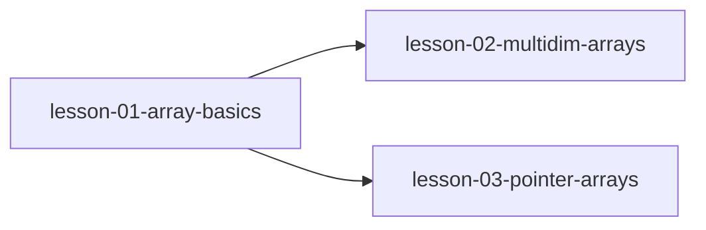

# MODULE.md — 数组与指针

## 模块信息
| 字段 | 值 |
|------|---|
| 模块编号 | module-03 |
| 模块名称 | 数组与指针 |
| 原书章节 | Ch 8 |
| 课程数量 | 3 |
| 预计总时长 | 3 小时 |

---
## 模块目标
学完本模块后，你应该能够：
1. 理解数组名与指针的关系和区别
2. 掌握多维数组的内存布局和指针访问
3. 能使用指针数组管理复杂数据

---
## 课程列表
| # | 课程文件 | 标题 | 核心概念 | 状态 |
|---|---------|------|---------|------|
| 1 | `lesson-01-array-basics.md` | 数组基础 | 数组声明、数组名与指针的关系、下标引用 | ⬜ |
| 2 | `lesson-02-multidim-arrays.md` | 多维数组 | 多维数组内存布局、行优先存储、指向数组的指针 | ⬜ |
| 3 | `lesson-03-pointer-arrays.md` | 指针数组 | 指针数组、字符串数组、数组指针 vs 指针数组 | ⬜ |

---
## 前置模块
- [module-01-pointer-fundamentals](../module-01-pointer-fundamentals/MODULE.md) — 指针的本质、运算和常见陷阱

---
## 模块内课程依赖

---
## 关键术语预览
| 术语 | 英文 | 首次出现课程 |
|------|------|------------|
| 数组名 | array name | lesson-01 |
| 下标引用 | subscript | lesson-01 |
| 指向数组的指针 | pointer to array | lesson-02 |
| 指针数组 | array of pointers | lesson-03 |
