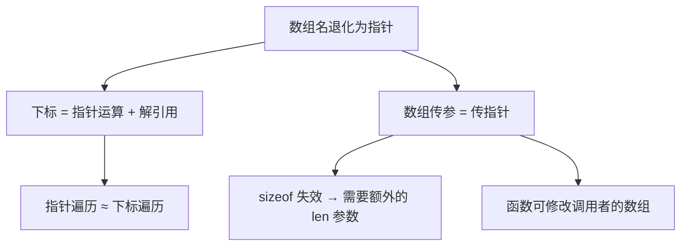

# 一维数组与指针关系

## 前置知识检查

> 开始前确认这几个问题你能回答，否则回头补前序课程。

1. `int *p = &x;` 后，`*(p + 3)` 会访问哪个地址？指针加整数时的缩放（scaling）规则是什么？→ 见 [lesson-03-pointer-arithmetic](../module-01-pointer-fundamentals/lesson-03-pointer-arithmetic.md)
2. `&` 取地址和 `*` 解引用是互逆操作——`*(&x)` 的结果是什么？→ 见 [lesson-01-memory-and-pointers](../module-01-pointer-fundamentals/lesson-01-memory-and-pointers.md)
3. C 函数参数传递只有传值一种方式，那为什么传指针可以修改调用者的变量？→ 见 [lesson-01-function-mechanics](../module-02-functions/lesson-01-function-mechanics.md)

---

## 核心概念

### 1. 数组名与退化

#### 是什么

先看两个声明：

```c
int a;       /* 标量（scalar）：单个整数 */
int b[10];   /* 数组（array）：10 个整数的集合 */
```

`a` 的类型是 `int`，这没有疑问。**`b` 的类型是什么？** 一个自然的猜测是"10 个 int 的数组"——在声明语境下确实如此。但在表达式（expression）中使用 `b` 时，它的值**自动变成**一个指针常量（pointer constant），指向数组第一个元素 `b[0]` 的地址。这个自动转换叫做**退化**（decay）。

退化后的类型取决于元素类型：如果元素是 `int`，数组名退化为 `int *`（指向 int 的指针）；如果元素是 `char`，退化为 `char *`。

用 ASCII 图展示退化：

```
声明: int b[10];

内存布局:
  b (数组名)
  |
  v
  +------+------+------+------+------+------+------+------+------+------+
  | b[0] | b[1] | b[2] | b[3] | b[4] | b[5] | b[6] | b[7] | b[8] | b[9] |
  +------+------+------+------+------+------+------+------+------+------+
  ^
  |
  b 在表达式中退化为指向这里的指针常量
  等价于 &b[0]
```

**两个不退化的例外**：

| 场景 | 行为 | 结果 |
|------|------|------|
| `sizeof(b)` | 返回**整个数组**的字节数 | `10 * sizeof(int)` = 40（在 32/64 位系统上） |
| `&b` | 返回**指向整个数组的指针** | 类型是 `int (*)[10]`，值与 `&b[0]` 相同但类型不同 |

这两个例外极其重要——它们是你判断"数组名是不是真的等于指针"的试金石。

#### 为什么重要

数组退化是 C 语言中最核心的设计决策之一。理解它，后续所有关于数组和指针的用法（下标、函数参数、多维数组）都顺理成章；不理解它，你会不断遇到"为什么这里可以这样写"的困惑。

关键认知：**数组不是指针，指针也不是数组。** 数组名在表达式中退化为指针，但这不代表它们相同。数组有确定的元素数量和内存大小，而指针只是一个标量值。编译器用数组名记住这些属性——只有在表达式中使用时，才产生一个指针常量。

#### 代码演示

```c
/* decay_demo.c — 演示数组名退化和两个例外 */
#include <stdio.h>

int main(void) {
    int a[5] = {10, 20, 30, 40, 50};
    int *p = a;  /* a 退化为 &a[0]，赋给指针 p */

    /* 退化：a 和 &a[0] 值相同 */
    printf("a       = %p\n", (void *)a);
    printf("&a[0]   = %p\n", (void *)&a[0]);
    printf("p       = %p\n", (void *)p);

    printf("\n");

    /* 例外 1：sizeof 不退化，返回整个数组的大小 */
    printf("sizeof(a) = %zu（整个数组：%zu 个 int × %zu 字节）\n",
           sizeof(a), sizeof(a) / sizeof(a[0]), sizeof(int));
    printf("sizeof(p) = %zu（一个指针的大小）\n", sizeof(p));

    printf("\n");

    /* 例外 2：&a 返回指向整个数组的指针 */
    printf("&a      = %p（类型是 int (*)[5]）\n", (void *)&a);
    printf("&a[0]   = %p（类型是 int *）\n", (void *)&a[0]);
    printf("值相同，但类型不同：\n");
    printf("  &a + 1   = %p（跳过整个数组 = %zu 字节）\n",
           (void *)(&a + 1), sizeof(a));
    printf("  &a[0] + 1 = %p（跳过一个 int = %zu 字节）\n",
           (void *)(&a[0] + 1), sizeof(int));

    return 0;
}
```

```bash
gcc -std=c99 -Wall -Wextra -g -o decay_demo decay_demo.c
./decay_demo
```

运行输出（地址值因运行而异，关注差异）：

```
a       = 0x7ffd1234abc0
&a[0]   = 0x7ffd1234abc0
p       = 0x7ffd1234abc0

sizeof(a) = 20（整个数组：5 个 int × 4 字节）
sizeof(p) = 8（一个指针的大小）

&a      = 0x7ffd1234abc0（类型是 int (*)[5]）
&a[0]   = 0x7ffd1234abc0（类型是 int *）
值相同，但类型不同：
  &a + 1   = 0x7ffd1234abd4（跳过整个数组 = 20 字节）
  &a[0] + 1 = 0x7ffd1234abc4（跳过一个 int = 4 字节）
```

注意最后两行：`&a + 1` 跳过了 20 字节（整个数组），而 `&a[0] + 1` 只跳过 4 字节（一个 int）。这就是类型不同带来的指针运算差异。

#### 易错点

❌ **把数组名当左值赋值**：

```c
int a[5] = {1, 2, 3, 4, 5};
int b[5];
int *p;

p = a;   /* ✅ a 退化为指针，赋给指针变量 */
a = p;   /* ❌ 编译错误！数组名是常量，不能赋值 */
b = a;   /* ❌ 编译错误！不能用赋值复制整个数组 */
```

数组名是**指针常量**，不是指针变量。你不能修改常量的值——因为数组在内存中的位置是固定的，"修改数组名"意味着要把整个数组搬走，这在程序运行时是不可能的。

✅ **要复制数组，用循环或 memcpy**：

```c
#include <string.h>
memcpy(b, a, sizeof(a));  /* ✅ 逐字节复制 */
```

❌ **误以为"数组就是指针"**：

```c
/* array_vs_pointer.c — 数组和指针不是一回事 */
#include <stdio.h>

int main(void) {
    int a[5] = {10, 20, 30, 40, 50};
    int *p = a;

    /* 它们的大小完全不同 */
    printf("sizeof(a) = %zu\n", sizeof(a));  /* 20 */
    printf("sizeof(p) = %zu\n", sizeof(p));  /* 8 */

    /* 数组名不能修改，指针可以 */
    p++;    /* ✅ 指针可以自增 */
    /* a++;  ❌ 编译错误：数组名不能自增 */

    printf("p 现在指向 a[1] = %d\n", *p);

    return 0;
}
```

```bash
gcc -std=c99 -Wall -Wextra -g -o array_vs_pointer array_vs_pointer.c
./array_vs_pointer
```

运行输出：

```
sizeof(a) = 20
sizeof(p) = 8
p 现在指向 a[1] = 20
```

#### ⭐ 深入：&a 的类型——指向数组的指针

> 以下内容为深层原理，理解它有助于加深认识，但不影响日常使用。跳过不影响后续学习。

`&a` 返回的类型是 `int (*)[5]`——读作"指向含 5 个 int 的数组的指针"。这和 `int *` 是完全不同的类型：

```c
int a[5];
int *p1      = a;      /* p1 类型：int *，指向单个 int */
int (*p2)[5] = &a;     /* p2 类型：int (*)[5]，指向整个数组 */

/* p1 + 1 跳过 sizeof(int) = 4 字节 */
/* p2 + 1 跳过 sizeof(int[5]) = 20 字节 */
```

这个概念在多维数组中非常重要——`int matrix[3][10]` 的数组名退化后类型是 `int (*)[10]`（指向含 10 个 int 的数组的指针），下一课会详细展开。

---

### 2. 下标引用与间接访问

#### 是什么

C 语言中，**下标引用**（subscript）和**间接访问**（indirection）在底层是同一件事。下标运算符 `[]` 被编译器翻译为指针运算加解引用：

```
array[subscript]  ==  *(array + (subscript))
```

这个等价性不是"大致相等"——它们生成**完全相同**的机器代码。

以 `int b[10];` 为例：

```
b[3] 的求值过程：
  1. b 退化为 int *，指向 b[0]
  2. b + 3 → 指针前移 3 个 int（= 12 字节）
  3. *(b + 3) → 解引用，得到 b[3] 的值

等价于：
  *(b + 3)
```

#### 为什么重要

理解 `[]` 的本质是指针运算，你就能：
- 看懂别人写的指针风格数组操作代码
- 理解为什么指针变量也能用下标（`p[i]`）
- 理解为什么数组参数传递后行为会变

#### 代码演示

```c
/* subscript_demo.c — 下标引用等价于间接访问 */
#include <stdio.h>

int main(void) {
    int a[5] = {10, 20, 30, 40, 50};
    int *p = a + 2;  /* p 指向 a[2] */

    /* 四种等价的访问方式 */
    printf("a[3]      = %d\n", a[3]);
    printf("*(a + 3)  = %d\n", *(a + 3));
    printf("p[1]      = %d\n", p[1]);      /* p 指向 a[2]，p[1] = a[3] */
    printf("*(p + 1)  = %d\n", *(p + 1));

    printf("\n");

    /* 指针也可以用下标 */
    printf("p[0]  = %d（就是 a[2]）\n", p[0]);
    printf("p[-1] = %d（就是 a[1]）\n", p[-1]);  /* 负下标也合法 */
    printf("p[-2] = %d（就是 a[0]）\n", p[-2]);

    printf("\n");

    /* 加法交换律导致的怪异写法 */
    printf("a[3]  = %d\n", a[3]);
    printf("3[a]  = %d\n", 3[a]);   /* *(3 + a) == *(a + 3) */
    /* 完全合法，但绝不要这样写！ */

    return 0;
}
```

```bash
gcc -std=c99 -Wall -Wextra -g -o subscript_demo subscript_demo.c
./subscript_demo
```

运行输出：

```
a[3]      = 40
*(a + 3)  = 40
p[1]      = 40
*(p + 1)  = 40

p[0]  = 30（就是 a[2]）
p[-1] = 20（就是 a[1]）
p[-2] = 10（就是 a[0]）

a[3]  = 40
3[a]  = 40
```

`3[a]` 之所以合法，是因为 `[]` 被翻译为 `*(3 + a)`，加法满足交换律所以 `*(3 + a) == *(a + 3)`。这是 C 语言的一个有趣特性，但你绝不应该这样写——它会严重损害代码可读性。

#### 易错点

❌ **数组越界访问（C 不做运行时下标检查）**：

```c
/* out_of_bounds.c — 数组越界是未定义行为 */
#include <stdio.h>

int main(void) {
    int a[5] = {10, 20, 30, 40, 50};

    /* ❌ 越界访问：下标 5 超出范围 [0, 4] */
    printf("a[5] = %d\n", a[5]);   /* 未定义行为！读到的是垃圾值 */

    /* ❌ 越界写入：可能破坏其他变量或导致段错误 */
    a[5] = 999;  /* 未定义行为！可能覆盖栈上其他数据 */

    return 0;
}
```

```bash
gcc -std=c99 -Wall -Wextra -g -o out_of_bounds out_of_bounds.c
./out_of_bounds
```

GCC 不会对越界访问报错或警告（除非用 `-fsanitize=address`）。C 标准把数组越界定义为**未定义行为**（undefined behavior），编译器不保证检测它。这意味着：
- 可能读到垃圾值
- 可能修改了其他变量
- 可能程序正常运行（最危险——bug 隐藏了）
- 可能段错误

✅ **始终自己检查下标范围**：

```c
int index = get_user_input();
if (index >= 0 && index < 5) {
    printf("a[%d] = %d\n", index, a[index]);  /* ✅ 先检查再访问 */
} else {
    printf("下标 %d 越界！\n", index);
}
```

---

### 3. 指针与下标等价

#### 是什么

既然 `a[i]` 和 `*(a + i)` 完全等价，那么遍历数组就有两种风格：

- **下标风格**：用整数变量 `i` 做下标，`a[i]` 访问元素
- **指针风格**：用指针变量 `p` 逐步前进，`*p` 访问元素

两种写法功能完全相同，选择取决于**可读性**和**场景**。

#### 为什么重要

在实际 C 代码中，两种风格都很常见。标准库函数（如 `strcpy`、`memcpy`）大量使用指针风格。你需要能读懂两种，并根据场景选择更清晰的写法。

#### 代码演示

```c
/* traverse_styles.c — 下标遍历 vs 指针遍历 */
#include <stdio.h>

/* 方式 1：下标遍历 */
int sum_subscript(const int *arr, int len) {
    int total = 0;
    for (int i = 0; i < len; i++) {
        total += arr[i];
    }
    return total;
}

/* 方式 2：指针遍历 */
int sum_pointer(const int *arr, int len) {
    int total = 0;
    const int *end = arr + len;  /* past-the-end 指针 */
    for (const int *p = arr; p < end; p++) {
        total += *p;
    }
    return total;
}

int main(void) {
    int data[] = {10, 20, 30, 40, 50};
    int len = sizeof(data) / sizeof(data[0]);

    printf("下标求和: %d\n", sum_subscript(data, len));
    printf("指针求和: %d\n", sum_pointer(data, len));

    return 0;
}
```

```bash
gcc -std=c99 -Wall -Wextra -g -o traverse_styles traverse_styles.c
./traverse_styles
```

运行输出：

```
下标求和: 150
指针求和: 150
```

两个函数产生相同的结果。`sum_subscript` 更直观——"第 i 个元素"；`sum_pointer` 更底层——"当前指针所指的元素"。

#### 易错点

❌ **为了微小效率牺牲可读性**：

```c
/* ❌ 过度优化：难以理解 */
void copy_bad(int *dst, int *src, int n) {
    while (n--)
        *dst++ = *src++;
}

/* ✅ 清晰直接：谁都看得懂 */
void copy_good(int *dst, const int *src, int n) {
    for (int i = 0; i < n; i++) {
        dst[i] = src[i];
    }
}
```

原书用 Motorola 68000 处理器的汇编代码详细对比了指针和下标的效率差异。在那个年代（1990s），手动优化指针确实能产生更快的代码。但在现代编译器（GCC/Clang 加 `-O2`）下，**编译器会自动把下标转换为最优的指针操作**，手动优化的收益已经很小。

🔄 **原书更新说明**：原书推荐使用 `register` 关键字把指针放入寄存器以提升效率。`register` 在 C 标准中的语义从未改变，但现代编译器自动进行寄存器分配，通常比程序员做得更好，`register` 已失去实际意义。你不需要手动写 `register`。

✅ **选择指针还是下标的实用建议**：

| 场景 | 推荐风格 | 理由 |
|------|---------|------|
| 按下标随机访问 | `a[i]` | 直观，意图清晰 |
| 顺序遍历 | 都可以 | 下标更易读，指针在链式操作中更简洁 |
| 字符串处理 | `*p++` | 标准库惯例，C 程序员都习惯 |
| 多维数组 | `a[i][j]` | 远比 `*(*(a+i)+j)` 易读 |

---

### 4. 数组作为函数参数

#### 是什么

当数组名作为**实参**（actual argument）传给函数时，它会退化为指针。函数接收到的不是整个数组的副本，而是**指向首元素的指针的副本**。

这意味着：
1. 函数内部**可以修改**调用者的数组元素（通过指针间接访问）
2. 函数内部**无法知道**数组的长度（sizeof 返回的是指针大小）
3. 形参（formal parameter）声明中，`int arr[]` 和 `int *arr` **完全等价**

用 ASCII 图展示参数传递过程：

```
调用 print_array(data, 5) 时：

  main 的栈帧:                       print_array 的栈帧:
  +---+---+---+---+---+             +-----------+
  |10 |20 |30 |40 |50 | data       | arr = &data[0] | ← data 退化为指针
  +---+---+---+---+---+             +-----------+
   ^                                 | len = 5   |
   |                                 +-----------+
   +-- arr 指向这里

  sizeof(data) = 20（在 main 中：整个数组）
  sizeof(arr)  = 8 （在函数中：一个指针！）
```

#### 为什么重要

这是 C 中**最常被误解的行为之一**。它完美解释了几个困惑：

- 为什么函数能修改调用者的数组？——因为传的是指针，通过指针间接访问修改了原数据
- 为什么函数内 sizeof 得到的不是数组大小？——因为形参已经退化为指针
- 为什么函数形参不需要指定数组长度？——因为编译器把 `int arr[]` 当作 `int *arr`，不分配数组空间

这也和 module-02 讲的传值调用（pass by value）完全一致：传递的是指针的**副本**，函数可以通过这个副本间接访问原数据，但不能改变调用者的指针本身。

#### 代码演示

```c
/* array_param.c — 数组参数退化为指针 */
#include <stdio.h>

/* int arr[] 和 int *arr 完全等价 */
void show_size(int arr[], int len) {
    /* ❌ sizeof(arr) 在这里是指针大小，不是数组大小！ */
    printf("函数内 sizeof(arr) = %zu（这是指针大小）\n", sizeof(arr));
    printf("函数内 len = %d（必须显式传入）\n", len);

    /* 可以修改调用者的数组 */
    arr[0] = 999;
}

/* 等价声明（编译器不区分） */
void show_size2(int *arr, int len) {
    printf("函数内 sizeof(arr) = %zu（同样是指针大小）\n", sizeof(arr));
    (void)len;  /* 消除未使用参数警告 */
}

int main(void) {
    int data[] = {10, 20, 30, 40, 50};
    int len = sizeof(data) / sizeof(data[0]);

    printf("main 中 sizeof(data) = %zu（整个数组）\n", sizeof(data));
    printf("main 中元素个数 = %d\n", len);
    printf("\n");

    show_size(data, len);
    printf("\n");

    /* 验证函数修改了调用者的数组 */
    printf("data[0] 被函数修改为 %d\n", data[0]);

    return 0;
}
```

```bash
gcc -std=c99 -Wall -Wextra -g -o array_param array_param.c
./array_param
```

运行输出：

```
main 中 sizeof(data) = 20（整个数组）
main 中元素个数 = 5

函数内 sizeof(arr) = 8（这是指针大小）
函数内 len = 5（必须显式传入）

data[0] 被函数修改为 999
```

#### 代码演示 2：正确传递数组长度的模式

```c
/* array_length_pattern.c — 数组 + 长度参数模式 */
#include <stdio.h>

/* ✅ 正确模式：数组指针 + 长度参数 */
int find_max(const int *arr, int len) {
    int max = arr[0];
    for (int i = 1; i < len; i++) {
        if (arr[i] > max) {
            max = arr[i];
        }
    }
    return max;
}

/* ✅ 用宏计算数组长度（只在数组声明的作用域内有效） */
#define ARRAY_LEN(a) ((int)(sizeof(a) / sizeof((a)[0])))

int main(void) {
    int data[] = {34, 78, 12, 89, 45, 67};

    /* sizeof 在这里有效，因为 data 还没退化 */
    printf("最大值: %d\n", find_max(data, ARRAY_LEN(data)));

    return 0;
}
```

```bash
gcc -std=c99 -Wall -Wextra -g -o array_length_pattern array_length_pattern.c
./array_length_pattern
```

运行输出：

```
最大值: 89
```

`ARRAY_LEN` 宏只能在**数组声明所在的作用域**中使用。一旦数组退化为指针（传入函数后），`sizeof` 返回的是指针大小，宏就失效了。这就是为什么 C 函数几乎总是需要一个额外的 `len` 参数。

#### 易错点

❌ **在函数内用 sizeof 计算数组长度**：

```c
/* ❌ 经典 bug：函数内 sizeof 得到的是指针大小 */
void print_all(int arr[]) {
    int len = sizeof(arr) / sizeof(arr[0]);  /* ❌ = 8/4 = 2，不是实际长度！ */
    for (int i = 0; i < len; i++) {
        printf("%d ", arr[i]);  /* 只会打印前两个元素 */
    }
}
```

GCC 会对此发出警告：`'sizeof' on array function parameter 'arr' will return size of 'int *'`。永远不要忽略这个警告。

✅ **正确做法**：始终把长度作为独立参数传入：

```c
void print_all(const int *arr, int len) {
    for (int i = 0; i < len; i++) {
        printf("%d ", arr[i]);
    }
    printf("\n");
}
```

❌ **混淆数组声明和指针声明**：

```c
int a[10];   /* 分配 40 字节内存，a 是常量，指向这段内存 */
int *p;      /* 分配 8 字节内存（指针本身），p 未初始化 */

*a = 5;      /* ✅ a 指向已分配的内存 */
*p = 5;      /* ❌ 未定义行为！p 未指向有效内存 */
```

在函数形参中 `int a[]` 和 `int *a` 等价，但在其他任何地方它们**完全不同**：
- `int a[10]` 分配了 10 个 int 的空间
- `int *p` 只分配了一个指针的空间，不分配任何 int 的空间

---

## 概念串联

本课的四个概念构成了一条逻辑链：



**核心要点**：一切都源于退化规则。数组名在表达式中退化为指针，所以下标可以用指针表达式替代；传参时退化为指针，所以函数接收的是指针而非数组副本。

**与前课的衔接**：
- module-01 lesson-01 讲了指针是"存储地址的变量"——本课说明数组名是"存储地址的**常量**"，不能修改
- module-01 lesson-03 讲了指针运算——本课说明下标 `a[i]` 就是指针运算 `*(a + i)` 的语法糖
- module-02 lesson-01 讲了传值调用——本课说明数组参数传递的不是"整个数组"，而是"指向首元素的指针的副本"，这和传值调用完全一致

**与后续课程的衔接**：
- module-03 lesson-02 将讲多维数组——多维数组名退化后类型是 `int (*)[N]`（指向数组的指针），是本课 `&a` 类型的直接延伸
- module-03 lesson-03 将讲指针数组——`int *arr[]`（指针的数组）和 `int (*arr)[]`（指向数组的指针）是不同的东西
- module-04 将讲字符串——`char s[] = "hello"` 和 `char *s = "hello"` 的区别正是本课"数组 vs 指针"的字符版

---

## 常见陷阱清单

| # | 陷阱 | 症状 | 原因 | 修复 |
|---|------|------|------|------|
| 1 | 给数组名赋值（`a = p`） | 编译错误 | 数组名是常量，不是变量 | 用 memcpy 复制数组内容 |
| 2 | 函数内用 sizeof(arr) 算数组长度 | 只遍历前 1-2 个元素 | 形参退化为指针，sizeof 返回指针大小 | 把长度作为独立参数传入 |
| 3 | 数组越界访问 | 垃圾值、段错误、或"正常"运行（隐藏 bug） | C 不做运行时下标检查 | 手动检查下标范围 |
| 4 | 混淆 `int a[10]` 和 `int *a` 的声明 | 解引用未初始化指针导致段错误 | 数组分配内存，指针声明不分配 | 指针使用前必须初始化 |
| 5 | 字符数组初始化忘记 '\0' 的空间 | 字符串函数越界读取 | `char s[5] = "hello"` 没有空间放 '\0' | 声明长度至少为字符串长度 + 1 |

---

## 动手练习提示

### 练习 1：数组反转

- 目标：写一个函数 `void reverse(int *arr, int len)`，原地反转数组
- 思路提示：用两个指针，一个从头、一个从尾，向中间靠拢交换
- 容易卡住的地方：循环终止条件是 `left < right`，不是 `left != right`

### 练习 2：数组查找（返回指针）

- 目标：写一个函数 `int *find(const int *arr, int len, int key)`，找到返回指向该元素的指针，找不到返回 NULL
- 思路提示：遍历数组，比较每个元素
- 容易卡住的地方：返回的指针指向调用者的数组元素，函数返回后仍然有效（因为数组还在调用者的栈帧中）

### 练习 3：ARRAY_LEN 宏的陷阱

- 目标：写一段代码验证 ARRAY_LEN 宏在函数内对形参使用时会得到错误结果
- 思路提示：在 main 中和函数中分别对同一个数组使用 ARRAY_LEN，对比输出
- 容易卡住的地方：理解为什么结果不同——退化

---

## 自测题

> 不给答案，动脑想完再往下学。

1. `int a[5]; int *p = a;` 后，`sizeof(a)` 和 `sizeof(p)` 分别是多少？为什么不同？如果在一个函数中 `void f(int a[])` 调用 `sizeof(a)` 会得到什么？

2. 为什么 `a = p;` 编译错误但 `p = a;` 合法？从"常量 vs 变量"的角度解释。

3. 写一个函数接受数组参数，如果去掉 `len` 参数，函数能自己算出数组有多少个元素吗？为什么？

---

## 补充资源

| 资源 | 类型 | 说明 |
|------|------|------|
| [C FAQ - Arrays and Pointers](https://c-faq.com/aryptr/aryptrparam.html) | 文档 | C FAQ 官方答案：数组参数如何转换为指针 |
| [Learn C++ - Array Decay](https://www.learncpp.com/cpp-tutorial/c-style-array-decay/) | 教程 | 数组退化机制的完整讲解（C 部分通用） |
| 搜索关键词：`C语言 数组名 指针 区别` | 搜索 | 中文社区关于数组和指针区别的讨论 |
| 搜索关键词：`C array decay sizeof exception` | 搜索 | sizeof 例外的深入解释 |
