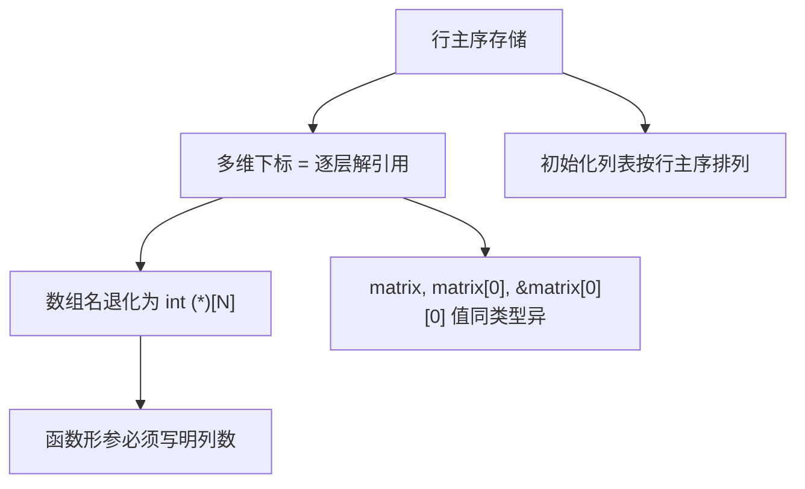

# 多维数组

## 前置知识检查

> 开始前确认这几个问题你能回答，否则回头补前序课程。

1. `int a[5];` 中 `a` 在表达式中退化（decay）为什么类型的指针？`sizeof(a)` 和 `&a` 为什么不退化？→ 见 [lesson-01-array-basics](lesson-01-array-basics.md)
2. `a[i]` 等价于 `*(a + i)`——下标引用（subscript）的本质是指针运算加解引用（dereference），你能写出等价的指针表达式吗？→ 见 [lesson-01-array-basics](lesson-01-array-basics.md)
3. 数组作为函数参数（function argument）时退化为指针，为什么函数内 `sizeof(arr)` 得到的是指针大小而非数组大小？→ 见 [lesson-01-array-basics](lesson-01-array-basics.md)

---

## 核心概念

### 1. 行主序存储

#### 是什么

C 语言的多维数组（multidimensional array）本质上是**数组的数组**。考虑这些声明：

```c
int a;           /* 标量：单个 int */
int b[10];       /* 一维数组：10 个 int */
int c[3][10];    /* 二维数组：3 个"含 10 个 int 的数组" */
int d[2][3][10]; /* 三维数组：2 个"含 3 个含 10 个 int 的数组的数组" */
```

`c` 不是一个"3 行 10 列的表格"——更准确地说，它是**一个含 3 个元素的一维数组，每个元素本身是一个含 10 个 int 的一维数组**。

在内存中，所有元素按**行主序**（row-major order）连续存储：最右边的下标率先变化。

```
int matrix[3][4] 在内存中的布局:

地址从低到高 →
+--------+--------+--------+--------+--------+--------+--------+--------+--------+--------+--------+--------+
| [0][0] | [0][1] | [0][2] | [0][3] | [1][0] | [1][1] | [1][2] | [1][3] | [2][0] | [2][1] | [2][2] | [2][3] |
+--------+--------+--------+--------+--------+--------+--------+--------+--------+--------+--------+--------+
|<-------- 第 0 行 -------->|<-------- 第 1 行 -------->|<-------- 第 2 行 -------->|

行主序：先填满一行，再填下一行。最右下标 [j] 先变化。
```

#### 为什么重要

理解存储顺序决定了：
- **初始化顺序**：初始化列表的值按行主序逐个赋给数组元素
- **遍历效率**：按行遍历（内层循环变化列下标）是缓存友好的，按列遍历则不是
- **指针访问**：用指针逐元素遍历多维数组时，地址是连续递增的

#### 代码演示

```c
/* row_major.c — 验证二维数组的行主序存储 */
#include <stdio.h>

int main(void) {
    int matrix[3][4] = {
        {10, 11, 12, 13},   /* 第 0 行 */
        {20, 21, 22, 23},   /* 第 1 行 */
        {30, 31, 32, 33}    /* 第 2 行 */
    };

    /* 用指针逐元素遍历，验证行主序 */
    int *p = &matrix[0][0];
    printf("按内存顺序遍历：\n");
    for (int i = 0; i < 12; i++) {
        printf("  地址 %p: 值 = %d\n", (void *)p, *p);
        p++;
    }

    printf("\n");

    /* 按行遍历（✅ 缓存友好） */
    printf("按行遍历（缓存友好）：\n");
    for (int i = 0; i < 3; i++) {
        for (int j = 0; j < 4; j++) {
            printf("%d ", matrix[i][j]);
        }
        printf("\n");
    }

    return 0;
}
```

```bash
gcc -std=c99 -Wall -Wextra -g -o row_major row_major.c
./row_major
```

运行输出（地址值因运行而异）：

```
按内存顺序遍历：
  地址 0x7ffd...: 值 = 10
  地址 0x7ffd...: 值 = 11
  地址 0x7ffd...: 值 = 12
  地址 0x7ffd...: 值 = 13
  地址 0x7ffd...: 值 = 20
  地址 0x7ffd...: 值 = 21
  ...（依次递增 4 字节）

按行遍历（缓存友好）：
10 11 12 13
20 21 22 23
30 31 32 33
```

指针每次 `+1` 跳过 4 字节（一个 int），地址连续递增，值的顺序正是 `[0][0], [0][1], ..., [0][3], [1][0], ...`——最右下标率先变化。

#### 易错点

❌ **用逗号写多维下标**：

```c
/* comma_trap.c — 逗号操作符陷阱 */
#include <stdio.h>

int main(void) {
    int matrix[3][4] = {
        {10, 11, 12, 13},
        {20, 21, 22, 23},
        {30, 31, 32, 33}
    };

    /* ❌ 逗号操作符：丢弃左值，只保留右值 */
    printf("matrix[1,2] = %p\n", (void *)matrix[1,2]);
    /* 等价于 matrix[2]，不是 matrix[1][2]！ */

    /* ✅ 正确的多维下标 */
    printf("matrix[1][2] = %d\n", matrix[1][2]);

    return 0;
}
```

```bash
gcc -std=c99 -Wall -Wextra -g -o comma_trap comma_trap.c
./comma_trap
```

编译时 GCC 会警告：`left-hand operand of comma expression has no effect`。`matrix[1,2]` 中的逗号是**逗号操作符**（comma operator），它先求值 `1`（丢弃），再求值 `2`，所以整个表达式等价于 `matrix[2]`——得到的是第 2 行的地址，而不是 `matrix[1][2]` 的值。

✅ **C 的多维下标必须用多个 `[]`**：`matrix[1][2]`，不是 `matrix[1,2]`。

#### ⭐ 深入：行主序 vs 列主序

> 以下内容为深层原理，理解它有助于加深认识，但不影响日常使用。跳过不影响后续学习。

C 使用**行主序**（row-major order）：最右下标率先变化。Fortran 和 MATLAB 使用**列主序**（column-major order）：最左下标率先变化。

对于 `matrix[3][4]`：
- 行主序（C）：`[0][0], [0][1], [0][2], [0][3], [1][0], ...`
- 列主序（Fortran）：`[0][0], [1][0], [2][0], [0][1], [1][1], ...`

这意味着 C 中按行遍历是连续内存访问（缓存友好），而 Fortran 中按列遍历才是连续的。如果你需要与 Fortran 库交互（如 LAPACK），要注意存储顺序的差异。

---

### 2. 多维下标与指针等价

#### 是什么

上一课讲过一维数组的等价性：`a[i]` == `*(a + i)`。多维数组是同一原理的逐层应用。

以 `int matrix[3][10];` 为例，`matrix[1][5]` 的求值过程是**两层退化 + 两层解引用**：

```
matrix[1][5] 的逐步求值：

第 1 步：matrix 退化为 int (*)[10]（指向含 10 个 int 的数组的指针）
         指向 matrix 的第 0 行

第 2 步：matrix + 1 → 指针前移 1 个"含 10 个 int 的数组"
         = 跳过 10 × 4 = 40 字节，指向第 1 行

第 3 步：*(matrix + 1) → 解引用，得到第 1 行（类型变为 int *）
         等价于 matrix[1]

第 4 步：*(matrix + 1) + 5 → int * 前移 5 个 int
         = 跳过 5 × 4 = 20 字节

第 5 步：*(*(matrix + 1) + 5) → 解引用，得到 int 值
         等价于 matrix[1][5]
```

用 ASCII 图展示：

```
matrix (int (*)[10])
  |
  v
  +---+---+---+---+---+---+---+---+---+---+
  | 0 | 1 | 2 | 3 | 4 | 5 | 6 | 7 | 8 | 9 |  ← 第 0 行 (matrix[0])
  +---+---+---+---+---+---+---+---+---+---+
  | 0 | 1 | 2 | 3 | 4 |[5]| 6 | 7 | 8 | 9 |  ← 第 1 行 (matrix[1])
  +---+---+---+---+---+---+---+---+---+---+
  | 0 | 1 | 2 | 3 | 4 | 5 | 6 | 7 | 8 | 9 |  ← 第 2 行 (matrix[2])
  +---+---+---+---+---+---+---+---+---+---+

  matrix + 1       → 指向第 1 行起始
  *(matrix + 1)    → 第 1 行退化为 int *
  *(matrix+1) + 5  → 指向 [1][5]
  *(*(matrix+1)+5) → 取得 [1][5] 的值
```

等价关系总结：

| 表达式 | 等价写法 | 类型 |
|--------|---------|------|
| `matrix` | `&matrix[0]` | `int (*)[10]` |
| `matrix + 1` | `&matrix[1]` | `int (*)[10]` |
| `*(matrix + 1)` | `matrix[1]` | `int *` |
| `*(matrix + 1) + 5` | `matrix[1] + 5` 或 `&matrix[1][5]` | `int *` |
| `*(*(matrix + 1) + 5)` | `matrix[1][5]` | `int` |

#### 为什么重要

理解逐层解引用：
- 才能看懂别人写的 `*(*(mat + i) + j)` 风格代码
- 才能理解为什么函数形参（formal parameter）需要指定列数——编译器需要知道每行有多少个元素才能计算 `matrix + i` 的偏移量
- 才能理解 `matrix`、`matrix[0]`、`&matrix[0][0]` 三者的值相同但类型不同

#### 代码演示

```c
/* subscript_equiv.c — 多维下标等价于逐层间接访问 */
#include <stdio.h>

int main(void) {
    int matrix[3][10] = {
        { 0,  1,  2,  3,  4,  5,  6,  7,  8,  9},
        {10, 11, 12, 13, 14, 15, 16, 17, 18, 19},
        {20, 21, 22, 23, 24, 25, 26, 27, 28, 29}
    };

    /* 五种等价方式访问 matrix[1][5] */
    printf("matrix[1][5]              = %d\n", matrix[1][5]);
    printf("*(matrix[1] + 5)          = %d\n", *(matrix[1] + 5));
    printf("*(*(matrix + 1) + 5)      = %d\n", *(*(matrix + 1) + 5));
    printf("(*(matrix + 1))[5]        = %d\n", (*(matrix + 1))[5]);
    printf("*(&matrix[0][0] + 1*10+5) = %d\n",
           *(&matrix[0][0] + 1 * 10 + 5));

    printf("\n");

    /* 三者值相同，类型不同 */
    printf("matrix        = %p（类型 int (*)[10]）\n",
           (void *)matrix);
    printf("matrix[0]     = %p（类型 int *）\n",
           (void *)matrix[0]);
    printf("&matrix[0][0] = %p（类型 int *）\n",
           (void *)&matrix[0][0]);

    printf("\n");

    /* +1 后跳过的字节数不同 */
    printf("matrix + 1        = %p（跳过 %zu 字节 = 1 行）\n",
           (void *)(matrix + 1),
           (char *)(matrix + 1) - (char *)matrix);
    printf("matrix[0] + 1     = %p（跳过 %zu 字节 = 1 个 int）\n",
           (void *)(matrix[0] + 1),
           (char *)(matrix[0] + 1) - (char *)matrix[0]);
    printf("&matrix[0][0] + 1 = %p（跳过 %zu 字节 = 1 个 int）\n",
           (void *)(&matrix[0][0] + 1),
           (char *)(&matrix[0][0] + 1) - (char *)&matrix[0][0]);

    return 0;
}
```

```bash
gcc -std=c99 -Wall -Wextra -g -o subscript_equiv subscript_equiv.c
./subscript_equiv
```

运行输出（地址因运行而异）：

```
matrix[1][5]              = 15
*(matrix[1] + 5)          = 15
*(*(matrix + 1) + 5)      = 15
(*(matrix + 1))[5]        = 15
*(&matrix[0][0] + 1*10+5) = 15

matrix        = 0x7ffd...（类型 int (*)[10]）
matrix[0]     = 0x7ffd...（类型 int *）
&matrix[0][0] = 0x7ffd...（类型 int *）

matrix + 1        = 0x7ffd...（跳过 40 字节 = 1 行）
matrix[0] + 1     = 0x7ffd...（跳过 4 字节 = 1 个 int）
&matrix[0][0] + 1 = 0x7ffd...（跳过 4 字节 = 1 个 int）
```

关键观察：`matrix`、`matrix[0]`、`&matrix[0][0]` 三者的**值**相同（都指向同一个内存地址），但**类型**不同——`+1` 后跳过的字节数分别是 40、4、4。

#### 易错点

❌ **混淆 `matrix[1]` 的类型**：

```c
int matrix[3][10];

/* ❌ matrix[1] 不是 int！它是 int *（指向第 1 行首元素） */
int x = matrix[1];    /* 编译警告：从指针赋给整数 */

/* ✅ 取元素值需要两层下标 */
int x = matrix[1][0]; /* 第 1 行第 0 个元素 */
```

`matrix[1]` 等价于 `*(matrix + 1)`，结果是第 1 行这个子数组的数组名——它退化为 `int *`，不是 `int`。要取到具体的 `int` 值，必须再加一层下标。

---

### 3. 指向数组的指针

#### 是什么

**指向数组的指针**（pointer to array）是一种特殊的指针类型，声明方式：

```c
int (*p)[10];  /* p 是指向"含 10 个 int 的数组"的指针 */
```

括号至关重要——去掉括号含义完全不同：

```c
int (*p)[10];  /* 指向数组的指针：p 指向整行 */
int *p[10];    /* 指针数组：p 是含 10 个 int * 的数组 */
```

解读 `int (*p)[10]` 的方法：假设它是表达式，按优先级求值：
1. `(*p)` — 括号优先，`p` 是指针
2. `(*p)[10]` — 对指针解引用后再下标，得到的是数组元素
3. `int` — 数组元素类型是 int

所以 `p` 是"指向含 10 个 int 的数组的指针"。

这正是二维数组名退化后的类型：

```c
int matrix[3][10];
/* matrix 退化为 int (*)[10] — 指向第 0 行（含 10 个 int 的数组）的指针 */
int (*p)[10] = matrix;  /* p 指向 matrix 的第 0 行 */
```

`p + 1` 跳过整整一行（40 字节），`p + 2` 跳过两行（80 字节）。

#### 为什么重要

指向数组的指针是多维数组机制的核心：
- 多维数组名退化后的类型就是指向数组的指针
- 函数接受多维数组参数时，形参类型就是指向数组的指针
- 理解它才能正确声明和使用多维数组相关的函数

#### 代码演示

```c
/* ptr_to_array.c — 指向数组的指针 */
#include <stdio.h>

int main(void) {
    int matrix[3][4] = {
        {10, 11, 12, 13},
        {20, 21, 22, 23},
        {30, 31, 32, 33}
    };

    /* 指向数组的指针 */
    int (*p)[4] = matrix;  /* p 指向第 0 行 */

    /* 用 p 逐行访问 */
    for (int i = 0; i < 3; i++) {
        printf("第 %d 行：", i);
        for (int j = 0; j < 4; j++) {
            /* 三种等价写法 */
            printf("%d ", p[i][j]);
            /* 也可以写 (*(p + i))[j] */
            /* 也可以写 *(*(p + i) + j) */
        }
        printf("\n");
    }

    printf("\n");

    /* p + 1 跳过整行 */
    printf("p     = %p\n", (void *)p);
    printf("p + 1 = %p（跳过 %zu 字节 = 1 行）\n",
           (void *)(p + 1),
           (char *)(p + 1) - (char *)p);
    printf("p + 2 = %p（跳过 %zu 字节 = 2 行）\n",
           (void *)(p + 2),
           (char *)(p + 2) - (char *)p);

    return 0;
}
```

```bash
gcc -std=c99 -Wall -Wextra -g -o ptr_to_array ptr_to_array.c
./ptr_to_array
```

运行输出：

```
第 0 行：10 11 12 13
第 1 行：20 21 22 23
第 2 行：30 31 32 33

p     = 0x7ffd...
p + 1 = 0x7ffd...（跳过 16 字节 = 1 行）
p + 2 = 0x7ffd...（跳过 32 字节 = 2 行）
```

每行 4 个 int × 4 字节 = 16 字节，所以 `p + 1` 跳过 16 字节。

#### 易错点

❌ **用 `int *` 接收二维数组名**：

```c
int matrix[3][4];

/* ❌ 类型不匹配：matrix 退化为 int (*)[4]，不是 int * */
int *p = matrix;  /* 编译警告 */

/* ✅ 正确：用指向数组的指针 */
int (*p)[4] = matrix;

/* ✅ 如果确实需要 int *，取首元素地址 */
int *q = &matrix[0][0];   /* 逐元素访问 */
int *r = matrix[0];        /* 等价写法 */
```

❌ **省略数组大小 `int (*p)[]`**：

```c
/* ❌ p 指向未知大小的数组，指针运算无法确定步长 */
int (*p)[] = matrix;
/* p + 1 应该跳过多少字节？编译器不知道！ */
/* 某些编译器会报错，某些会默默产生错误结果 */
```

✅ **必须指定数组大小**：`int (*p)[4] = matrix;`

---

### 4. 多维数组作为函数参数

#### 是什么

多维数组传给函数时，和一维数组一样发生退化——但退化后的类型不是简单的 `int *`，而是**指向数组的指针**。

```c
int matrix[3][10];
/* 传参时 matrix 退化为 int (*)[10] */
```

因此，函数形参有两种等价声明方式：

```c
void print_matrix(int mat[][10], int rows);   /* 数组形式 */
void print_matrix(int (*mat)[10], int rows);  /* 指针形式（更准确） */
```

两者完全等价。注意：
- **第 1 维**的大小可以省略（`mat[]`）——因为编译器不需要它来计算偏移
- **第 2 维及之后**的大小**必须**指定（`[10]`）——编译器需要知道每行有多少列才能计算 `mat[i][j]` 的偏移

偏移量计算公式：`mat[i][j]` 的地址 = `mat 的起始地址 + i × 列数 × sizeof(int) + j × sizeof(int)`。如果不知道列数，这个计算无法完成。

#### 为什么重要

几乎所有处理二维数组的 C 函数都需要接收多维数组参数。正确声明形参类型是写出这类函数的基础。这也是"为什么 `int **` 不能接收二维数组"这个经典问题的答案。

#### 代码演示

```c
/* array_param_2d.c — 多维数组作为函数参数 */
#include <stdio.h>

/* 两种等价声明（选一种即可） */
/* void print_matrix(int (*mat)[4], int rows) */
void print_matrix(int mat[][4], int rows) {
    for (int i = 0; i < rows; i++) {
        for (int j = 0; j < 4; j++) {
            printf("%3d ", mat[i][j]);
        }
        printf("\n");
    }
}

/* 函数可以修改调用者的数组 */
void fill_matrix(int mat[][4], int rows) {
    for (int i = 0; i < rows; i++) {
        for (int j = 0; j < 4; j++) {
            mat[i][j] = i * 10 + j;
        }
    }
}

int main(void) {
    int matrix[3][4];

    fill_matrix(matrix, 3);
    printf("填充后的矩阵：\n");
    print_matrix(matrix, 3);

    return 0;
}
```

```bash
gcc -std=c99 -Wall -Wextra -g -o array_param_2d array_param_2d.c
./array_param_2d
```

运行输出：

```
填充后的矩阵：
  0   1   2   3
 10  11  12  13
 20  21  22  23
```

#### 易错点

❌ **用 `int **` 接收二维数组**：

```c
/* double_ptr_error.c — int ** 不等于 int [][N] */
#include <stdio.h>

void bad_print(int **mat, int rows, int cols) {
    /* 这里 mat[i] 会把 int 值当作指针解引用——灾难！ */
    for (int i = 0; i < rows; i++) {
        for (int j = 0; j < cols; j++) {
            printf("%d ", mat[i][j]);  /* ❌ 未定义行为 */
        }
        printf("\n");
    }
}

int main(void) {
    int matrix[3][4] = {
        {10, 11, 12, 13},
        {20, 21, 22, 23},
        {30, 31, 32, 33}
    };

    /* ❌ 类型不匹配：matrix 退化为 int (*)[4]，不是 int ** */
    /* bad_print(matrix, 3, 4); */
    /* GCC: warning: passing 'int (*)[4]' to 'int **' */

    printf("编译器会对类型不匹配发出警告\n");

    return 0;
}
```

```bash
gcc -std=c99 -Wall -Wextra -g -o double_ptr_error double_ptr_error.c
./double_ptr_error
```

为什么 `int **` 不能接收二维数组？关键在于**解引用方式不同**：

| 操作 | `int (*mat)[4]` | `int **mat` |
|------|----------------|-------------|
| `mat[i]` | 跳过 `i` 个含 4 个 int 的行，得到 `int *` | 跳过 `i` 个指针，取出一个 `int *` 值 |
| `mat[i][j]` | 在第 `i` 行内偏移 `j` 个 int | 先取出 `mat[i]` 指向的地址，再偏移 `j` |

`int (*mat)[4]` 直接计算偏移量访问连续内存；`int **mat` 先读取一个指针值再跳转。二维数组的内存是连续的，里面没有存储行指针，所以 `int **` 的"先取指针再跳转"会把 `matrix[0][0]` 的值当作地址来访问——这是未定义行为（undefined behavior）。

✅ **正确的声明方式**：

```c
/* ✅ 两种等价方式 */
void f(int mat[][4], int rows);
void f(int (*mat)[4], int rows);

/* ✅ 如果列数在运行时才知道（C99 VLA 参数语法） */
void f(int rows, int cols, int mat[rows][cols]);
```

❌ **忘记指定第 2 维大小**：

```c
/* ❌ 编译错误：数组元素类型不完整 */
void f(int mat[][], int rows);

/* ❌ 二级指针，不是指向数组的指针 */
void f(int **mat, int rows);
```

---

## 概念串联

本课的四个概念构成了一条逻辑链：



**核心要点**：多维数组是"数组的数组"，存储是行主序的连续内存。数组名退化后类型是指向子数组的指针（`int (*)[N]`），编译器需要知道 N 才能正确计算偏移——这就是为什么函数形参必须指定除第 1 维外所有维的大小。

**与前课的衔接**：
- lesson-01 讲了一维数组名退化为 `int *`——本课说明多维数组名退化为 `int (*)[N]`，是"指向更复杂类型"的自然扩展
- lesson-01 讲了 `a[i]` == `*(a + i)`——本课说明多维下标是这个等价性的逐层应用
- lesson-01 讲了 `&a` 返回 `int (*)[5]`——本课说明这正是多维数组名退化后的类型

**与后续课程的衔接**：
- lesson-03 将讲指针数组（`int *p[10]`）——和本课的 `int (*p)[10]` 形成对比
- module-04 将讲字符串数组——`char *names[]`（指针数组）vs `char names[][20]`（二维字符数组）是两种不同的设计

---

## 常见陷阱清单

| # | 陷阱 | 症状 | 原因 | 修复 |
|---|------|------|------|------|
| 1 | 用逗号写下标 `matrix[1,2]` | 得到第 2 行的地址而非 `[1][2]` 的值 | 逗号是操作符，丢弃左值取右值 | 用 `matrix[1][2]` |
| 2 | 用 `int **` 接收二维数组 | 编译警告或段错误 | `int **` 需要间接取指针，二维数组内存中没有行指针 | 用 `int (*mat)[N]` 或 `int mat[][N]` |
| 3 | 函数形参省略第 2 维大小 | 编译错误 | 编译器需要列数计算偏移量 | 显式写出第 2 维及之后的大小 |
| 4 | `int (*p)[]` 省略数组大小 | 指针运算结果错误 | 编译器无法确定指针步长（按 0 缩放） | 写明大小 `int (*p)[N]` |
| 5 | 按列遍历大型二维数组 | 程序运行缓慢 | 列遍历导致缓存行频繁失效（cache miss） | 尽量按行遍历（内层循环变化列下标） |

---

## 动手练习提示

### 练习 1：矩阵转置

- 目标：写一个函数 `void transpose(int src[][4], int dst[][3], int rows, int cols)`，将 `src` 转置到 `dst`
- 思路提示：`dst[j][i] = src[i][j]`
- 容易卡住的地方：`dst` 的维度声明——源是 3×4，转置后是 4×3，形参中列数要匹配目标

### 练习 2：用指向数组的指针遍历

- 目标：用 `int (*p)[4]` 指针遍历 `int matrix[3][4]` 的所有元素并打印
- 思路提示：外层循环移动 `p`（每次跳一行），内层循环用 `(*p)[j]` 访问列
- 容易卡住的地方：`(*p)[j]` 的括号不能省——省掉变成 `*p[j]`，含义完全不同

### 练习 3：打印任意行数的矩阵

- 目标：写一个函数接受列数固定为 5 的二维数组和行数参数，打印全部元素
- 思路提示：形参声明为 `int mat[][5]` 或 `int (*mat)[5]`
- 容易卡住的地方：不要写成 `int **mat`

---

## 自测题

> 不给答案，动脑想完再往下学。

1. `int matrix[3][10];` 后，`matrix`、`matrix[0]`、`&matrix[0][0]` 三者的值相同吗？类型相同吗？对它们分别 `+1` 后各跳过多少字节？

2. 为什么 `void f(int **mat)` 不能接收 `int matrix[3][10]`？从"解引用方式"的角度解释 `int **` 和 `int (*)[10]` 的本质区别。

3. 如果你需要写一个函数处理"列数在运行时才知道"的二维数组，函数原型应该怎么声明？（提示：C99 引入了什么特性？）

---

## 补充资源

| 资源 | 类型 | 说明 |
|------|------|------|
| [Memory Layout of Multi-Dimensional Arrays](https://eli.thegreenplace.net/2015/memory-layout-of-multi-dimensional-arrays) | 博客 | 行主序/列主序的内存布局详解，含性能基准测试 |
| [C语言数组指针详解](https://c.biancheng.net/view/1993.html) | 教程 | 数组指针的定义、遍历方法、运算符优先级辨析 |
| [Pointer to an Array](https://www.geeksforgeeks.org/c/pointer-array-array-pointer/) | 教程 | 数组指针 vs 指针数组的对比，含 1D/2D/3D 示例 |
| [Passing Multi-Dimensional Array to Function](https://solarianprogrammer.com/2019/03/27/c-programming-passing-multi-dimensional-array-to-function/) | 博客 | 多维数组传参的各种方式（固定维度、VLA、动态分配） |
