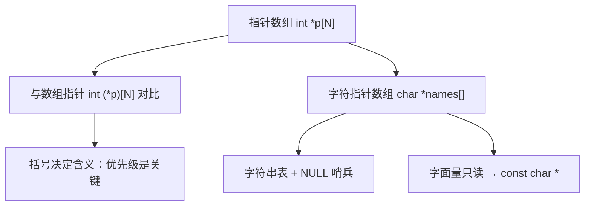

# 指针数组与效率

## 前置知识检查

> 开始前确认这几个问题你能回答，否则回头补前序课程。

1. `int (*p)[10]` 声明的是什么类型？`p + 1` 跳过多少字节？→ 见 [lesson-02-multidim-arrays](lesson-02-multidim-arrays.md)
2. 下标运算符 `[]` 的优先级（precedence）和间接访问 `*` 的优先级谁更高？→ 见 [lesson-01-array-basics](lesson-01-array-basics.md)
3. `char s[] = "hello"` 和 `char *s = "hello"` 有什么区别？（如不知道也没关系，本课会讲）

---

## 核心概念

### 1. 指针数组

#### 是什么

**指针数组**（array of pointers）就是"元素是指针"的数组。声明方式：

```c
int *api[10];
```

怎么读这个声明？按操作符优先级（precedence）分析：

1. `api[10]` — `[]` 优先级高于 `*`，先取下标（subscript）：`api` 是一个含 10 个元素的数组
2. `*api[10]` — 对数组元素执行间接访问（indirection）：元素是指针
3. `int` — 指针指向 `int`

所以 `api` 是**一个含 10 个 `int *` 元素的数组**。每个元素都是一个指针，可以指向不同的 `int` 变量或数组。

用 ASCII 图展示内存布局：

```
int *api[10];   （10 个指针，每个 8 字节，共 80 字节）

api:
+------+------+------+------+------+--- ... ---+------+
| api0 | api1 | api2 | api3 | api4 |           | api9 |
+------+------+------+------+------+--- ... ---+------+
  |       |       |
  v       v       v
 int     int     int   ...（各元素指向不同的 int 值）
```

#### 为什么重要

指针数组是管理"一组地址"的基本数据结构，广泛用于：
- **字符串表**：`char *keywords[]` 存储关键字列表
- **命令分发表**：`void (*handlers[])()` 存储函数指针（module-08 会讲）
- **动态数据管理**：用 `malloc` 为每个元素分配不同大小的内存（module-06 会讲）

#### 代码演示

```c
/* ptr_array_basic.c — 指针数组基础用法 */
#include <stdio.h>

int main(void) {
    int a = 10, b = 20, c = 30, d = 40;

    /* 声明指针数组并初始化 */
    int *api[4] = {&a, &b, &c, &d};

    /* 遍历指针数组，通过指针访问原变量 */
    for (int i = 0; i < 4; i++) {
        printf("api[%d] = %p, *api[%d] = %d\n",
               i, (void *)api[i], i, *api[i]);
    }

    printf("\n");

    /* 通过指针数组修改原变量 */
    *api[2] = 999;
    printf("修改后 c = %d\n", c);  /* c 被改为 999 */

    printf("\n");

    /* sizeof 验证：数组占 4 个指针的空间 */
    printf("sizeof(api) = %zu（4 个指针 × %zu 字节）\n",
           sizeof(api), sizeof(int *));

    return 0;
}
```

```bash
gcc -std=c99 -Wall -Wextra -g -o ptr_array_basic ptr_array_basic.c
./ptr_array_basic
```

运行输出：

```
api[0] = 0x7ffd..., *api[0] = 10
api[1] = 0x7ffd..., *api[1] = 20
api[2] = 0x7ffd..., *api[2] = 30
api[3] = 0x7ffd..., *api[3] = 40

修改后 c = 999

sizeof(api) = 32（4 个指针 × 8 字节）
```

每个 `api[i]` 是一个 `int *`，解引用（dereference）`*api[i]` 得到它指向的 `int` 值。通过 `*api[2] = 999` 修改了变量 `c` 的值。

#### 易错点

❌ **指针数组元素未初始化就解引用**：

```c
/* uninit_ptr_array.c — 指针数组未初始化的危险 */
#include <stdio.h>

int main(void) {
    int *api[4];  /* 局部数组，元素未初始化！ */

    /* ❌ 未初始化的指针指向随机地址 */
    /* printf("%d\n", *api[0]); */
    /* 未定义行为：可能段错误 */

    /* ✅ 使用前先初始化 */
    int x = 42;
    api[0] = &x;
    printf("*api[0] = %d\n", *api[0]);  /* 安全 */

    /* ✅ 或者初始化为 NULL，使用前检查 */
    api[1] = NULL;
    if (api[1] != NULL) {
        printf("%d\n", *api[1]);
    } else {
        printf("api[1] 是 NULL，不能解引用\n");
    }

    return 0;
}
```

```bash
gcc -std=c99 -Wall -Wextra -g -o uninit_ptr_array uninit_ptr_array.c
./uninit_ptr_array
```

运行输出：

```
*api[0] = 42
api[1] 是 NULL，不能解引用
```

指针数组的元素是指针——**指针使用前必须初始化**。未初始化的局部指针包含垃圾地址，解引用是未定义行为（undefined behavior）。

---

### 2. 指针数组 vs 数组指针

#### 是什么

C 中最容易搞混的一对声明：

```c
int *p[10];    /* 指针数组：p 是含 10 个 int * 的数组 */
int (*p)[10];  /* 数组指针：p 是指向"含 10 个 int 的数组"的指针 */
```

区别只有一对括号，但内存布局和用途完全不同。

解读方法——按操作符优先级：

| 声明 | 第 1 步（高优先级） | 第 2 步 | 结论 |
|------|-------------------|---------|------|
| `int *p[10]` | `p[10]`：p 是 10 元素数组 | `*`：元素是指针 | 10 个 `int *` 的数组 |
| `int (*p)[10]` | `(*p)`：p 是指针 | `[10]`：指向 10 元素数组 | 指向 `int [10]` 的指针 |

用 ASCII 图并排对比内存布局：

```
int *p[4];                       int (*q)[4];
（指针数组：4 个指针）             （数组指针：1 个指针）

p:                                q:
+------+------+------+------+    +------+
| ptr0 | ptr1 | ptr2 | ptr3 |    |  q   |
+------+------+------+------+    +------+
  |       |       |       |        |
  v       v       v       v        v
 int     int     int     int     +---+---+---+---+
（各自独立的 int）                | 0 | 1 | 2 | 3 |  一整个数组
                                  +---+---+---+---+

sizeof(p) = 4 × 8 = 32 字节      sizeof(q) = 8 字节（一个指针）
```

#### 为什么重要

这两种声明的混淆是 C 中最常见的错误之一。上一课讲的 `int (*p)[N]` 用于多维数组的函数参数，本课讲的 `int *p[N]` 用于管理一组独立的指针。搞反了，编译器可能只报一个 warning，但运行时行为完全错误。

能区分它们，你就能正确选择数据结构来处理多维数据。

#### 代码演示

```c
/* ptr_array_vs_array_ptr.c — 指针数组 vs 数组指针 */
#include <stdio.h>

int main(void) {
    int arr[4] = {10, 20, 30, 40};
    int a = 1, b = 2, c = 3, d = 4;

    /* 指针数组：4 个指针，各指向不同的 int */
    int *pa[4] = {&a, &b, &c, &d};

    /* 数组指针：1 个指针，指向含 4 个 int 的数组 */
    int (*pArr)[4] = &arr;

    /* 对比 sizeof */
    printf("sizeof(pa)   = %zu（4 个指针）\n",
           sizeof(pa));
    printf("sizeof(pArr) = %zu（1 个指针）\n",
           sizeof(pArr));

    printf("\n");

    /* 对比访问方式 */
    printf("指针数组访问：\n");
    for (int i = 0; i < 4; i++) {
        printf("  *pa[%d] = %d\n", i, *pa[i]);
    }

    printf("数组指针访问：\n");
    for (int i = 0; i < 4; i++) {
        printf("  (*pArr)[%d] = %d\n",
               i, (*pArr)[i]);
    }

    printf("\n");

    /* 对比 +1 的步长 */
    printf("pa + 1 跳过 %zu 字节（1 个指针）\n",
           (char *)(pa + 1) - (char *)pa);
    printf("pArr + 1 跳过 %zu 字节（整个数组）\n",
           (char *)(pArr + 1) - (char *)pArr);

    return 0;
}
```

```bash
gcc -std=c99 -Wall -Wextra -g -o ptr_array_vs_array_ptr ptr_array_vs_array_ptr.c
./ptr_array_vs_array_ptr
```

运行输出：

```
sizeof(pa)   = 32（4 个指针）
sizeof(pArr) = 8（1 个指针）

指针数组访问：
  *pa[0] = 1
  *pa[1] = 2
  *pa[2] = 3
  *pa[3] = 4
数组指针访问：
  (*pArr)[0] = 10
  (*pArr)[1] = 20
  (*pArr)[2] = 30
  (*pArr)[3] = 40

pa + 1 跳过 8 字节（1 个指针）
pArr + 1 跳过 16 字节（整个数组）
```

关键差异：
- `sizeof(pa)` = 32（4 个指针的空间），`sizeof(pArr)` = 8（1 个指针的空间）
- `pa + 1` 跳过 1 个指针（8 字节），`pArr + 1` 跳过整个数组（16 字节）
- 指针数组的每个元素独立指向不同的内存；数组指针（pointer to array）整体指向一块连续的数组内存

#### 易错点

❌ **声明时漏掉括号导致含义反转**：

```c
/* bracket_trap.c — 括号决定含义 */
#include <stdio.h>

int main(void) {
    int arr[4] = {10, 20, 30, 40};

    /* ❌ 少了括号：变成指针数组 */
    /* int *p[4] = &arr; */
    /* 编译错误：不能用 int (*)[4] 初始化 int *[4] */

    /* ✅ 加上括号：数组指针 */
    int (*p)[4] = &arr;
    printf("(*p)[0] = %d\n", (*p)[0]);

    return 0;
}
```

```bash
gcc -std=c99 -Wall -Wextra -g -o bracket_trap bracket_trap.c
./bracket_trap
```

运行输出：

```
(*p)[0] = 10
```

记忆口诀：**括号护指针**——加了括号 `(*p)` 是指针，没有括号 `*p[N]` 先解 `[]` 得到数组。

---

### 3. 字符指针数组与字符串表

#### 是什么

**字符指针数组**（array of character pointers）是指针数组最常见的应用：用 `char *` 数组存储一组字符串。

```c
char *names[] = {"alice", "bob", "charlie"};
```

这里 `names` 是含 3 个 `char *` 元素的数组，每个元素指向一个**字符串字面量**（string literal）。

另一种方式是用二维字符数组：

```c
char names2[][8] = {"alice", "bob", "charlie"};
```

两者的内存布局截然不同：

```
方式 1：char *names[] = {"alice", "bob", "charlie"};
（指针数组 + 字符串字面量）

names:                            只读数据区:
+------+------+---------+        +-----------+
|  p0  |  p1  |   p2    |        |"alice\0"  | ← 6 字节
+------+------+---------+        +-----------+
  |       |       |               |"bob\0"    | ← 4 字节
  |       |       +------------>  +-----------+
  |       +-------------------->  |"charlie\0"| ← 8 字节
  +----------------------------->  +-----------+

内存占用：3 个指针(24) + 字符串(6+4+8) = 42 字节

方式 2：char names2[][8] = {"alice", "bob", "charlie"};
（二维数组，每行 8 字节）

names2:
+---+---+---+---+---+---+---+---+
| a | l | i | c | e |\0 |\0 |\0 |  ← 3 字节浪费
+---+---+---+---+---+---+---+---+
| b | o | b |\0 |\0 |\0 |\0 |\0 |  ← 5 字节浪费
+---+---+---+---+---+---+---+---+
| c | h | a | r | l | i | e |\0 |  ← 0 字节浪费
+---+---+---+---+---+---+---+---+

内存占用：3 × 8 = 24 字节（每行固定宽度，短字符串浪费空间）
```

#### 为什么重要

字符串表是 C 程序中最常用的数据结构之一——关键字列表、菜单项、错误信息、命令名等。选择指针数组还是二维字符数组取决于实际场景：

| 特性 | `char *names[]`（指针数组） | `char names[][N]`（二维数组） |
|------|--------------------------|------------------------------|
| 每行长度 | 可变（各字符串独立） | 固定为 N |
| 额外开销 | 每行一个指针（8 字节） | 无指针，但短字符串浪费空间 |
| 可修改性 | 字面量只读，不能修改字符 | 栈上拷贝，可以修改 |
| 适用场景 | 字符串长度差异大 | 字符串长度相近 |

原书的分析仍然准确：如果字符串长度差别不大，二维数组更紧凑（不需要指针开销）；如果长度差异大，指针数组更紧凑（不浪费固定长度的填充空间）。实际中人们更常用指针数组方案，因为它更灵活。

#### 代码演示

```c
/* string_table.c — 字符指针数组 vs 二维字符数组 */
#include <stdio.h>
#include <string.h>

/* 方式 1：指针数组（NULL 哨兵标记结尾） */
const char *keywords[] = {
    "do",
    "for",
    "if",
    "register",
    "return",
    "switch",
    "while",
    NULL            /* 哨兵：标记表的结尾 */
};

/* 查找关键字，返回索引（找不到返回 -1） */
int lookup_keyword(const char *word,
                   const char *table[]) {
    for (int i = 0; table[i] != NULL; i++) {
        if (strcmp(word, table[i]) == 0) {
            return i;
        }
    }
    return -1;
}

int main(void) {
    /* 遍历关键字表（用 NULL 哨兵判断结尾） */
    printf("关键字列表：\n");
    for (int i = 0; keywords[i] != NULL; i++) {
        printf("  [%d] %s\n", i, keywords[i]);
    }

    printf("\n");

    /* 查找测试 */
    const char *test[] = {"for", "main", "while"};
    for (int i = 0; i < 3; i++) {
        int idx = lookup_keyword(test[i], keywords);
        if (idx >= 0) {
            printf("\"%s\" 找到，索引 = %d\n",
                   test[i], idx);
        } else {
            printf("\"%s\" 未找到\n", test[i]);
        }
    }

    printf("\n");

    /* 方式 2：二维字符数组 */
    char kw_matrix[][9] = {
        "do", "for", "if", "register",
        "return", "switch", "while"
    };
    int kw_count = sizeof(kw_matrix)
                   / sizeof(kw_matrix[0]);

    printf("二维数组方式（%d 个关键字）：\n",
           kw_count);
    for (int i = 0; i < kw_count; i++) {
        printf("  [%d] \"%s\"（占 %zu 字节）\n",
               i, kw_matrix[i],
               sizeof(kw_matrix[i]));
    }

    printf("\n");

    /* 内存占用对比 */
    printf("指针数组占用：%zu 字节"
           "（含 NULL 哨兵）\n",
           sizeof(keywords));
    printf("二维数组占用：%zu 字节\n",
           sizeof(kw_matrix));

    return 0;
}
```

```bash
gcc -std=c99 -Wall -Wextra -g -o string_table string_table.c
./string_table
```

运行输出：

```
关键字列表：
  [0] do
  [1] for
  [2] if
  [3] register
  [4] return
  [5] switch
  [6] while

"for" 找到，索引 = 1
"main" 未找到
"while" 找到，索引 = 6

二维数组方式（7 个关键字）：
  [0] "do"（占 9 字节）
  [1] "for"（占 9 字节）
  [2] "if"（占 9 字节）
  [3] "register"（占 9 字节）
  [4] "return"（占 9 字节）
  [5] "switch"（占 9 字节）
  [6] "while"（占 9 字节）

指针数组占用：64 字节（含 NULL 哨兵）
二维数组占用：63 字节
```

注意 `lookup_keyword` 函数用 `NULL` **哨兵**（sentinel）判断表的结尾——循环条件是 `table[i] != NULL`，不需要传入表的长度。这是 C 中非常常见的模式，`main` 函数的 `argv` 参数就是以 NULL 结尾的字符指针数组。

原书也展示了两种等价的遍历方式：

```c
/* 下标遍历 */
for (int i = 0; table[i] != NULL; i++) { ... }

/* 指针遍历（原书风格） */
for (const char **kwp = table; *kwp != NULL; kwp++) {
    ...
}
```

两者功能完全相同。指针遍历中 `kwp` 是 `const char **`——**指向指针的指针**（pointer to pointer）：`kwp` 指向 `table` 的某个元素，`*kwp` 取出该元素（一个 `char *`），`**kwp` 取出字符串的第一个字符。

#### 易错点

❌ **修改字符串字面量**：

```c
/* string_literal_readonly.c — 字符串字面量只读 */
#include <stdio.h>

int main(void) {
    /* 指针指向字符串字面量（只读区） */
    char *s1 = "hello";

    /* 字符数组（栈上拷贝，可修改） */
    char s2[] = "hello";

    /* ✅ 数组可以修改 */
    s2[0] = 'H';
    printf("s2 = %s\n", s2);

    /* ❌ 修改字面量是未定义行为！ */
    /* s1[0] = 'H'; */
    /* 典型结果：段错误（SIGSEGV） */
    printf("s1 = %s（不要试图修改！）\n", s1);

    return 0;
}
```

```bash
gcc -std=c99 -Wall -Wextra -g -o string_literal_readonly string_literal_readonly.c
./string_literal_readonly
```

运行输出：

```
s2 = Hello
s1 = hello（不要试图修改！）
```

📝 **原书解释增强**：原书在指针数组一节中没有显式强调字符串字面量（string literal）的只读性。这是现代 C 编程中最常见的 bug 来源之一，必须理解清楚：

- `char *s = "hello"` — `s` 是一个指针，指向**只读数据区**中的字符串字面量。字面量在编译时就确定了内容，存储在程序的只读段（通常是 `.rodata`）。试图通过 `s[0] = 'H'` 修改它是未定义行为，大多数系统上会导致段错误（segmentation fault）。
- `char s[] = "hello"` — `s` 是一个字符数组，编译器在栈上分配 6 字节并将 `"hello\0"` **拷贝**进去。这块内存属于你，可以随意修改。

✅ **最佳实践**：指向字符串字面量的指针**总是**声明为 `const char *`：

```c
const char *s = "hello";   /* ✅ const 防止意外修改 */
/* s[0] = 'H'; */          /* 编译错误，而不是运行时段错误 */
```

❌ **忘记 NULL 哨兵导致遍历越界**：

```c
/* missing_sentinel.c — 忘记 NULL 哨兵 */
#include <stdio.h>

int main(void) {
    /* ❌ 没有 NULL 哨兵 */
    const char *bad_table[] = {"do", "for", "if"};
    (void)bad_table;  /* 仅演示声明，消除未使用警告 */

    /* 这个循环会读到数组之外的内存！ */
    /* for (int i = 0; bad_table[i] != NULL; i++) */
    /*     printf("%s\n", bad_table[i]); */
    /* 未定义行为：可能打印垃圾，可能段错误 */

    /* ✅ 加上 NULL 哨兵 */
    const char *good_table[] = {
        "do", "for", "if", NULL
    };
    for (int i = 0; good_table[i] != NULL; i++) {
        printf("%s\n", good_table[i]);
    }

    return 0;
}
```

```bash
gcc -std=c99 -Wall -Wextra -g -o missing_sentinel missing_sentinel.c
./missing_sentinel
```

运行输出：

```
do
for
if
```

如果不用 NULL 哨兵（sentinel）模式，就必须用 `sizeof` 计算元素个数（只能在数组声明的作用域内）或者显式传递长度参数。

---

## 概念串联

本课的三个概念构成了一条从声明到应用的链：



**核心要点**：指针数组和数组指针只差一对括号，但内存布局截然不同。指针数组最常见的应用是字符指针数组（字符串表），使用时注意两点：字符串字面量不可修改，用 NULL 哨兵标记结尾。

**与前课的衔接**：
- lesson-01 讲了 `[]` 优先级高于 `*`——本课利用这个规则解读 `int *p[10]` vs `int (*p)[10]`
- lesson-02 讲了指向数组的指针 `int (*p)[N]`——本课的指针数组 `int *p[N]` 与它形成对比
- lesson-01 讲了数组名退化（decay）为指针——本课的 `char *names[]` 中每个元素就是退化后的字符串指针

**与后续课程的衔接**：
- module-04 将系统讲解字符串操作——`strcpy`、`strcmp` 等函数经常与字符指针数组配合使用
- module-06 将讲动态内存——用 `malloc` 为指针数组的每个元素分配空间，是 C 中实现"动态字符串数组"的标准方式
- module-08 将讲函数指针——函数指针数组（转移表）和本课的指针数组是同一结构，只是元素类型换成了函数指针

---

## 常见陷阱清单

| # | 陷阱 | 症状 | 原因 | 修复 |
|---|------|------|------|------|
| 1 | 混淆 `int *p[10]` 和 `int (*p)[10]` | 类型不匹配的编译警告或运行时错误 | 括号改变了优先级，含义完全不同 | 记住"括号护指针"：有括号是数组指针，无括号是指针数组 |
| 2 | 修改字符串字面量 `char *s = "hello"; s[0] = 'H';` | 段错误 | 字面量在只读数据段 | 用 `const char *` 声明；需要修改就用 `char s[]` |
| 3 | 指针数组元素未初始化就解引用 | 段错误或垃圾值 | 局部指针数组元素含垃圾地址 | 使用前初始化每个元素，或初始化为 NULL 后检查 |
| 4 | 忘记 NULL 哨兵导致遍历越界 | 打印垃圾、段错误 | 循环检测 `!= NULL` 但数组末尾没有 NULL | 在指针数组末尾加 `NULL`，或用 sizeof 计算长度 |

---

## 动手练习提示

### 练习 1：月份名查找

- 目标：用 `const char *months[]` 存储 12 个月份名（January ~ December），写一个函数 `const char *month_name(int n)` 返回第 n 个月的名字（1-12），无效返回 `"Invalid"`
- 思路提示：数组下标从 0 开始，月份从 1 开始，注意偏移
- 容易卡住的地方：边界检查 `n < 1 || n > 12`

### 练习 2：字符串排序

- 目标：用 `char *words[]` 存储一组单词，写一个冒泡排序函数对字符串按字典序排序
- 思路提示：比较用 `strcmp`，交换的是**指针**（`char *` 值），不是字符串内容本身
- 容易卡住的地方：交换指针 vs 交换字符串——交换指针只需要 `char *tmp = words[i]; words[i] = words[j]; words[j] = tmp;`，不需要 `strcpy`

### 练习 3：内存占用计算

- 目标：分别用 `char *table[]` 和 `char table[][N]` 存储同一组字符串（长度差异大），计算并打印两者的内存占用
- 思路提示：指针数组 = 指针个数 × 8 + 各字符串实际长度之和；二维数组 = 行数 × 最长字符串长度
- 容易卡住的地方：`sizeof` 在数组声明作用域中返回整个数组大小，但字符串字面量的长度需要用 `strlen + 1`

---

## 自测题

> 不给答案，动脑想完再往下学。

1. `int *p[5]` 的 `sizeof` 是多少？`int (*p)[5]` 的 `sizeof` 是多少？为什么不同？

2. `char *names[] = {"alice", "bob"}` 和 `char names[][6] = {"alice", "bob"}` 各占多少内存？哪种方式在字符串长度差异大时更省空间？

3. 写一个函数接收 `const char *words[]`（NULL 结尾）作为参数，返回字符串总数。函数原型应该怎么声明？为什么不需要传长度参数？

---

## 补充资源

| 资源 | 类型 | 说明 |
|------|------|------|
| [Array of Pointers in C](https://www.geeksforgeeks.org/c/array-of-pointers-in-c/) | 教程 | 指针数组的定义、声明和应用示例 |
| [C语言指针数组详解](https://c.biancheng.net/view/2020.html) | 教程 | 中文社区指针数组讲解 |
| [Pointer vs Array in C](https://www.geeksforgeeks.org/c/pointer-vs-array-in-c/) | 教程 | 指针和数组的区别辨析 |
