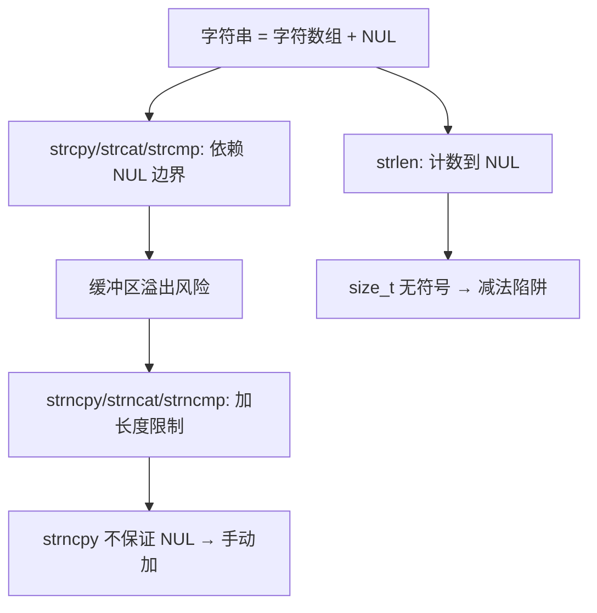

# 字符串基础与标准函数

## 前置知识检查

> 开始前确认这几个问题你能回答，否则回头补前序课程。

1. `char *s = "hello"` 和 `char s[] = "hello"` 哪个可以修改字符内容？为什么？→ 见 [lesson-03-pointer-arrays](../module-03-arrays-and-pointers/lesson-03-pointer-arrays.md)
2. 数组作为函数参数时退化（decay）为指针，函数内 `sizeof(arr)` 得到的是什么？→ 见 [lesson-01-array-basics](../module-03-arrays-and-pointers/lesson-01-array-basics.md)
3. `const char *p` 声明表示指针 `p` 所指向的内容不可修改——你能通过 `p[0] = 'X'` 修改吗？→ 见 [lesson-03-pointer-arrays](../module-03-arrays-and-pointers/lesson-03-pointer-arrays.md)

---

## 核心概念

### 1. 字符串基础与 NUL 终止符

#### 是什么

C 语言**没有**内置的字符串类型。C 中的字符串就是**一个以 NUL 字节结尾的字符数组**。

**NUL 终止符**（NUL terminator）是一个值为 0 的字节，写作 `'\0'`。它标记字符串的结束位置。所有标准库字符串函数都依赖它来判断字符串在哪里结束。NUL 本身不算字符串的一部分，但它必须占用数组中的一个位置。

用 ASCII 图展示字符串在内存中的布局：

```
char greeting[] = "Hello";

内存布局（6 字节，不是 5 字节）：
+-----+-----+-----+-----+-----+------+
| 'H' | 'e' | 'l' | 'l' | 'o' | '\0' |
+-----+-----+-----+-----+-----+------+
  [0]   [1]   [2]   [3]   [4]   [5]

strlen("Hello") = 5（不含 NUL）
sizeof(greeting) = 6（含 NUL）
```

使用字符串函数前，需要包含头文件 `<string.h>`。

**NUL 与 NULL 的区别**——这是初学者最常混淆的一对：

| 名称 | 写法 | 值 | 含义 | 用途 |
|------|------|---|------|------|
| NUL | `'\0'` | 整数 0 | 字符串终止符 | 标记字符串结尾 |
| NULL | `NULL` | `((void *)0)` | 空指针（null pointer） | 表示指针不指向任何有效数据 |

它们的数值都是 0，但**语义完全不同**：NUL 是一个字符，NULL 是一个指针。

#### 为什么重要

所有标准库字符串函数（`strlen`、`strcpy`、`strcmp` 等）都通过扫描 NUL 来确定字符串的结尾。如果忘记了 NUL：
- `strlen` 会继续向后扫描，返回一个随机的大数
- `strcpy` 会复制远超预期的字节，覆盖相邻内存
- `printf("%s", ...)` 会打印出垃圾字符直到碰巧遇到一个 0 字节

这些都是**未定义行为**（undefined behavior），而且不容易调试——程序可能"看起来正常"却在某些条件下崩溃。

#### 代码演示

```c
/* string_basics.c — 字符串的本质：字符数组 + NUL */
#include <stdio.h>
#include <string.h>

int main(void) {
    /* 方式 1：字符串字面量初始化（自动加 NUL） */
    char s1[] = "Hello";

    /* 方式 2：手动逐字符初始化 */
    char s2[6];
    s2[0] = 'H';
    s2[1] = 'e';
    s2[2] = 'l';
    s2[3] = 'l';
    s2[4] = 'o';
    s2[5] = '\0';  /* 必须手动加 NUL！ */

    printf("s1 = \"%s\", strlen = %zu, sizeof = %zu\n",
           s1, strlen(s1), sizeof(s1));
    printf("s2 = \"%s\", strlen = %zu, sizeof = %zu\n",
           s2, strlen(s2), sizeof(s2));

    printf("\n");

    /* 逐字节查看内存内容 */
    printf("s1 的每个字节：\n");
    for (int i = 0; i < (int)sizeof(s1); i++) {
        printf("  s1[%d] = '%c' (ASCII %d)\n",
               i, s1[i] ? s1[i] : '?', s1[i]);
    }

    printf("\n");

    /* NUL vs NULL */
    char nul_char = '\0';
    char *null_ptr = NULL;
    printf("NUL: '\\0' 的整数值 = %d\n",
           nul_char);
    printf("NULL: 空指针的值 = %p\n",
           (void *)null_ptr);

    return 0;
}
```

```bash
gcc -std=c99 -Wall -Wextra -g -o string_basics string_basics.c
./string_basics
```

运行输出：

```
s1 = "Hello", strlen = 5, sizeof = 6
s2 = "Hello", strlen = 5, sizeof = 6

s1 的每个字节：
  s1[0] = 'H' (ASCII 72)
  s1[1] = 'e' (ASCII 101)
  s1[2] = 'l' (ASCII 108)
  s1[3] = 'l' (ASCII 108)
  s1[4] = 'o' (ASCII 111)
  s1[5] = '?' (ASCII 0)

NUL: '\0' 的整数值 = 0
NULL: 空指针的值 = (nil)
```

`strlen` 返回 5（不含 NUL），`sizeof` 返回 6（含 NUL）。最后一个字节 `s1[5]` 的 ASCII 值是 0，就是 NUL 终止符。

#### 易错点

❌ **字符数组长度不够放 NUL**：

```c
/* nul_missing.c — 忘记 NUL 的后果 */
#include <stdio.h>
#include <string.h>

int main(void) {
    /* ❌ 数组只有 5 个位置，刚好放 5 个字符，没有 NUL */
    char bad[5] = {'H', 'e', 'l', 'l', 'o'};

    /* ✅ 数组 6 个位置，最后一个放 NUL */
    char good[6] = {'H', 'e', 'l', 'l', 'o', '\0'};

    /* strlen 在 bad 上会越界扫描 */
    printf("good: strlen = %zu\n", strlen(good));
    /* printf("bad: strlen = %zu\n", strlen(bad)); */
    /* ❌ 未定义行为！strlen 会一直扫描直到碰到 0 */

    /* ✅ 用字符串字面量初始化最安全 */
    char safe[] = "Hello";  /* 自动 6 字节 */
    printf("safe: strlen = %zu, sizeof = %zu\n",
           strlen(safe), sizeof(safe));

    (void)bad;  /* 消除未使用警告 */

    return 0;
}
```

```bash
gcc -std=c99 -Wall -Wextra -g -o nul_missing nul_missing.c
./nul_missing
```

运行输出：

```
good: strlen = 5
safe: strlen = 5, sizeof = 6
```

**M03-L03 知识强化**：`char *s = "Hello"` 和 `char s[] = "Hello"` 的区别在本模块尤为关键：

```c
const char *p = "Hello";  /* 指向只读的字符串字面量 */
char a[] = "Hello";        /* 栈上可修改的副本 */

a[0] = 'h';  /* ✅ 可以修改 */
/* p[0] = 'h'; */  /* ❌ 未定义行为，字面量只读 */
```

字符串操作函数（`strcpy`、`strcat` 等）的目标参数必须是**可修改的字符数组**或动态分配的内存，**绝不能是字符串字面量（string literal）**。

---

### 2. strlen 与 size_t 陷阱

#### 是什么

`strlen` 计算字符串中 NUL 之前的字符个数：

```c
size_t strlen(const char *string);
```

返回类型 `size_t` 是在 `<stddef.h>`（也被 `<string.h>` 间接包含）中定义的**无符号整数类型**（unsigned integer type）。在 64 位系统上通常是 `unsigned long`，打印用 `%zu`。

#### 为什么重要

`size_t` 是无符号的——这意味着它**永远不会是负数**。当你对两个 `size_t` 做减法，结果如果在数学上为负数，在 C 中会变成一个巨大的正数（无符号回绕）。这个特性会导致极其隐蔽的 bug。

原书特别警告了这个陷阱，至今仍然是 C 中最常见的错误之一。

#### 代码演示

```c
/* strlen_trap.c — size_t 无符号减法陷阱 */
#include <stdio.h>
#include <string.h>

int main(void) {
    char *x = "abc";      /* strlen = 3 */
    char *y = "abcdef";   /* strlen = 6 */

    /* ✅ 直接比较：正确 */
    if (strlen(x) >= strlen(y)) {
        printf("x 不短于 y\n");
    } else {
        printf("x 短于 y\n");  /* 执行这里 */
    }

    /* ❌ 减法后比较：永远为真！ */
    if (strlen(x) - strlen(y) >= 0) {
        printf("减法结果 >= 0（意外！）\n");
        /* 执行这里：3 - 6 无符号回绕成巨大正数 */
    } else {
        printf("减法结果 < 0\n");
        /* 永远不会执行 */
    }

    printf("\n");

    /* 查看实际的减法结果 */
    size_t diff = strlen(x) - strlen(y);
    printf("strlen(x) - strlen(y) = %zu"
           "（无符号回绕！）\n", diff);

    /* ❌ 同样的陷阱：和字面量比较 */
    if (strlen(x) - 10 >= 0) {
        printf("strlen(x) - 10 >= 0（又是意外！）\n");
    }

    printf("\n");

    /* ✅ 正确做法：转为 int 或直接比较 */
    if ((int)strlen(x) - (int)strlen(y) >= 0) {
        printf("转 int 后：x 不短于 y\n");
    } else {
        printf("转 int 后：x 短于 y\n");
    }

    return 0;
}
```

```bash
gcc -std=c99 -Wall -Wextra -g -o strlen_trap strlen_trap.c
./strlen_trap
```

> 编译时 GCC 会报 `-Wtype-limits` 警告：`comparison of unsigned expression in '>= 0' is always true`——这正是本例要演示的陷阱，编译器已经在帮你抓 bug 了。

运行输出：

```
x 短于 y
减法结果 >= 0（意外！）

strlen(x) - strlen(y) = 18446744073709551613（无符号回绕！）
strlen(x) - 10 >= 0（又是意外！）

转 int 后：x 短于 y
```

`18446744073709551613` 就是 `(size_t)-3`——无符号 64 位整数的最大值减去 2。这个数当然 `>= 0`。

#### 易错点

❌ **strlen 结果直接参与减法**：

```c
/* ❌ 经典 bug：无符号减法回绕 */
size_t len = strlen(input);
if (len - HEADER_SIZE >= 0) {  /* 永远为真！ */
    /* ... */
}

/* ✅ 方法 1：直接比较，不做减法 */
if (len >= HEADER_SIZE) { /* ... */ }

/* ✅ 方法 2：强制转换为有符号类型 */
if ((int)len - (int)HEADER_SIZE >= 0) { /* ... */ }
```

**核心原则**：对 `size_t` 值，**优先用 `>=` 直接比较**，避免做减法。

---

### 3. 不受限字符串函数

#### 是什么

**不受限字符串函数**（unrestricted string functions）是最常用的字符串操作函数。它们只通过 NUL 判断字符串边界，**不检查目标缓冲区的大小**：

```c
char *strcpy(char *dst, const char *src);
char *strcat(char *dst, const char *src);
int   strcmp(const char *s1, const char *s2);
```

- **strcpy** — 把 `src` 复制到 `dst`（包含 NUL），返回 `dst`
- **strcat** — 把 `src` 追加到 `dst` 已有字符串的末尾，返回 `dst`
- **strcmp** — 逐字符比较，返回：`< 0`（s1 < s2）、`0`（相等）、`> 0`（s1 > s2）

"不受限"的含义：这些函数会一直操作到遇到 NUL 为止，**完全不关心目标缓冲区有多大**。如果源字符串比目标缓冲区长，多余的字节照样写入，覆盖相邻内存——这就是**缓冲区溢出**（buffer overflow）。

#### 为什么重要

`strcpy` 和 `strcat` 是 C 程序中最基础的字符串操作。但它们也是安全漏洞的首要来源。

📝 **原书解释增强**：原书正确地警告了溢出风险，但没有从安全角度强调。在现代实践中，缓冲区溢出是 CWE（Common Weakness Enumeration）排名前列的软件缺陷。攻击者可以利用 `strcpy` 溢出覆盖栈上的返回地址，执行恶意代码。生产代码中应尽量用长度受限的替代函数（下一节讲），或者用 `snprintf` 代替 `strcpy` + `strcat` 的组合。

#### 代码演示

```c
/* unrestricted_funcs.c — strcpy, strcat, strcmp */
#include <stdio.h>
#include <string.h>

int main(void) {
    /* === strcpy === */
    char dst[20];
    strcpy(dst, "Hello");
    printf("strcpy: dst = \"%s\"\n", dst);

    /* strcpy 覆盖原有内容（NUL 之后的旧数据不可见） */
    strcpy(dst, "Hi");
    printf("strcpy 覆盖: dst = \"%s\"\n", dst);

    printf("\n");

    /* === strcat === */
    char msg[50];
    strcpy(msg, "Hello ");     /* 先放基础字符串 */
    strcat(msg, "Jim");        /* 追加 */
    strcat(msg, ", how are "); /* 继续追加 */
    strcat(msg, "you?");
    printf("strcat: msg = \"%s\"\n", msg);

    printf("\n");

    /* === strcmp === */
    printf("strcmp 三种结果：\n");
    printf("  strcmp(\"abc\", \"abd\") = %d（< 0）\n",
           strcmp("abc", "abd"));
    printf("  strcmp(\"abc\", \"abc\") = %d（= 0）\n",
           strcmp("abc", "abc"));
    printf("  strcmp(\"abd\", \"abc\") = %d（> 0）\n",
           strcmp("abd", "abc"));

    printf("\n");

    /* 嵌套调用（原书提到的风格） */
    char result[30];
    strcat(strcpy(result, "Hello "), "World");
    printf("嵌套: \"%s\"\n", result);

    return 0;
}
```

```bash
gcc -std=c99 -Wall -Wextra -g -o unrestricted_funcs unrestricted_funcs.c
./unrestricted_funcs
```

运行输出：

```
strcpy: dst = "Hello"
strcpy 覆盖: dst = "Hi"

strcat: msg = "Hello Jim, how are you?"

strcmp 三种结果：
  strcmp("abc", "abd") = -1（< 0）
  strcmp("abc", "abc") = 0（= 0）
  strcmp("abd", "abc") = 1（> 0）

嵌套: "Hello World"
```

注意：`strcmp` 的具体返回值（-1 或 1）**不是标准保证的**——标准只保证小于零、等于零、大于零。不同编译器/平台可能返回不同的值（如字符差值）。代码中只应该和 0 比较，不应该假设具体值。

#### 易错点

❌ **目标缓冲区太小导致溢出**：

```c
/* strcpy_overflow.c — strcpy 缓冲区溢出演示 */
#include <stdio.h>
#include <string.h>

int main(void) {
    char small[8] = "OK";
    char after[8] = "SAFE";

    printf("溢出前: small=\"%s\", after=\"%s\"\n",
           small, after);

    /* ❌ "A very long string" 有 18 个字符 + NUL
       远超 small 的 8 字节空间 */
    /* strcpy(small, "A very long string"); */
    /* 会覆盖 small 之后的内存（可能是 after） */

    /* ✅ 先检查长度 */
    const char *src = "A very long string";
    if (strlen(src) < sizeof(small)) {
        strcpy(small, src);
    } else {
        printf("源字符串太长（%zu），"
               "缓冲区只有 %zu 字节\n",
               strlen(src) + 1, sizeof(small));
    }

    printf("溢出后: small=\"%s\", after=\"%s\"\n",
           small, after);

    return 0;
}
```

```bash
gcc -std=c99 -Wall -Wextra -g -o strcpy_overflow strcpy_overflow.c
./strcpy_overflow
```

> GCC 可能报 `-Wstringop-overflow` 警告，因为它的静态分析检测到 `strcpy(small, src)` 中 `src` 长度超过 `small` 容量。虽然运行时 if 条件会阻止溢出，但 GCC 不做流敏感分析，仍会警告。可忽略。

运行输出：

```
溢出前: small="OK", after="SAFE"
源字符串太长（19），缓冲区只有 8 字节
溢出后: small="OK", after="SAFE"
```

溢出时 `strcpy` 覆盖的内存示意：

```
strcpy(small, "A very long string") 的后果：

小缓冲区 small[8]    相邻内存 after[8]     更后面的内存
+-+-+-+-+-+-+-+-+    +-+-+-+-+-+-+-+-+    +-+-+-+-+...
|A| |v|e|r|y| |l|    |o|n|g| |s|t|r|i|    |n|g|0|...
+-+-+-+-+-+-+-+-+    +-+-+-+-+-+-+-+-+    +-+-+-+-+...
                      ↑
                      after 被覆盖了！
```

❌ **strcmp 的布尔值陷阱**：

```c
/* strcmp_trap.c — strcmp 返回 0 表示相等 */
#include <stdio.h>
#include <string.h>

int main(void) {
    const char *a = "hello";
    const char *b = "hello";

    /* ❌ 初学者常犯：以为返回 true 表示相等 */
    if (strcmp(a, b)) {
        printf("不相等\n");    /* 相等时不执行 */
    } else {
        printf("相等（返回值是 0 = false）\n");
    }

    /* ✅ 正确写法：显式与 0 比较 */
    if (strcmp(a, b) == 0) {
        printf("相等（推荐写法）\n");
    }

    /* ✅ 判断大小关系 */
    if (strcmp("apple", "banana") < 0) {
        printf("\"apple\" < \"banana\"（字典序）\n");
    }

    return 0;
}
```

```bash
gcc -std=c99 -Wall -Wextra -g -o strcmp_trap strcmp_trap.c
./strcmp_trap
```

运行输出：

```
相等（返回值是 0 = false）
相等（推荐写法）
"apple" < "banana"（字典序）
```

`strcmp` 返回 0 表示相等——和你的直觉相反。把返回值直接当布尔值用（`if(strcmp(a,b))`）会得到逻辑**完全相反**的结果。

---

### 4. 长度受限字符串函数

#### 是什么

**长度受限字符串函数**（length-restricted string functions）接受一个额外的 `size_t len` 参数，限制操作的最大字符数：

```c
char *strncpy(char *dst, const char *src, size_t len);
char *strncat(char *dst, const char *src, size_t len);
int   strncmp(const char *s1, const char *s2, size_t len);
```

它们的设计目的是防止缓冲区溢出，但**各函数的 NUL 处理规则不同**，这是最大的陷阱。

**strncpy 的行为**——出人意料：
- 如果 `strlen(src) < len`：复制 src，然后**用 NUL 填充剩余空间**直到写满 len 个字节
- 如果 `strlen(src) >= len`：只复制前 len 个字符，**不添加 NUL 终止符！**

**strncat 的行为**——比较合理：
- 从 src 最多复制 len 个字符追加到 dst 末尾
- **总是**在结果后面添加 NUL
- 注意：len 不包含 dst 中已有的字符串长度

**strncmp 的行为**——最简单：
- 最多比较前 len 个字符
- 如果前 len 个字符全部相等，返回 0

#### 为什么重要

长度受限函数是防御性编程的基本工具。但 `strncpy` 的"不保证 NUL 终止"特性是 C 中最出名的设计缺陷之一——它最初不是为"安全的 strcpy"而设计的，而是为了处理 Unix 早期的固定长度字符串字段。

📝 **原书解释增强**：原书正确地警告了 strncpy 不保证 NUL 终止，但没有给出标准的安全复制模式。现代实践中的标准写法是：

```c
strncpy(dst, src, sizeof(dst) - 1);
dst[sizeof(dst) - 1] = '\0';  /* 手动保证 NUL 终止 */
```

#### 代码演示

```c
/* restricted_funcs.c — strncpy, strncat, strncmp */
#include <stdio.h>
#include <string.h>

int main(void) {
    /* === strncpy: 安全复制模式 === */
    char buf[8];

    /* 源字符串短于缓冲区：正常复制 + NUL 填充 */
    strncpy(buf, "Hi", sizeof(buf));
    printf("strncpy 短串: \"%s\"\n", buf);

    /* 源字符串长于缓冲区：截断，不加 NUL！ */
    strncpy(buf, "A very long string", sizeof(buf));
    /* ❌ buf 此时没有 NUL 终止符！ */
    /* printf("%s\n", buf); — 未定义行为 */

    /* ✅ 安全模式：手动加 NUL */
    strncpy(buf, "A very long string",
            sizeof(buf) - 1);
    buf[sizeof(buf) - 1] = '\0';
    printf("strncpy 安全模式: \"%s\"\n", buf);

    printf("\n");

    /* === strncat: 总是加 NUL === */
    char msg[20];
    strcpy(msg, "Hello");
    /* 最多追加 6 个字符（+ 自动加 NUL） */
    strncat(msg, " World!!!", 6);
    printf("strncat: \"%s\"\n", msg);
    /* 结果："Hello World"（追加了 6 个字符：' ','W','o','r','l','d'） */

    printf("\n");

    /* === strncmp: 前缀比较 === */
    printf("strncmp 前缀比较：\n");
    printf("  strncmp(\"Hello\", \"Help\", 3) = %d"
           "（前 3 字符相同）\n",
           strncmp("Hello", "Help", 3));
    printf("  strncmp(\"Hello\", \"Help\", 4) = %d"
           "（第 4 字符不同）\n",
           strncmp("Hello", "Help", 4));

    return 0;
}
```

```bash
gcc -std=c99 -Wall -Wextra -g -o restricted_funcs restricted_funcs.c
./restricted_funcs
```

运行输出：

```
strncpy 短串: "Hi"
strncpy 安全模式: "A very "

strncat: "Hello World"

strncmp 前缀比较：
  strncmp("Hello", "Help", 3) = 0（前 3 字符相同）
  strncmp("Hello", "Help", 4) = -4（第 4 字符不同）
```

`strncat(msg, " World!!!", 6)` 最多追加 6 个字符（`" World"`），然后自动加 NUL。注意 `strncat` 的 len 参数是**最多追加的字符数**，不包含已有的 `"Hello"` 部分。

#### 易错点

❌ **strncpy 不加 NUL 终止符**：

```c
/* strncpy_no_nul.c — strncpy 最大陷阱 */
#include <stdio.h>
#include <string.h>

int main(void) {
    char buf[4];

    /* 源字符串 "Hello" 长度 5 >= len 4 */
    strncpy(buf, "Hello", sizeof(buf));
    /* buf 内容：'H','e','l','l' — 没有 NUL！ */

    /* ❌ strlen 会越界扫描 */
    /* printf("len = %zu\n", strlen(buf)); */
    /* 未定义行为！ */

    /* ✅ 正确做法：预留一个字节给 NUL */
    strncpy(buf, "Hello", sizeof(buf) - 1);
    buf[sizeof(buf) - 1] = '\0';
    printf("安全截断: \"%s\"\n", buf);  /* "Hel" */

    return 0;
}
```

```bash
gcc -std=c99 -Wall -Wextra -g -o strncpy_no_nul strncpy_no_nul.c
./strncpy_no_nul
```

运行输出：

```
安全截断: "Hel"
```

❌ **误以为 strncat 的 len 包含 dst 已有字符串**：

```c
/* strncat_len.c — strncat 的 len 不含已有内容 */
#include <stdio.h>
#include <string.h>

int main(void) {
    char buf[10] = "Hello";  /* 已占 5+1=6 字节 */

    /* ❌ 以为 len=10 意味着总共不超过 10 字节 */
    /* strncat(buf, " World!!!", 10); */
    /* 实际追加 10 个字符 + NUL = 11 字节 */
    /* 加上已有的 5 字节 = 16 字节 → 溢出！ */

    /* ✅ 正确计算剩余空间 */
    size_t remain = sizeof(buf) - strlen(buf) - 1;
    strncat(buf, " World!!!", remain);
    printf("buf = \"%s\"\n", buf);  /* "Hello Wor" */

    return 0;
}
```

```bash
gcc -std=c99 -Wall -Wextra -g -o strncat_len strncat_len.c
./strncat_len
```

运行输出：

```
buf = "Hello Wor"
```

`sizeof(buf) - strlen(buf) - 1` = 10 - 5 - 1 = 4，所以最多追加 4 个字符（`" Wor"`），加 NUL 刚好填满缓冲区。

---

## 概念串联

本课的四个概念构成了一条从基础到防御的链：



**核心要点**：C 字符串的一切都围绕 NUL 终止符——所有函数靠它判断字符串边界。不受限函数简单但危险（不检查缓冲区大小），长度受限函数更安全但有自己的陷阱（strncpy 不保证 NUL 终止）。

**与前课的衔接**：
- M03-L01 讲了数组作为函数参数退化为指针——字符串函数的参数全是 `char *`，正是退化后的字符数组
- M03-L03 讲了 `char *s = "hello"` vs `char s[] = "hello"`——本课强化：字符串函数的目标参数必须是可修改的字符数组
- M03-L03 讲了 `const char *`——字符串函数的源参数都声明为 `const char *`，表示不修改源字符串

**与后续课程的衔接**：
- lesson-02 将讲字符串查找（`strchr`、`strstr`、`strtok`）和内存操作函数（`memcpy`、`memmove`）
- module-06 将讲动态内存——用 `malloc` 分配足够大的缓冲区是避免溢出的另一种方式

---

## 常见陷阱清单

| # | 陷阱 | 症状 | 原因 | 修复 |
|---|------|------|------|------|
| 1 | 字符数组不够放 NUL | `strlen` 返回随机大值、`printf` 打印垃圾 | 数组长度 = 字符数，没有 +1 给 NUL | 数组长度至少为 `strlen + 1` |
| 2 | `strlen(x) - strlen(y) >= 0` 永远为真 | 条件判断逻辑错误 | `size_t` 无符号减法回绕 | 用 `strlen(x) >= strlen(y)` 直接比较 |
| 3 | `strcpy` 目标缓冲区太小 | 相邻变量被覆盖、段错误、安全漏洞 | `strcpy` 不检查缓冲区大小 | 先检查长度，或用 `strncpy` |
| 4 | `if(strcmp(a,b))` 以为相等时为真 | 逻辑完全反转 | `strcmp` 相等返回 0（false） | 写 `strcmp(a,b) == 0` |
| 5 | `strncpy` 后不手动加 NUL | 后续字符串函数越界读取 | 源字符串 ≥ len 时 `strncpy` 不加 NUL | 总是写 `dst[len-1] = '\0'` |

---

## 动手练习提示

### 练习 1：手写 strlen

- 目标：不用库函数，自己实现 `size_t my_strlen(const char *s)`
- 思路提示：循环扫描直到遇到 `'\0'`
- 容易卡住的地方：返回类型应该是 `size_t`，不要用 `int`

### 练习 2：安全的字符串拼接

- 目标：写一个函数 `void safe_concat(char *dst, size_t dst_size, const char *s1, const char *s2)`，将 s1 和 s2 拼接到 dst 中，保证不溢出
- 思路提示：先用 `strncpy` 复制 s1，再用 `strncat` 追加 s2，注意计算剩余空间
- 容易卡住的地方：`strncat` 的 len 参数是**最多追加的字符数**，不含已有内容

### 练习 3：不区分大小写的比较

- 目标：写一个 `int my_stricmp(const char *s1, const char *s2)` 实现不区分大小写的字符串比较
- 思路提示：逐字符比较，比较前用 `tolower()`（需要 `<ctype.h>`）转换
- 容易卡住的地方：`tolower` 的参数必须是 `unsigned char` 或 `EOF`，直接传 `char` 在负值字符时是未定义行为

---

## 自测题

> 不给答案，动脑想完再往下学。

1. `char s[5] = "hello";` 在 C99 中能编译通过吗？如果能，`s` 是合法的 C 字符串吗？用 `strlen(s)` 会怎样？

2. `strlen("abc") - strlen("abcdef")` 的结果是正数还是负数？为什么？怎么修改才能得到正确的 -3？

3. 用 `strncpy(dst, src, sizeof(dst))` 复制后，`dst` 一定是合法的以 NUL 结尾的字符串吗？什么情况下不是？怎么修复？

---

## 补充资源

| 资源 | 类型 | 说明 |
|------|------|------|
| [C 字符串 - 菜鸟教程](https://www.runoob.com/cprogramming/c-strings.html) | 教程 | C 字符串基础讲解 |
| [strcpy, strcpy_s - cppreference.com](https://en.cppreference.com/w/c/string/byte/strcpy) | 文档 | strcpy 官方参考，含 C11 安全替代 |
| [strncpy, strncpy_s - cppreference.com](https://en.cppreference.com/w/c/string/byte/strncpy) | 文档 | strncpy 官方参考，详解 NUL 终止行为 |
| [Stop using strncpy already!](https://randomascii.wordpress.com/2013/04/03/stop-using-strncpy-already/) | 博客 | strncpy 设计缺陷的深度分析 |
