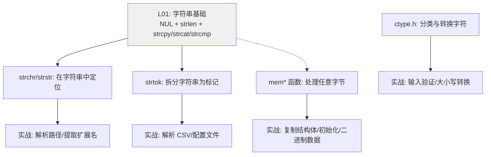

# 字符串查找与内存操作

## 前置知识检查

> 开始前确认这几个问题你能回答，否则回头补前序课程。

1. `strlen` 返回的 `size_t` 是什么类型？为什么两个 `size_t` 做减法有陷阱？→ 见 [lesson-01-string-basics](lesson-01-string-basics.md)
2. `strcpy` 为什么危险？"不受限字符串函数（unrestricted string function）"的含义是什么？→ 见 [lesson-01-string-basics](lesson-01-string-basics.md)
3. `'\0'`（NUL）和 `NULL` 的区别是什么？→ 见 [lesson-01-string-basics](lesson-01-string-basics.md)

---

## 核心概念

### 1. 字符串查找函数

#### 是什么

标准库提供了一组函数，用于在字符串中查找字符或子串。它们的原型都在 `<string.h>` 中：

```c
char *strchr(const char *str, int ch);    /* 从左向右找字符 */
char *strrchr(const char *str, int ch);   /* 从右向左找字符 */
char *strpbrk(const char *str,            /* 找字符集中任一字符 */
              const char *accept);
char *strstr(const char *haystack,        /* 找子串 */
             const char *needle);
```

- **strchr**（string character）— 在 `str` 中查找字符 `ch` **第一次**出现的位置，返回指向该位置的指针。找不到返回 `NULL`
- **strrchr**（string reverse character）— 与 `strchr` 相同，但查找**最后一次**出现的位置（从右向左）
- **strpbrk**（string pointer break）— 在 `str` 中查找 `accept` 字符串中**任意一个字符**第一次出现的位置
- **strstr**（string string）— 在 `haystack` 中查找整个 `needle` 子串第一次出现的起始位置。如果 `needle` 为空串，返回 `haystack`

所有函数找不到时都返回 `NULL`（null pointer）。注意第二个参数 `ch` 是 `int` 类型，但实际传入的是一个字符值。

还有两个计数函数，返回的不是指针而是长度：

```c
size_t strspn(const char *str,            /* 前缀匹配长度 */
              const char *accept);
size_t strcspn(const char *str,           /* 前缀不匹配长度 */
               const char *reject);
```

- **strspn** — 计算 `str` 开头连续匹配 `accept` 中任意字符的字符数
- **strcspn** — 计算 `str` 开头连续**不匹配** `reject` 中任何字符的字符数（`c` 来自 "complement"，补集）

#### 为什么重要

字符串查找是文本处理的基础。日常场景：
- 提取文件扩展名：`strrchr(filename, '.')` 找到最后一个 `.`
- 解析路径：`strrchr(path, '/')` 找到最后一个 `/` 取文件名
- 检查子串是否存在：`strstr(line, "error")` 在日志中搜索关键词
- 跳过前导空白：`str + strspn(str, " \t\n")` 得到第一个非空白字符的位置

#### 代码演示

```c
/* string_search.c — strchr/strrchr/strpbrk/strstr 综合演示 */
#include <stdio.h>
#include <string.h>

int main(void) {
    const char *path = "/home/user/docs/report.final.txt";

    /* === strchr: 找第一个 '.' === */
    const char *first_dot = strchr(path, '.');
    if (first_dot != NULL) {
        printf("第一个 '.': %s\n", first_dot);
    }

    /* === strrchr: 找最后一个 '/' === */
    const char *last_slash = strrchr(path, '/');
    if (last_slash != NULL) {
        printf("文件名: %s\n", last_slash + 1);
    }

    /* === strrchr: 找最后一个 '.' 取扩展名 === */
    const char *ext = strrchr(path, '.');
    if (ext != NULL) {
        printf("扩展名: %s\n", ext);
    }

    printf("\n");

    /* === strpbrk: 找第一个元音字母 === */
    const char *msg = "Hello World";
    const char *vowel = strpbrk(msg, "aeiouAEIOU");
    if (vowel != NULL) {
        printf("第一个元音: '%c' 在位置 %td\n",
               *vowel, vowel - msg);
    }

    printf("\n");

    /* === strstr: 找子串 === */
    const char *log = "2024-01-15 ERROR: disk full";
    const char *err = strstr(log, "ERROR");
    if (err != NULL) {
        printf("找到 ERROR 在位置 %td: \"%s\"\n",
               err - log, err);
    }

    /* strstr 找不到时返回 NULL */
    if (strstr(log, "WARNING") == NULL) {
        printf("未找到 WARNING\n");
    }

    printf("\n");

    /* === strspn/strcspn: 跳过前导空白 === */
    const char *input = "   hello world";
    size_t spaces = strspn(input, " \t\n");
    printf("前导空白: %zu 个\n", spaces);
    printf("第一个非空白: \"%s\"\n", input + spaces);

    /* strcspn: 计算到第一个空白为止的长度 */
    const char *word = "hello world";
    size_t word_len = strcspn(word, " \t\n");
    printf("第一个单词长度: %zu\n", word_len);

    return 0;
}
```

```bash
gcc -std=c99 -Wall -Wextra -g -o string_search string_search.c
./string_search
```

运行输出：

```
第一个 '.': .final.txt
文件名: report.final.txt
扩展名: .txt

第一个元音: 'e' 在位置 1

找到 ERROR 在位置 11: "ERROR: disk full"
未找到 WARNING

前导空白: 3 个
第一个非空白: "hello world"
第一个单词长度: 5
```

注意 `strchr(path, '.')` 找到的是**第一个** `.`（`.final.txt`），而 `strrchr(path, '.')` 找到的是**最后一个** `.`（`.txt`）。提取扩展名应该用 `strrchr`。

#### 易错点

❌ **不检查 NULL 返回值就直接使用**：

```c
/* null_deref.c — 未检查 NULL 返回值 */
#include <stdio.h>
#include <string.h>

int main(void) {
    const char *str = "hello";

    /* ❌ 如果找不到 '@'，strchr 返回 NULL */
    /* 对 NULL 解引用是未定义行为 */
    /* char ch = *strchr(str, '@'); */
    /* 段错误（segmentation fault）！ */

    /* ✅ 先检查再使用 */
    const char *at = strchr(str, '@');
    if (at != NULL) {
        printf("找到 '@' 在位置 %td\n", at - str);
    } else {
        printf("未找到 '@'\n");
    }

    return 0;
}
```

```bash
gcc -std=c99 -Wall -Wextra -g -o null_deref null_deref.c
./null_deref
```

运行输出：

```
未找到 '@'
```

**核心原则**：所有返回指针的查找函数（`strchr`、`strstr` 等），使用返回值前**必须检查是否为 NULL**。

---

### 2. strtok 标记分割

#### 是什么

**strtok**（string tokenize）用于将字符串按分隔符拆分成多个**标记**（token）。它的原型：

```c
char *strtok(char *str, const char *delim);
```

调用协议比较特殊——分两步走：
1. **首次调用**：传入要解析的字符串 `str` 和分隔符集合 `delim`，返回第一个标记
2. **后续调用**：第一个参数传 `NULL`，`strtok` 从上次停下的位置继续，返回下一个标记
3. **没有更多标记时**：返回 `NULL`

`strtok` 的工作原理是**直接修改原字符串**——它把找到的分隔符替换为 NUL 终止符（NUL terminator）`'\0'`，然后返回指向标记起始位置的指针。

用 ASCII 图展示 `strtok` 的逐步工作过程：

```
原始字符串 str = "hello,world,,end"
分隔符 delim = ","

第 1 次调用 strtok(str, ","):
+---+---+---+---+---+---+---+---+---+---+---+---+---+---+---+---+---+
| h | e | l | l | o | , | w | o | r | l | d | , | , | e | n | d |\0 |
+---+---+---+---+---+---+---+---+---+---+---+---+---+---+---+---+---+
  ↑ 返回                  ↑ 替换为 '\0'
结果: "hello"

第 2 次调用 strtok(NULL, ","):
+---+---+---+---+---+---+---+---+---+---+---+---+---+---+---+---+---+
| h | e | l | l | o |\0 | w | o | r | l | d | , | , | e | n | d |\0 |
+---+---+---+---+---+---+---+---+---+---+---+---+---+---+---+---+---+
                          ↑ 返回          ↑ 替换为 '\0'
结果: "world"
（注意：跳过了连续的两个逗号！）

第 3 次调用 strtok(NULL, ","):
+---+---+---+---+---+---+---+---+---+---+---+---+---+---+---+---+---+
| h | e | l | l | o |\0 | w | o | r | l | d |\0 |\0 | e | n | d |\0 |
+---+---+---+---+---+---+---+---+---+---+---+---+---+---+---+---+---+
                                                  ↑ 返回
结果: "end"

第 4 次调用 strtok(NULL, ","):
返回 NULL — 没有更多标记
```

➕ **原书未提及的要点**：`strtok` 会跳过连续的分隔符。上例中 `"hello,world,,end"` 有两个连续逗号，`strtok` 只产生 3 个标记（`"hello"`、`"world"`、`"end"`），**不会**产生一个空标记。如果你需要空标记（比如解析 CSV 中的空字段），`strtok` 不适用。

#### 为什么重要

`strtok` 是 C 中最常用的字符串分割工具——解析配置文件、处理命令行输入、拆分 CSV 行等场景都会用到。但它有两个严重的限制：

1. **修改原字符串**——传入的字符串会被破坏（分隔符被替换为 `'\0'`）
2. **不可重入**（non-reentrant）——`strtok` 内部使用**静态变量**保存解析位置，所以你**不能**同时解析两个字符串

📝 **原书解释增强**：原书正确地警告了这两个问题，但没有给出替代方案。在 POSIX 系统（Linux/macOS）上，`strtok_r` 是线程安全的可重入版本，它用一个额外的 `char **saveptr` 参数代替内部静态变量：

```c
/* POSIX 扩展，非 C 标准 */
char *strtok_r(char *str, const char *delim,
               char **saveptr);
```

#### 代码演示

```c
/* strtok_demo.c — strtok 拆分字符串 */
#include <stdio.h>
#include <string.h>

int main(void) {
    /* 必须用字符数组，strtok 会修改字符串 */
    char csv[] = "Alice,30,Engineer";

    printf("原始字符串: \"%s\"\n\n", csv);

    /* 典型用法：for 循环 + strtok */
    char *token;
    int field = 0;
    for (token = strtok(csv, ",");
         token != NULL;
         token = strtok(NULL, ",")) {
        printf("字段 %d: \"%s\"\n", field++, token);
    }

    printf("\n原始字符串被修改了: \"%s\"\n", csv);
    /* csv 现在只剩 "Alice"，因为第一个逗号被替换为 '\0' */

    printf("\n");

    /* === 连续分隔符被跳过 === */
    char data[] = "a,,b,,,c";
    printf("解析 \"%s\"：\n", "a,,b,,,c");
    int count = 0;
    for (token = strtok(data, ",");
         token != NULL;
         token = strtok(NULL, ",")) {
        printf("  标记 %d: \"%s\"\n", ++count, token);
    }
    printf("共 %d 个标记（不是 6 个！）\n", count);

    return 0;
}
```

```bash
gcc -std=c99 -Wall -Wextra -g -o strtok_demo strtok_demo.c
./strtok_demo
```

运行输出：

```
原始字符串: "Alice,30,Engineer"

字段 0: "Alice"
字段 1: "30"
字段 2: "Engineer"

原始字符串被修改了: "Alice"

解析 "a,,b,,,c"：
  标记 1: "a"
  标记 2: "b"
  标记 3: "c"
共 3 个标记（不是 6 个！）
```

`strtok` 调用后原字符串 `csv` 变成了 `"Alice"`——第一个逗号已被替换为 `'\0'`，后面的内容虽然还在内存中，但 `printf("%s", csv)` 只能看到 `'\0'` 之前的部分。

#### 易错点

❌ **对字符串字面量（string literal）调用 strtok**：

```c
/* strtok_trap.c — strtok 使用陷阱 */
#include <stdio.h>
#include <string.h>

int main(void) {
    /* ❌ 字符串字面量存储在只读区，strtok 修改它会段错误 */
    /* char *s = "hello,world"; */
    /* strtok(s, ","); */   /* 段错误！ */

    /* ✅ 使用字符数组（栈上可修改的副本） */
    char s[] = "hello,world";
    char *tok = strtok(s, ",");
    while (tok != NULL) {
        printf("%s\n", tok);
        tok = strtok(NULL, ",");
    }

    printf("\n");

    /* ❌ 嵌套调用 strtok：内层会破坏外层的状态 */
    char outer[] = "a-b-c";
    char inner[] = "1:2:3";
    (void)inner;  /* 仅演示声明，消除未使用警告 */
    char *otok = strtok(outer, "-");
    while (otok != NULL) {
        printf("外层: %s → 内层: ", otok);
        /* 这里调用 strtok 解析 inner 会破坏 outer 的解析 */
        /* char *itok = strtok(inner, ":"); */
        /* 后续 strtok(NULL, "-") 会在 inner 中继续而非 outer */
        printf("（嵌套调用会出错，已注释掉）\n");
        otok = strtok(NULL, "-");
    }

    return 0;
}
```

```bash
gcc -std=c99 -Wall -Wextra -g -o strtok_trap strtok_trap.c
./strtok_trap
```

运行输出：

```
hello
world

外层: a → 内层: （嵌套调用会出错，已注释掉）
外层: b → 内层: （嵌套调用会出错，已注释掉）
外层: c → 内层: （嵌套调用会出错，已注释掉）
```

**三条铁律**：
1. 只传**可修改的字符数组**给 `strtok`，绝不传字符串字面量
2. **不要嵌套调用** `strtok`（需要嵌套时用 `strtok_r`）
3. 如果需要保留原字符串，先用 `strcpy` 复制一份再传给 `strtok`

---

### 3. 字符分类与转换（ctype.h）

#### 是什么

头文件 `<ctype.h>` 提供两组函数：**分类函数**测试字符属于什么类别，**转换函数**在大小写之间转换。

**分类函数**（返回非零表示真，零表示假）：

| 函数 | 测试条件 | 示例为真的字符 |
|------|---------|--------------|
| `isalpha(c)` | 字母 | `'a'`-`'z'`, `'A'`-`'Z'` |
| `isdigit(c)` | 十进制数字 | `'0'`-`'9'` |
| `isalnum(c)` | 字母或数字 | 字母 + 数字 |
| `isupper(c)` | 大写字母 | `'A'`-`'Z'` |
| `islower(c)` | 小写字母 | `'a'`-`'z'` |
| `isspace(c)` | 空白字符 | 空格、`\t`、`\n`、`\r`、`\f`、`\v` |
| `ispunct(c)` | 标点符号 | 可打印非字母非数字非空格 |
| `isprint(c)` | 可打印字符 | 图形字符 + 空格 |
| `iscntrl(c)` | 控制字符 | ASCII 0-31 和 127 |
| `isxdigit(c)` | 十六进制数字 | `'0'`-`'9'`, `'a'`-`'f'`, `'A'`-`'F'` |

**转换函数**：

```c
int toupper(int c);  /* 小写 → 大写，非小写字母原样返回 */
int tolower(int c);  /* 大写 → 小写，非大写字母原样返回 */
```

#### 为什么重要

原书强调：直接用 `ch >= 'A' && ch <= 'Z'` 判断大写字母在 ASCII 字符集上可以工作，但在 EBCDIC 字符集上会失败（EBCDIC 的字母编码不连续）。使用 `isupper(ch)` 则**无论字符集如何都能正确工作**——这是可移植性的基本保证。

即使你只在 Linux/ASCII 环境下开发，`ctype.h` 函数的优势也很明显：代码更清晰、意图更明确。`isdigit(ch)` 比 `ch >= '0' && ch <= '9'` 一眼就能看懂。

#### 代码演示

```c
/* ctype_demo.c — 字符分类与转换 */
#include <stdio.h>
#include <ctype.h>
#include <string.h>

int main(void) {
    const char *text = "Hello, World! 123\n";

    /* === 统计各类字符 === */
    int alpha = 0, digit = 0, space = 0, punct = 0;
    for (int i = 0; text[i] != '\0'; i++) {
        unsigned char ch = (unsigned char)text[i];
        if (isalpha(ch)) alpha++;
        if (isdigit(ch)) digit++;
        if (isspace(ch)) space++;
        if (ispunct(ch)) punct++;
    }
    printf("字符串: \"%s\"\n", "Hello, World! 123\\n");
    printf("字母: %d, 数字: %d, 空白: %d, 标点: %d\n",
           alpha, digit, space, punct);

    printf("\n");

    /* === 大小写转换 === */
    char buf[] = "Hello World";
    printf("原始: \"%s\"\n", buf);

    /* 全部转大写 */
    for (int i = 0; buf[i] != '\0'; i++) {
        buf[i] = (char)toupper((unsigned char)buf[i]);
    }
    printf("大写: \"%s\"\n", buf);

    /* 全部转小写 */
    for (int i = 0; buf[i] != '\0'; i++) {
        buf[i] = (char)tolower((unsigned char)buf[i]);
    }
    printf("小写: \"%s\"\n", buf);

    printf("\n");

    /* === isdigit 比手动比较更清晰 === */
    char test_chars[] = {'A', '5', ' ', '!', '\n'};
    int n = sizeof(test_chars) / sizeof(test_chars[0]);
    for (int i = 0; i < n; i++) {
        unsigned char c = (unsigned char)test_chars[i];
        printf("'%c' (ASCII %3d): alpha=%d digit=%d "
               "space=%d punct=%d\n",
               isprint(c) ? c : '?', c,
               isalpha(c) != 0, isdigit(c) != 0,
               isspace(c) != 0, ispunct(c) != 0);
    }

    return 0;
}
```

```bash
gcc -std=c99 -Wall -Wextra -g -o ctype_demo ctype_demo.c
./ctype_demo
```

运行输出：

```
字符串: "Hello, World! 123\n"
字母: 10, 数字: 3, 空白: 3, 标点: 2

原始: "Hello World"
大写: "HELLO WORLD"
小写: "hello world"

'A' (ASCII  65): alpha=1 digit=0 space=0 punct=0
'5' (ASCII  53): alpha=0 digit=1 space=0 punct=0
' ' (ASCII  32): alpha=0 digit=0 space=1 punct=0
'!' (ASCII  33): alpha=0 digit=0 space=0 punct=1
'?' (ASCII  10): alpha=0 digit=0 space=1 punct=0
```

注意代码中每次调用 `ctype.h` 函数时都将参数转为 `(unsigned char)`——这不是多余的，而是**必须的**。

#### 易错点

➕ **原书未提及的重要陷阱**：`ctype.h` 函数的参数类型是 `int`，但 C 标准要求它的值必须是 **`unsigned char` 范围内的值或 `EOF`**。直接传入 `char` 类型（在大多数平台上是 `signed char`）时，如果字符值为负数（如扩展 ASCII 字符 ≥ 128），就是**未定义行为**（undefined behavior）。

```c
/* ctype_trap.c — ctype 函数的 unsigned char 要求 */
#include <stdio.h>
#include <ctype.h>

int main(void) {
    /* ❌ 直接传 char，负值字符导致未定义行为 */
    char ch = '\x80';  /* -128（signed char） */
    /* if (isalpha(ch)) ... */
    /* ch 为负数，用作数组下标会越界！ */

    /* ✅ 转为 unsigned char 后再传 */
    if (isalpha((unsigned char)ch)) {
        printf("是字母\n");
    } else {
        printf("不是字母\n");
    }

    /* ✅ 同样的规则适用于 toupper/tolower */
    char c = 'a';
    char upper = (char)toupper((unsigned char)c);
    printf("'%c' -> '%c'\n", c, upper);

    return 0;
}
```

```bash
gcc -std=c99 -Wall -Wextra -g -o ctype_trap ctype_trap.c
./ctype_trap
```

运行输出：

```
不是字母
'a' -> 'A'
```

**安全模式**：调用 `ctype.h` 函数时，**总是**写 `isXXX((unsigned char)ch)` 和 `(char)toupper((unsigned char)ch)`。虽然在纯 ASCII 范围（0-127）内不转换也不会出问题，但养成习惯能避免处理非 ASCII 数据时的隐蔽 bug。

---

### 4. 内存操作函数

#### 是什么

字符串函数（`str*` 系列）遇到 NUL 字节就停止。但如果你要处理的数据**内部包含 0 字节**（如整型数组、结构体、二进制数据），字符串函数就无能为力了。

**内存操作函数**（`mem*` 系列）不依赖 NUL 终止符，而是用**显式的长度参数**指定操作的字节数。原型在 `<string.h>` 中：

```c
void *memcpy(void *dst, const void *src, size_t n);
void *memmove(void *dst, const void *src, size_t n);
int   memcmp(const void *a, const void *b, size_t n);
void *memchr(const void *ptr, int ch, size_t n);
void *memset(void *ptr, int ch, size_t n);
```

- **memcpy** — 从 `src` 复制 `n` 个字节到 `dst`。源和目标**不能重叠**，否则是未定义行为
- **memmove** — 与 `memcpy` 功能相同，但**允许源和目标重叠**。内部通过临时缓冲区或反向复制保证正确性
- **memcmp** — 逐字节比较 `a` 和 `b` 的前 `n` 个字节，返回值规则与 `strcmp` 相同（< 0 / 0 / > 0）
- **memchr** — 在 `ptr` 开始的 `n` 个字节中查找字节 `ch`，返回指向第一次出现位置的指针，找不到返回 `NULL`
- **memset** — 将 `ptr` 开始的 `n` 个字节全部设置为 `ch` 的低 8 位

**memcpy vs memmove 的关键区别**——用 ASCII 图展示重叠时的问题：

```
假设要把 src[0..4] 复制到 dst[0..4]，且 dst = src + 2（重叠）：

内存：[A][B][C][D][E][F][G]
           src ───────┘
      dst ───┘

memcpy（从前往后复制）：
  步骤 1: dst[0] = src[0] → [A][B][A][D][E][F][G]  ✓
  步骤 2: dst[1] = src[1] → [A][B][A][B][E][F][G]  ✓
  步骤 3: dst[2] = src[2] → [A][B][A][B][A][F][G]  ❌ src[2] 已被覆盖！
  结果错误！

memmove（检测重叠方向，选择从后往前复制）：
  步骤 1: dst[4] = src[4] → [A][B][C][D][E][F][E]  ✓
  步骤 2: dst[3] = src[3] → [A][B][C][D][D][F][E]  ✓
  步骤 3: dst[2] = src[2] → [A][B][C][C][D][F][E]  ✓
  步骤 4: dst[1] = src[1] → [A][B][B][C][D][F][E]  ✓
  步骤 5: dst[0] = src[0] → [A][A][B][C][D][F][E]  ✓
  结果正确！
```

参数类型都是 `void *`——任何类型的指针都可以直接传入，无需强制类型转换。

#### 为什么重要

- **复制结构体/数组**：`memcpy(dst, src, sizeof(struct_type))` 是复制结构体最直接的方式
- **初始化内存**：`memset(buf, 0, sizeof(buf))` 是清零缓冲区的标准做法
- **处理二进制数据**：网络协议、文件格式中的数据往往包含 0 字节，只能用 `mem*` 函数
- **数组元素移动**：在数组中插入/删除元素时，需要移动后续元素——源和目标重叠，必须用 `memmove`

#### 代码演示

```c
/* mem_funcs.c — memcpy/memmove/memset/memcmp 演示 */
#include <stdio.h>
#include <string.h>

int main(void) {
    /* === memcpy: 复制整型数组 === */
    int src[] = {10, 20, 30, 40, 50};
    int dst[5];
    memcpy(dst, src, sizeof(src));
    printf("memcpy 整型数组: ");
    for (int i = 0; i < 5; i++) {
        printf("%d ", dst[i]);
    }
    printf("\n\n");

    /* === memmove: 处理重叠——数组元素右移 === */
    int arr[] = {1, 2, 3, 4, 5, 0, 0};
    printf("移动前: ");
    for (int i = 0; i < 7; i++) printf("%d ", arr[i]);
    printf("\n");

    /* 将 arr[0..4] 右移 2 位到 arr[2..6]（重叠！） */
    memmove(&arr[2], &arr[0], 5 * sizeof(int));
    arr[0] = 0;
    arr[1] = 0;
    printf("右移后: ");
    for (int i = 0; i < 7; i++) printf("%d ", arr[i]);
    printf("\n\n");

    /* === memset: 初始化内存 === */
    char buf[20];
    memset(buf, 0, sizeof(buf));       /* 清零 */
    memset(buf, 'A', 5);              /* 前 5 字节填 'A' */
    buf[5] = '\0';
    printf("memset: \"%s\"\n", buf);

    printf("\n");

    /* === memcmp: 比较内存块 === */
    int a[] = {1, 2, 3};
    int b[] = {1, 2, 3};
    int c[] = {1, 2, 4};
    printf("memcmp(a, b) = %d（相等）\n",
           memcmp(a, b, sizeof(a)));
    printf("memcmp(a, c) = %d（a < c）\n",
           memcmp(a, c, sizeof(a)));

    printf("\n");

    /* === memchr: 在字节序列中查找 === */
    unsigned char data[] = {0x10, 0x20, 0x00, 0x30, 0x40};
    unsigned char *found = memchr(data, 0x00, sizeof(data));
    if (found != NULL) {
        printf("memchr 找到 0x00 在偏移 %td\n",
               found - data);
    }

    return 0;
}
```

```bash
gcc -std=c99 -Wall -Wextra -g -o mem_funcs mem_funcs.c
./mem_funcs
```

运行输出：

```
memcpy 整型数组: 10 20 30 40 50

移动前: 1 2 3 4 5 0 0
右移后: 0 0 1 2 3 4 5

memset: "AAAAA"

memcmp(a, b) = 0（相等）
memcmp(a, c) = -1（a < c）

memchr 找到 0x00 在偏移 2
```

`memmove` 在重叠情况下正确地将 `{1,2,3,4,5}` 右移了 2 位。如果换成 `memcpy`，结果可能是错误的（`{1,2,1,2,1,2,1}` 之类的乱序）。

#### 易错点

❌ **memset 对非 char 类型的误用**：

```c
/* memset_trap.c — memset 按字节填充的陷阱 */
#include <stdio.h>
#include <string.h>

int main(void) {
    int arr[5];

    /* ✅ memset 清零：每个字节都是 0，int 也是 0 */
    memset(arr, 0, sizeof(arr));
    printf("memset 0: ");
    for (int i = 0; i < 5; i++) printf("%d ", arr[i]);
    printf("\n");

    /* ❌ memset 填 1：每个字节都变成 0x01 */
    /* int 的值不是 1，而是 0x01010101 = 16843009！ */
    memset(arr, 1, sizeof(arr));
    printf("memset 1: ");
    for (int i = 0; i < 5; i++) printf("%d ", arr[i]);
    printf("\n");

    /* ❌ memset 填 -1：每个字节都变成 0xFF */
    /* int 的值是 0xFFFFFFFF = -1（补码），碰巧"正确" */
    memset(arr, -1, sizeof(arr));
    printf("memset -1: ");
    for (int i = 0; i < 5; i++) printf("%d ", arr[i]);
    printf("\n");

    printf("\n");

    /* ✅ 要初始化 int 数组为特定值，用循环 */
    for (int i = 0; i < 5; i++) arr[i] = 42;
    printf("循环赋值: ");
    for (int i = 0; i < 5; i++) printf("%d ", arr[i]);
    printf("\n");

    return 0;
}
```

```bash
gcc -std=c99 -Wall -Wextra -g -o memset_trap memset_trap.c
./memset_trap
```

运行输出：

```
memset 0: 0 0 0 0 0
memset 1: 16843009 16843009 16843009 16843009 16843009
memset -1: -1 -1 -1 -1 -1

循环赋值: 42 42 42 42 42
```

**核心原则**：`memset` 是按**字节**填充的。对 `int`/`float` 等多字节类型，只有填 `0`（全零）和 `-1`（全 `0xFF`）是安全的。要初始化为其他值，用循环。

---

## 概念串联

本课的四个概念覆盖了 `<string.h>` 和 `<ctype.h>` 的剩余核心功能：



**与前课的衔接**：
- L01 讲了字符串的本质（字符数组 + NUL）和基本操作函数（strlen/strcpy/strcat/strcmp）——本课在此基础上扩展查找、分割、字符处理和内存操作能力
- L01 讲了 `size_t` 的无符号陷阱——本课的 `strspn`/`strcspn` 也返回 `size_t`，同样的规则适用
- L01 讲了字符串字面量（string literal）不可修改——本课 `strtok` 一节再次强化这个要点

**与后续课程的衔接**：
- module-05 结构体课程中，`memcpy` 会用于复制结构体
- module-06 动态内存课程中，`memset` 常用于初始化 `malloc` 分配的内存
- module-08 高级指针课程中，`void *` 参数类型会作为泛型编程的入口深入讲解

---

## 常见陷阱清单

| # | 陷阱 | 症状 | 原因 | 修复 |
|---|------|------|------|------|
| 1 | `strchr`/`strstr` 返回 NULL 未检查就解引用 | 段错误（segmentation fault） | 字符/子串不存在时返回 NULL | 使用前先 `if (ptr != NULL)` |
| 2 | 对字符串字面量调用 `strtok` | 段错误 | 字面量在只读内存区，`strtok` 试图写入 | 用 `char s[] = "..."` 字符数组 |
| 3 | 嵌套调用 `strtok` | 外层解析被破坏，结果错误 | `strtok` 内部用静态变量保存状态 | 用 POSIX `strtok_r` |
| 4 | `ctype.h` 函数传入负值 `char` | 未定义行为（越界访问内部查找表） | `char` 可能是 signed，负值超出 `unsigned char` 范围 | 总是写 `isXXX((unsigned char)ch)` |
| 5 | `memset(arr, 1, sizeof(arr))` 初始化 `int` 数组 | 每个元素变成 16843009 而不是 1 | `memset` 按字节填充 0x01 | 用循环赋值，或只 `memset` 为 0 |
| 6 | 重叠内存区域用 `memcpy` | 数据损坏，结果不可预测 | `memcpy` 不处理重叠 | 有重叠可能就用 `memmove` |

---

## 动手练习提示

### 练习 1：手写 strstr

- 目标：不用库函数，实现 `char *my_strstr(const char *haystack, const char *needle)`
- 思路提示：外层循环遍历 `haystack`，内层循环逐字符比较 `needle`
- 容易卡住的地方：`needle` 为空串时应返回 `haystack`（标准行为）

### 练习 2：安全的字符串分割

- 目标：写一个函数，在不修改原字符串的情况下按分隔符提取第 N 个字段
- 思路提示：用 `strcspn` 计算到下一个分隔符的距离，用 `strspn` 跳过连续分隔符
- 容易卡住的地方：不能用 `strtok`（它会修改原字符串），需要用指针+长度方式工作

### 练习 3：memmove 模拟数组删除

- 目标：从 `int arr[10] = {0,1,2,...,9}` 中删除索引为 3 的元素，后续元素前移
- 思路提示：`memmove(&arr[3], &arr[4], 6 * sizeof(int))`
- 容易卡住的地方：第三个参数是**字节数**，不是元素个数——要乘以 `sizeof(int)`

---

## 自测题

> 不给答案，动脑想完再往下学。

1. `strchr("hello world", '\0')` 返回什么？是 `NULL` 还是指向 NUL 终止符的指针？为什么？

2. 用 `strtok` 解析 `"a,,b,c"`（注意两个连续逗号），会得到几个标记？分别是什么？如果你需要得到 4 个标记（包括一个空字段），应该怎么做？

3. `memset(arr, 0, sizeof(arr))` 和 `memset(arr, 1, sizeof(arr))` 对 `int arr[10]` 的效果分别是什么？为什么填 0 得到的是 `{0,0,...}`，但填 1 得到的不是 `{1,1,...}`？

---

## 补充资源

| 资源 | 类型 | 说明 |
|------|------|------|
| [strtok - cppreference.com](https://zh.cppreference.com/w/c/string/byte/strtok) | 文档 | strtok 官方参考，含 C11 strtok_s |
| [strtok - 菜鸟教程](https://www.runoob.com/cprogramming/c-function-strtok.html) | 教程 | strtok 中文基础讲解与示例 |
| [memcpy vs memmove - GeeksforGeeks](https://www.geeksforgeeks.org/cpp/write-memcpy/) | 教程 | memcpy 与 memmove 区别详解与自实现 |
| [ctype.h - Programiz](https://www.programiz.com/c-programming/library-function/ctype.h) | 文档 | ctype.h 函数完整列表与示例 |
