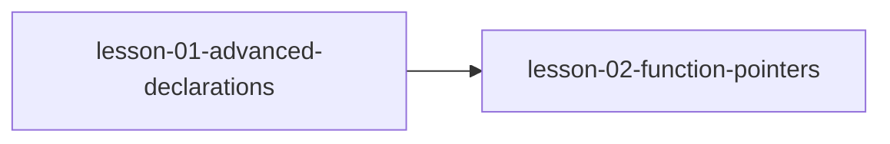

# MODULE.md — 高级指针技巧

## 模块信息
| 字段 | 值 |
|------|---|
| 模块编号 | module-08 |
| 模块名称 | 高级指针技巧 |
| 原书章节 | Ch 13 |
| 课程数量 | 2 |
| 预计总时长 | 2 小时 |

---
## 模块目标
学完本模块后，你应该能够：
1. 能解读复杂的 C 声明
2. 掌握函数指针的声明和使用
3. 能实现回调函数和转移表

---
## 课程列表
| # | 课程文件 | 标题 | 核心概念 | 状态 |
|---|---------|------|---------|------|
| 1 | `lesson-01-advanced-declarations.md` | 高级声明解读 | 复杂声明解读、右左法则、cdecl 工具 | ⬜ |
| 2 | `lesson-02-function-pointers.md` | 函数指针 | 函数指针声明、回调函数、转移表、命令行参数 | ⬜ |

---
## 前置模块
- [module-07-linked-lists](../module-07-linked-lists/MODULE.md) — 链表实现中对指针的综合运用

---
## 模块内课程依赖

---
## 关键术语预览
| 术语 | 英文 | 首次出现课程 |
|------|------|------------|
| 函数指针 | function pointer | lesson-02 |
| 回调函数 | callback | lesson-02 |
| 转移表 | jump table | lesson-02 |
| 命令行参数 | command-line arguments | lesson-02 |
